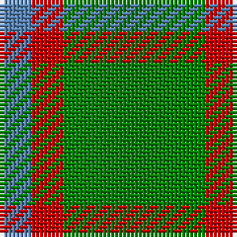

In pattern [BRG](/stripes/brg/).

This was sourced from weddslist.  It is a [3 stripe tartan](/stripes/stripes3/).

Original link http://www.weddslist.com/cgi-bin/tartans/pg.pl?source=sts

## Thread count
G/36 R8 B/8

## Palette
Each colour and the base-6 reference it is a variant of.

| Colour | Shade | Base |
|---|---|---|
| B | <code style="background-color:#5480B0;">#5480B0</code> `oklch(58.8% 0.089 251.5)` <small>#5480B0</small> | B <code style="background-color:#2A418A;">#2A418A</code> |
| G | <code style="background-color:#008000;">#008000</code> `oklch(52.0% 0.177 142.5)` <small>#008000</small> | G <code style="background-color:#006100;">#006100</code> |
| R | <code style="background-color:#C00000;">#C00000</code> `oklch(50.7% 0.208 29.2)` <small>#C00000</small> | R <code style="background-color:#CC0000;">#CC0000</code> |

# Sample pattern

## Nearest tartans

The nearest existing variants by ΔTartan distance.

1. [O'Neill (Australia) (Name)](/setts/s4/g9o20g40w5~x2/) — ΔT 1.22
1. [Ledford Family Tartan Tartan Number: 835. Earliest known date: 1987 A quantity of this cloth was woven in 1998 for a Ledford family in the USA. See products available Copyright © Blair Urquhart, Comrie, 2015](/setts/s3/g9o4ly1~x4/) — ΔT 1.23
1. [O'Neill](/setts/s4/g9lo20g40w5~x2/) — ΔT 1.36
1. [Highland Spring (Green)](/setts/s4/g7r3g23m7~x2/) — ΔT 1.37
1. [O'Neill, Red (Corporate?)](/setts/s4/g9o20g46lg5~x2/) — ΔT 1.47
1. [Ledford](/setts/s3/dg9y4lo1~x8/) — ΔT 1.53
1. [McMoosie](/setts/s3/g81r10ly20~x2/) — ΔT 1.67
1. [Wilson's No.212](/setts/s4/r2g9r2t2~x4/) — ΔT 1.73
1. [Highland Spring (1997) (Corporate)](/setts/s4/dp7g23r3g7~x2/) — ΔT 1.73
1. [Unidentified, pattern](/setts/s3/g12db3ly1~x4/) — ΔT 1.94

## Neighbour map

Every grey dot is one of 14299 variants placed by the first two principal components of the ΔTartan feature space (44% of its variance). Red is this tartan; blue dots are its nearest — click one to open its page.

<svg viewBox="0 0 640 380" role="img" style="max-width:100%;height:auto;border:1px solid #e0e0e0;border-radius:4px;display:block" xmlns="http://www.w3.org/2000/svg"><image href="/nn/cloud.v1.png" width="640" height="380"/><a href="/setts/s4/g9o20g40w5~x2/"><circle cx="413.2" cy="286.9" r="4" fill="#3465a4"><title>O'Neill (Australia) (Name)</title></circle></a><a href="/setts/s3/g9o4ly1~x4/"><circle cx="415.8" cy="303.5" r="4" fill="#3465a4"><title>Ledford Family Tartan Tartan Number: 835. Earliest known date: 1987 A quantity of this cloth was woven in 1998 for a Ledford family in the USA. See products available Copyright © Blair Urquhart, Comrie, 2015</title></circle></a><a href="/setts/s4/g9lo20g40w5~x2/"><circle cx="405.5" cy="281.2" r="4" fill="#3465a4"><title>O'Neill</title></circle></a><a href="/setts/s4/g7r3g23m7~x2/"><circle cx="474.2" cy="288.5" r="4" fill="#3465a4"><title>Highland Spring (Green)</title></circle></a><a href="/setts/s4/g9o20g46lg5~x2/"><circle cx="463.7" cy="288.5" r="4" fill="#3465a4"><title>O'Neill, Red (Corporate?)</title></circle></a><a href="/setts/s3/dg9y4lo1~x8/"><circle cx="421.5" cy="306.5" r="4" fill="#3465a4"><title>Ledford</title></circle></a><a href="/setts/s3/g81r10ly20~x2/"><circle cx="441.5" cy="273.7" r="4" fill="#3465a4"><title>McMoosie</title></circle></a><a href="/setts/s4/r2g9r2t2~x4/"><circle cx="343.7" cy="288.2" r="4" fill="#3465a4"><title>Wilson's No.212</title></circle></a><a href="/setts/s4/dp7g23r3g7~x2/"><circle cx="471.7" cy="289.2" r="4" fill="#3465a4"><title>Highland Spring (1997) (Corporate)</title></circle></a><a href="/setts/s3/g12db3ly1~x4/"><circle cx="495.9" cy="275.1" r="4" fill="#3465a4"><title>Unidentified, pattern</title></circle></a><circle cx="414.8" cy="318.5" r="5" fill="#c00000"/></svg>

ID: /setts/s3/g9r2t2~x4/
