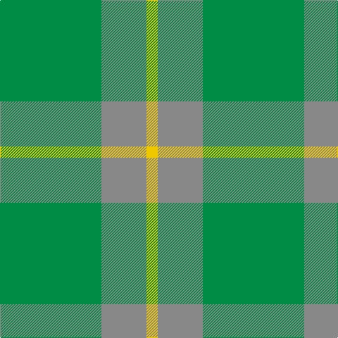

In pattern [GRY](/patterns/gry/).

This was sourced from tartans-authority.  It is a [3 stripes tartan](/stripes/stripes3/).

Original link http://www.tartansauthority.com/tartan-ferret/display/835/

## Thread count
G/144 N64 Y/16

## Palette
Each colour and its ΔE from the base-6 reference it is a variant of.

| Colour | Shade | Base | ΔE (OKLab) |
|---|---|---|---|
| G | <code style="background-color:#008C44;">#008C44</code> `#008C44` | G <code style="background-color:#006100;">#006100</code> | 0.14 |
| N | <code style="background-color:#888888;">#888888</code> `#888888` | R <code style="background-color:#CC0000;">#CC0000</code> | 0.24 |
| Y | <code style="background-color:#F0C800;">#F0C800</code> `#F0C800` | Y <code style="background-color:#F2BF00;">#F2BF00</code> | 0.02 |

# Sample pattern

## Nearest tartans

The nearest existing variants by ΔTartan distance.

1. [Spring Morning (Fashion)](/setts/s4/g1ga9g9y1~g006818-ga74846c-yd09800~x4/) — ΔT 1.62
1. [Colonial Marine (Corporate)](/setts/s4/g56ga13y13y5~g006818-ga604000-ybc8c00~x2/) — ΔT 1.72
1. [Ledford Family Tartan Tartan Number: 835. Earliest known date: 1987 A quantity of this cloth was woven in 1998 for a Ledford family in the USA. See products available Copyright © Blair Urquhart, Comrie, 2015](/setts/s3/g9r4y1~g006818-r888888-ye8c000~x4/) — ΔT 1.81
1. [Gordon Cumming (Artefact)](/setts/s6/y10g30ga25g30k2g3~g009468-ga007460-k101010-ye8c000~x2/) — ΔT 1.98
1. [O'Neill, Red (Corporate?)](/setts/s4/g9r20g46y5~g006818-rb84c00-y48a4c0~x2/) — ΔT 2.04
1. [Ledford](/setts/s3/g9ga4y1~g005020-ga808080-yc89600~x8/) — ΔT 2.13
1. [Confederate Artillery (Military)](/setts/s6/g2r14g8r3g12ra2~g006818-ra0783c-ra8c0000~x2/) — ΔT 2.16
1. [Spring Morning](/setts/s6/g9ga9y1ga9g9ga1~g74846c-ga006818-yd09800~x4/) — ΔT 2.16
1. [Irving of Bonshaw](/setts/s5/g27ga14b2ga2y2~b003c64-g006818-ga048888-ye8c000~x4/) — ΔT 2.23
1. [Campbell Simpson (Dalgliesh)](/setts/s6/g22k3g3ga16g6k4~g408060-ga006818-k101010~x2/) — ΔT 2.29

## Neighbour map

Every grey dot is one of 15726 variants placed by the first two principal components of the ΔTartan feature space (44% of its variance). Red is this tartan; blue dots are its nearest — click one to open its page.

<svg viewBox="0 0 640 380" role="img" style="max-width:100%;height:auto;border:1px solid #e0e0e0;border-radius:4px;display:block" xmlns="http://www.w3.org/2000/svg"><image href="/nn/cloud.v1.png" width="640" height="380"/><a href="/setts/s4/g1ga9g9y1~g006818-ga74846c-yd09800~x4/"><circle cx="412.6" cy="301.9" r="4" fill="#3465a4"><title>Spring Morning (Fashion)</title></circle></a><a href="/setts/s4/g56ga13y13y5~g006818-ga604000-ybc8c00~x2/"><circle cx="458.5" cy="274.8" r="4" fill="#3465a4"><title>Colonial Marine (Corporate)</title></circle></a><a href="/setts/s3/g9r4y1~g006818-r888888-ye8c000~x4/"><circle cx="414.4" cy="301.3" r="4" fill="#3465a4"><title>Ledford Family Tartan Tartan Number: 835. Earliest known date: 1987 A quantity of this cloth was woven in 1998 for a Ledford family in the USA. See products available Copyright © Blair Urquhart, Comrie, 2015</title></circle></a><a href="/setts/s6/y10g30ga25g30k2g3~g009468-ga007460-k101010-ye8c000~x2/"><circle cx="417.0" cy="251.6" r="4" fill="#3465a4"><title>Gordon Cumming (Artefact)</title></circle></a><a href="/setts/s4/g9r20g46y5~g006818-rb84c00-y48a4c0~x2/"><circle cx="462.9" cy="285.8" r="4" fill="#3465a4"><title>O'Neill, Red (Corporate?)</title></circle></a><a href="/setts/s3/g9ga4y1~g005020-ga808080-yc89600~x8/"><circle cx="420.1" cy="304.0" r="4" fill="#3465a4"><title>Ledford</title></circle></a><a href="/setts/s6/g2r14g8r3g12ra2~g006818-ra0783c-ra8c0000~x2/"><circle cx="384.4" cy="290.3" r="4" fill="#3465a4"><title>Confederate Artillery (Military)</title></circle></a><a href="/setts/s6/g9ga9y1ga9g9ga1~g74846c-ga006818-yd09800~x4/"><circle cx="401.4" cy="309.6" r="4" fill="#3465a4"><title>Spring Morning</title></circle></a><a href="/setts/s5/g27ga14b2ga2y2~b003c64-g006818-ga048888-ye8c000~x4/"><circle cx="422.8" cy="239.9" r="4" fill="#3465a4"><title>Irving of Bonshaw</title></circle></a><a href="/setts/s6/g22k3g3ga16g6k4~g408060-ga006818-k101010~x2/"><circle cx="371.9" cy="277.9" r="4" fill="#3465a4"><title>Campbell Simpson (Dalgliesh)</title></circle></a><circle cx="454.6" cy="317.3" r="5" fill="#c00000"/></svg>

ID: /setts/s3/g9r4y1~g008c44-r888888-yf0c800~x16/
