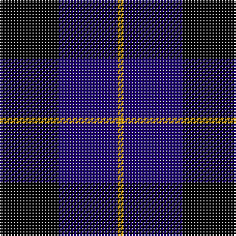

This page is one **sett** — a single exact thread-count. It belongs to the [tartan](/tartans/k10db10lo1/)
(the same proportion at any scale), whose colour order is pattern [KBY](/stripes/kby/).

Sourced from tartans-authority.  It is a [3 stripe tartan](/stripes/stripes3/).

Original link http://www.tartansauthority.com/tartan-ferret/display/2312/

## Register references

External register numbers recorded for this tartan.

- Scottish Tartans Authority (ITI): 2312

## Thread count
K/40 DB40 DY/4

## Palette

Palette: <strong>Tartan Register</strong> <small style="color:#888">(3 of 4 colours)</small>
<table><thead><tr><th>Colour</th><th>Threads</th><th>Shade</th><th>Base</th><th>OKLCh</th></tr></thead><tbody><tr><td>K/</td><td style="text-align:right;font-variant-numeric:tabular-nums">40</td><td><code style="background-color:#000000;">#000000</code> <small style="color:#888">#000000</small></td><td>K <code style="background-color:#000000;">#000000</code></td><td><small style="color:#888">oklch(0.0% 0.000 0.0)</small></td></tr><tr><td>DB</td><td style="text-align:right;font-variant-numeric:tabular-nums">40</td><td><code style="background-color:#1C0070;">#1C0070</code> <small style="color:#888">#1C0070</small></td><td>B <code style="background-color:#2A418A;">#2A418A</code></td><td><small style="color:#888">oklch(26.3% 0.162 277.1)</small></td></tr><tr><td>DY/</td><td style="text-align:right;font-variant-numeric:tabular-nums">4</td><td><code style="background-color:#D09800;">#D09800</code> <small style="color:#888">#D09800</small></td><td>Y <code style="background-color:#F2BF00;">#F2BF00</code></td><td><small style="color:#888">oklch(71.4% 0.147 82.1)</small></td></tr></tbody></table>

# Sample pattern

## Nearest tartans

The nearest existing variants by ΔTartan distance, with this tartan at the top so the swatches line up against it.

ΔTartan

Tartan

Sett

—

<a href="/ttd/edit/#slug=k10db10lo1~x4">Mother's Pride (Corporate)</a> <a class="nn-out" href="/setts/s3/k10db10lo1~x4/" title="open its dictionary page">↗</a>

1.21

<a href="/ttd/edit/#slug=k1db8k8ly1">Wallace Blue</a> <a class="nn-out" href="/setts/s4/k1db8k8ly1/" title="open its dictionary page">↗</a>

1.42

<a href="/ttd/edit/#slug=k1db7k7ly1~x10">Wallace (Personal)</a> <a class="nn-out" href="/setts/s4/k1db7k7ly1~x10/" title="open its dictionary page">↗</a>

1.82

<a href="/ttd/edit/#slug=k15lo2k10db18lb3~x2">College of Radiographers</a> <a class="nn-out" href="/setts/s5/k15lo2k10db18lb3~x2/" title="open its dictionary page">↗</a>

1.91

<a href="/ttd/edit/#slug=k5db1k5db7w2~x2">Grampian, T.V.</a> <a class="nn-out" href="/setts/s5/k5db1k5db7w2~x2/" title="open its dictionary page">↗</a>

1.93

<a href="/ttd/edit/#slug=k4dg3dp18k18lb2~x2">Wcwm 1106-2</a> <a class="nn-out" href="/setts/s5/k4dg3dp18k18lb2~x2/" title="open its dictionary page">↗</a>

1.96

<a href="/setts/s6/ki6db50k29b6k29db6/">Scottish Express International</a>

1.98

<a href="/ttd/edit/#slug=k15y2k10db18w3~x2">College of Radiographers</a> <a class="nn-out" href="/setts/s5/k15y2k10db18w3~x2/" title="open its dictionary page">↗</a>

2.03

<a href="/ttd/edit/#slug=db9k9r3db9k9ly1~x4">Old Brigade</a> <a class="nn-out" href="/setts/s6/db9k9r3db9k9ly1~x4/" title="open its dictionary page">↗</a>

2.04

<a href="/ttd/edit/#slug=k15ly2k10db18w3~x2">College of Radiographers Corporate Tartan Tartan Number: 1274. Earliest known date: 1988 Marketed in Edinburgh around 1930s but no longer seen. See products available Copyright © Blair Urquhart, Comrie, 2015</a> <a class="nn-out" href="/setts/s5/k15ly2k10db18w3~x2/" title="open its dictionary page">↗</a>

2.08

<a href="/ttd/edit/#slug=w4db30k23db24ly4~x2">Bank of Scotland</a> <a class="nn-out" href="/setts/s5/w4db30k23db24ly4~x2/" title="open its dictionary page">↗</a>

## Neighbour map

Every grey dot is one of 14359 variants placed by the first two principal components of the ΔTartan feature space (44% of its variance). Red is this tartan; blue dots are its nearest — click one to open its page.

<svg viewBox="0 0 640 380" role="img" style="max-width:100%;height:auto;border:1px solid #e0e0e0;border-radius:4px;display:block" xmlns="http://www.w3.org/2000/svg"><image href="/nn/cloud.v1.png" width="640" height="380"/><a href="/setts/s4/k1db8k8ly1/"><circle cx="324.3" cy="287.4" r="4" fill="#3465a4"><title>Wallace Blue</title></circle></a><a href="/setts/s4/k1db7k7ly1~x10/"><circle cx="308.5" cy="283.1" r="4" fill="#3465a4"><title>Wallace (Personal)</title></circle></a><a href="/setts/s5/k15lo2k10db18lb3~x2/"><circle cx="273.6" cy="254.1" r="4" fill="#3465a4"><title>College of Radiographers</title></circle></a><a href="/setts/s5/k5db1k5db7w2~x2/"><circle cx="235.6" cy="275.4" r="4" fill="#3465a4"><title>Grampian, T.V.</title></circle></a><a href="/setts/s5/k4dg3dp18k18lb2~x2/"><circle cx="271.6" cy="232.6" r="4" fill="#3465a4"><title>Wcwm 1106-2</title></circle></a><a href="/setts/s6/ki6db50k29b6k29db6/"><circle cx="255.8" cy="236.0" r="4" fill="#3465a4"><title>Scottish Express International</title></circle></a><a href="/setts/s5/k15y2k10db18w3~x2/"><circle cx="250.4" cy="241.6" r="4" fill="#3465a4"><title>College of Radiographers</title></circle></a><a href="/setts/s6/db9k9r3db9k9ly1~x4/"><circle cx="233.7" cy="265.5" r="4" fill="#3465a4"><title>Old Brigade</title></circle></a><a href="/setts/s5/k15ly2k10db18w3~x2/"><circle cx="267.1" cy="246.0" r="4" fill="#3465a4"><title>College of Radiographers Corporate Tartan Tartan Number: 1274. Earliest known date: 1988 Marketed in Edinburgh around 1930s but no longer seen. See products available Copyright © Blair Urquhart, Comrie, 2015</title></circle></a><a href="/setts/s5/w4db30k23db24ly4~x2/"><circle cx="311.1" cy="261.8" r="4" fill="#3465a4"><title>Bank of Scotland</title></circle></a><circle cx="308.2" cy="300.0" r="5" fill="#c00000"/></svg>

ID: /setts/s3/k10db10lo1~x4/
