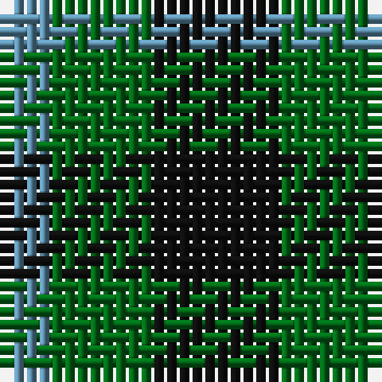

In pattern [BGK](/patterns/bgk/).

This was sourced from register-of-tartans.  It is a [3 stripes tartan](/stripes/stripes3/).

Original link https://www.tartanregister.gov.uk/tartanDetails.aspx?ref=3043

## Attestations

This cloth appears in 2 source records; the oldest owns this page.

- 01/01/2002 — Mull (register-of-tartans, [record](https://www.tartanregister.gov.uk/tartanDetails.aspx?ref=3043))
- undated — Mull or Glenlyon District Tartan Tartan Number: 162. Earliest known date: 1819 This sett appears in the pattern books of the 18th century weaving firm, William Wilson and Sons, where it is recorded as pattern No. 53 or Glen Lyon. See products available Copyright © Blair Urquhart, Comrie, 2015 (house-of-tartan, [record](http://www.house-of-tartan.scotland.net/house/TartanViewjs.asp?colr=Def&tnam=162))

## Thread count
B/4 G8 K/10

## Palette
Each colour and its ΔE from the base-6 reference it is a variant of.

| Colour | Shade | Base | ΔE (OKLab) |
|---|---|---|---|
| B | <code style="background-color:#5C8CA8;">#5C8CA8</code> `#5C8CA8` | B <code style="background-color:#2C4084;">#2C4084</code> | 0.23 |
| G | <code style="background-color:#006818;">#006818</code> `#006818` | G <code style="background-color:#006400;">#006400</code> | 0.02 |
| K | <code style="background-color:#101010;">#101010</code> `#101010` | K <code style="background-color:#000000;">#000000</code> | 0.17 |

# Sample pattern

ID: /setts/s3/k10g8b4-b5c8ca8-g006818-k101010/
