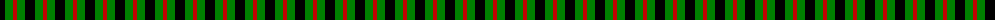

In pattern [KGR](/patterns/kgr/).

This was sourced from weddslist.  It is a [3 stripes tartan](/stripes/stripes3/).

Original link http://www.weddslist.com/cgi-bin/tartans/pg.pl?source=sts

## Thread count
K/10 G8 R/4

## Palette
Each colour and its ΔE from the base-6 reference it is a variant of.

| Colour | Shade | Base | ΔE (OKLab) |
|---|---|---|---|
| G | <code style="background-color:#008000;">#008000</code> `#008000` | G <code style="background-color:#006400;">#006400</code> | 0.09 |
| K | <code style="background-color:#000000;">#000000</code> `#000000` | K <code style="background-color:#000000;">#000000</code> | 0.00 |
| R | <code style="background-color:#C00000;">#C00000</code> `#C00000` | R <code style="background-color:#C80000;">#C80000</code> | 0.02 |

# Sample pattern

## Nearest tartans

The nearest existing variants by ΔTartan distance.

1. [Glen Lyon](/setts/s3/k12g10r4-g008000-k000000-rc00000/) — ΔT 0.47
1. [Wilson's, No 200](/setts/s3/g8k14r8-g008000-k000000-rc00000/) — ΔT 0.92
1. [Mull, or Glenlyon](/setts/s3/k10g8b4-b5480b0-g008000-k000000/) — ΔT 1.08
1. [Wilson's, No 202](/setts/s3/g14k8r8-g008000-k000000-rc00000/) — ΔT 1.14
1. [Glen Lyon, or Mull (No.53)](/setts/s3/k10g6b4-b5480b0-g008000-k000000/) — ΔT 1.16
1. [Glen Lyon District Tartan Tartan Number: 23. Earliest known date: 1820 Appears to be No 185 in Wilson's '1819' See products available Copyright © Blair Urquhart, Comrie, 2015](/setts/s3/k12g10r4-g006818-k101010-rc80000/) — ΔT 1.49
1. [Wilson's No.200](/setts/s3/g8k14r8-g006818-k101010-rc80000/) — ΔT 1.59
1. [Glen Lyon or Mull (No.53) District Tartan Tartan Number: 24. Earliest known date: 1820 Appears to be No 185 in Wilson's '1819' See products available Copyright © Blair Urquhart, Comrie, 2015](/setts/s3/k10g6b4-b5c8ca8-g006818-k101010/) — ΔT 1.74
1. [Wilson's, No 2/53 or Mull](/setts/s3/k10g8y2-g008000-k000000-yf0c000/) — ΔT 1.75
1. [Zwijnenberg, Frans (Personal)](/setts/s3/k92g32y32-g00643c-k000000-ye0a126/) — ΔT 1.75

## Neighbour map

Every grey dot is one of 15726 variants placed by the first two principal components of the ΔTartan feature space (44% of its variance). Red is this tartan; blue dots are its nearest — click one to open its page.

<svg viewBox="0 0 640 380" role="img" style="max-width:100%;height:auto;border:1px solid #e0e0e0;border-radius:4px;display:block" xmlns="http://www.w3.org/2000/svg"><image href="/nn/cloud.v1.png" width="640" height="380"/><a href="/setts/s3/k12g10r4-g008000-k000000-rc00000/"><circle cx="169.7" cy="343.3" r="4" fill="#3465a4"><title>Glen Lyon</title></circle></a><a href="/setts/s3/g8k14r8-g008000-k000000-rc00000/"><circle cx="131.3" cy="366.0" r="4" fill="#3465a4"><title>Wilson's, No 200</title></circle></a><a href="/setts/s3/k10g8b4-b5480b0-g008000-k000000/"><circle cx="141.5" cy="360.0" r="4" fill="#3465a4"><title>Mull, or Glenlyon</title></circle></a><a href="/setts/s3/g14k8r8-g008000-k000000-rc00000/"><circle cx="128.5" cy="366.0" r="4" fill="#3465a4"><title>Wilson's, No 202</title></circle></a><a href="/setts/s3/k10g6b4-b5480b0-g008000-k000000/"><circle cx="165.5" cy="355.5" r="4" fill="#3465a4"><title>Glen Lyon, or Mull (No.53)</title></circle></a><a href="/setts/s3/k12g10r4-g006818-k101010-rc80000/"><circle cx="208.1" cy="356.0" r="4" fill="#3465a4"><title>Glen Lyon District Tartan Tartan Number: 23. Earliest known date: 1820 Appears to be No 185 in Wilson's '1819' See products available Copyright © Blair Urquhart, Comrie, 2015</title></circle></a><a href="/setts/s3/g8k14r8-g006818-k101010-rc80000/"><circle cx="161.7" cy="366.0" r="4" fill="#3465a4"><title>Wilson's No.200</title></circle></a><a href="/setts/s3/k10g6b4-b5c8ca8-g006818-k101010/"><circle cx="199.5" cy="366.0" r="4" fill="#3465a4"><title>Glen Lyon or Mull (No.53) District Tartan Tartan Number: 24. Earliest known date: 1820 Appears to be No 185 in Wilson's '1819' See products available Copyright © Blair Urquhart, Comrie, 2015</title></circle></a><a href="/setts/s3/k10g8y2-g008000-k000000-yf0c000/"><circle cx="218.2" cy="310.9" r="4" fill="#3465a4"><title>Wilson's, No 2/53 or Mull</title></circle></a><a href="/setts/s3/k92g32y32-g00643c-k000000-ye0a126/"><circle cx="242.8" cy="325.4" r="4" fill="#3465a4"><title>Zwijnenberg, Frans (Personal)</title></circle></a><circle cx="149.5" cy="356.0" r="5" fill="#c00000"/></svg>

ID: /setts/s3/k10g8r4-g008000-k000000-rc00000/
