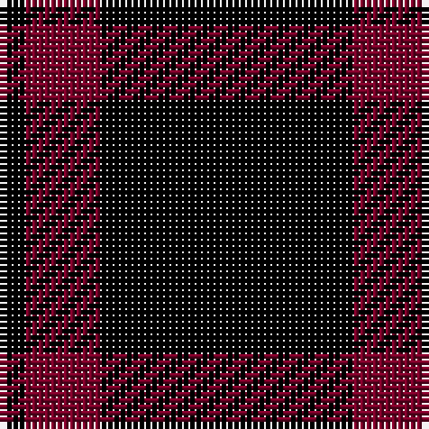

In pattern [KRK](/patterns/krk/).

This was sourced from register-of-tartans.  It is a [3 stripes tartan](/stripes/stripes3/).

Original link https://www.tartanregister.gov.uk/tartanDetails.aspx?ref=3480

## Thread count
K/4 DR12 K/40

## Palette
Each colour and its ΔE from the base-6 reference it is a variant of.

| Colour | Shade | Base | ΔE (OKLab) |
|---|---|---|---|
| DR | <code style="background-color:#780028;">#780028</code> `#780028` | R <code style="background-color:#CC0000;">#CC0000</code> | 0.19 |
| K | <code style="background-color:#000000;">#000000</code> `#000000` | K <code style="background-color:#000000;">#000000</code> | 0.00 |

# Sample pattern

## Nearest tartans

The nearest existing variants by ΔTartan distance.

1. [Batson (Personal)](/setts/s3/k69r14y5~k101010-rc80000-ye8c000~x2/) — ΔT 2.15
1. [Unidentified Kirtle](/setts/s5/k55r18k4r18k38~k000000-rc00000/) — ΔT 2.18
1. [St Kilda](/setts/s2/k4r1~k000000-rc00000~x6/) — ΔT 2.20
1. [St Kilda](/setts/s2/k4r1~k101010-rc80000~x36/) — ΔT 2.33
1. [St Kilda District Tartan Tartan Number: 1189. Earliest known date: pre 2003 Reconstructed by Dr Phil Smith from a fragment in the Royal Museum of Antiquities late of Queen Street, Edinburgh. Sample in Glasgow City Museum. No other details. See products available Copyright © Blair Urquhart, Comrie, 2015](/setts/s2/k4r1~k101010-rc80000~x6/) — ΔT 2.33
1. [Loevenstein Castle 2 (Artefact)](/setts/s4/k20b1k4b3~b00008c-k000000~x4/) — ΔT 2.36
1. [Unidentified 11](/setts/s7/k24g3r3k24r2k2r2~g008000-k000000-rc00000/) — ΔT 2.45
1. [Staines (2013)](/setts/s3/b1k12b1~b0000cd-k101010~x10/) — ΔT 2.48
1. [Unidentified Kirtle](/setts/s5/k55r18k4r18k38~k101010-rdc0000/) — ΔT 2.48
1. [Romsdal, Tresfjord](/setts/s5/k2r4k7ra1k1~k000000-r800000-rac00000~x2/) — ΔT 2.48

## Neighbour map

Every grey dot is one of 15726 variants placed by the first two principal components of the ΔTartan feature space (44% of its variance). Red is this tartan; blue dots are its nearest — click one to open its page.

<svg viewBox="0 0 640 380" role="img" style="max-width:100%;height:auto;border:1px solid #e0e0e0;border-radius:4px;display:block" xmlns="http://www.w3.org/2000/svg"><image href="/nn/cloud.v1.png" width="640" height="380"/><a href="/setts/s3/k69r14y5~k101010-rc80000-ye8c000~x2/"><circle cx="513.3" cy="252.8" r="4" fill="#3465a4"><title>Batson (Personal)</title></circle></a><a href="/setts/s5/k55r18k4r18k38~k000000-rc00000/"><circle cx="456.5" cy="270.1" r="4" fill="#3465a4"><title>Unidentified Kirtle</title></circle></a><a href="/setts/s2/k4r1~k000000-rc00000~x6/"><circle cx="480.6" cy="366.0" r="4" fill="#3465a4"><title>St Kilda</title></circle></a><a href="/setts/s2/k4r1~k101010-rc80000~x36/"><circle cx="505.3" cy="366.0" r="4" fill="#3465a4"><title>St Kilda</title></circle></a><a href="/setts/s2/k4r1~k101010-rc80000~x6/"><circle cx="505.3" cy="366.0" r="4" fill="#3465a4"><title>St Kilda District Tartan Tartan Number: 1189. Earliest known date: pre 2003 Reconstructed by Dr Phil Smith from a fragment in the Royal Museum of Antiquities late of Queen Street, Edinburgh. Sample in Glasgow City Museum. No other details. See products available Copyright © Blair Urquhart, Comrie, 2015</title></circle></a><a href="/setts/s4/k20b1k4b3~b00008c-k000000~x4/"><circle cx="626.0" cy="280.3" r="4" fill="#3465a4"><title>Loevenstein Castle 2 (Artefact)</title></circle></a><a href="/setts/s7/k24g3r3k24r2k2r2~g008000-k000000-rc00000/"><circle cx="547.0" cy="224.8" r="4" fill="#3465a4"><title>Unidentified 11</title></circle></a><a href="/setts/s3/b1k12b1~b0000cd-k101010~x10/"><circle cx="626.0" cy="301.6" r="4" fill="#3465a4"><title>Staines (2013)</title></circle></a><a href="/setts/s5/k55r18k4r18k38~k101010-rdc0000/"><circle cx="468.9" cy="267.3" r="4" fill="#3465a4"><title>Unidentified Kirtle</title></circle></a><a href="/setts/s5/k2r4k7ra1k1~k000000-r800000-rac00000~x2/"><circle cx="385.8" cy="271.2" r="4" fill="#3465a4"><title>Romsdal, Tresfjord</title></circle></a><circle cx="549.1" cy="312.7" r="5" fill="#c00000"/></svg>

ID: /setts/s3/k10r3k1~k000000-r780028~x4/
