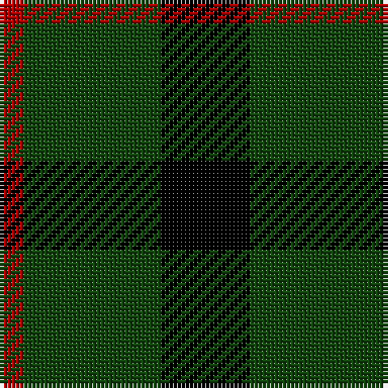

This page is one **sett** — a single exact thread-count. It belongs to the [tartan](/tartans/k11dg17dr3/)
(the same proportion at any scale), whose colour order is pattern [KGR](/stripes/kgr/).

Sourced from weddslist.  It is a [3 stripe tartan](/stripes/stripes3/).

Original link http://www.weddslist.com/cgi-bin/tartans/pg.pl?source=tinsel

## Thread count
K/22 DG34 DR/6

## Palette
Each colour and the base-6 reference it is a variant of.

| Colour | Shade | Base |
|---|---|---|
| DG | <code style="background-color:#11450D;">#11450D</code> `oklch(34.4% 0.101 142.1)` <small>#11450D</small> | G <code style="background-color:#006100;">#006100</code> |
| DR | <code style="background-color:#AA0000;">#AA0000</code> `oklch(46.3% 0.190 29.2)` <small>#AA0000</small> | R <code style="background-color:#CC0000;">#CC0000</code> |
| K | <code style="background-color:#000000;">#000000</code> `oklch(0.0% 0.000 0.0)` <small>#000000</small> | K <code style="background-color:#000000;">#000000</code> |

# Sample pattern

## Nearest tartans

The nearest existing variants by ΔTartan distance, with this tartan at the top so the swatches line up against it.

ΔTartan

Tartan

Sett

—

<a href="/ttd/edit/#slug=k11dg17r3~x2">Kincaid</a> <a class="nn-out" href="/setts/s3/k11dg17r3~x2/" title="open its dictionary page">↗</a>

0.44

<a href="/ttd/edit/#slug=k11dg17r3">Kincaid</a> <a class="nn-out" href="/setts/s3/k11dg17r3/" title="open its dictionary page">↗</a>

1.30

<a href="/ttd/edit/#slug=k3g15k20ly3~x2">Scotch Tape 2 (Corporate)</a> <a class="nn-out" href="/setts/s4/k3g15k20ly3~x2/" title="open its dictionary page">↗</a>

1.41

<a href="/ttd/edit/#slug=k5g6t1~x4">Wilson's No.050</a> <a class="nn-out" href="/setts/s3/k5g6t1~x4/" title="open its dictionary page">↗</a>

1.41

<a href="/ttd/edit/#slug=k1dg8k8ly1">Wallace Hunting</a> <a class="nn-out" href="/setts/s4/k1dg8k8ly1/" title="open its dictionary page">↗</a>

1.44

<a href="/ttd/edit/#slug=g5k6t1~x4">Wilson's, No 50</a> <a class="nn-out" href="/setts/s3/g5k6t1~x4/" title="open its dictionary page">↗</a>

1.54

<a href="/ttd/edit/#slug=k11g16r2~x4">Kincaid of Kincaid (Clan)</a> <a class="nn-out" href="/setts/s3/k11g16r2~x4/" title="open its dictionary page">↗</a>

1.56

<a href="/ttd/edit/#slug=g9k18r2~x4">Cowie, Justine (Personal)</a> <a class="nn-out" href="/setts/s3/g9k18r2~x4/" title="open its dictionary page">↗</a>

1.62

<a href="/ttd/edit/#slug=k4g6r1~x10">Kincaid, of Kincaid</a> <a class="nn-out" href="/setts/s3/k4g6r1~x10/" title="open its dictionary page">↗</a>

1.68

<a href="/ttd/edit/#slug=g6dp5t1~x4">Wilson's No.055</a> <a class="nn-out" href="/setts/s3/g6dp5t1~x4/" title="open its dictionary page">↗</a>

1.69

<a href="/ttd/edit/#slug=k5g4ly1~x2">Wilson's, No 2/53 or Mull</a> <a class="nn-out" href="/setts/s3/k5g4ly1~x2/" title="open its dictionary page">↗</a>

## Neighbour map

Every grey dot is one of 14299 variants placed by the first two principal components of the ΔTartan feature space (44% of its variance). Red is this tartan; blue dots are its nearest — click one to open its page.

<svg viewBox="0 0 640 380" role="img" style="max-width:100%;height:auto;border:1px solid #e0e0e0;border-radius:4px;display:block" xmlns="http://www.w3.org/2000/svg"><image href="/nn/cloud.v1.png" width="640" height="380"/><a href="/setts/s3/k11dg17r3/"><circle cx="283.5" cy="314.9" r="4" fill="#3465a4"><title>Kincaid</title></circle></a><a href="/setts/s4/k3g15k20ly3~x2/"><circle cx="311.9" cy="278.6" r="4" fill="#3465a4"><title>Scotch Tape 2 (Corporate)</title></circle></a><a href="/setts/s3/k5g6t1~x4/"><circle cx="284.7" cy="325.3" r="4" fill="#3465a4"><title>Wilson's No.050</title></circle></a><a href="/setts/s4/k1dg8k8ly1/"><circle cx="302.7" cy="272.6" r="4" fill="#3465a4"><title>Wallace Hunting</title></circle></a><a href="/setts/s3/g5k6t1~x4/"><circle cx="238.7" cy="305.7" r="4" fill="#3465a4"><title>Wilson's, No 50</title></circle></a><a href="/setts/s3/k11g16r2~x4/"><circle cx="339.1" cy="313.7" r="4" fill="#3465a4"><title>Kincaid of Kincaid (Clan)</title></circle></a><a href="/setts/s3/g9k18r2~x4/"><circle cx="343.3" cy="277.5" r="4" fill="#3465a4"><title>Cowie, Justine (Personal)</title></circle></a><a href="/setts/s3/k4g6r1~x10/"><circle cx="258.1" cy="299.0" r="4" fill="#3465a4"><title>Kincaid, of Kincaid</title></circle></a><a href="/setts/s3/g6dp5t1~x4/"><circle cx="289.9" cy="319.0" r="4" fill="#3465a4"><title>Wilson's No.055</title></circle></a><a href="/setts/s3/k5g4ly1~x2/"><circle cx="218.0" cy="309.3" r="4" fill="#3465a4"><title>Wilson's, No 2/53 or Mull</title></circle></a><circle cx="295.0" cy="320.3" r="5" fill="#c00000"/></svg>

ID: /setts/s3/k11dg17r3~x2/
