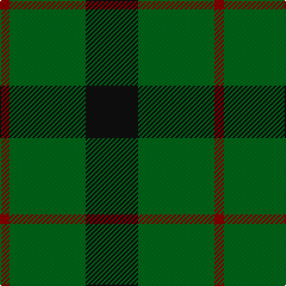

In pattern [KGR](/patterns/kgr/).

This was sourced from tartans-authority.  It is a [3 stripes tartan](/stripes/stripes3/).

Original link http://www.tartansauthority.com/tartan-ferret/display/1106/

## Thread count
DR/8 G64 K/44

## Palette
Each colour and its ΔE from the base-6 reference it is a variant of.

| Colour | Shade | Base | ΔE (OKLab) |
|---|---|---|---|
| DR | <code style="background-color:#880000;">#880000</code> `#880000` | R <code style="background-color:#CC0000;">#CC0000</code> | 0.15 |
| G | <code style="background-color:#006818;">#006818</code> `#006818` | G <code style="background-color:#006100;">#006100</code> | 0.02 |
| K | <code style="background-color:#101010;">#101010</code> `#101010` | K <code style="background-color:#000000;">#000000</code> | 0.17 |

# Sample pattern

## Nearest tartans

The nearest existing variants by ΔTartan distance.

1. [Kincaid of Kincaid Family Tartan Tartan Number: 1106. Earliest known date: pre 2003 This sample comes from the MacGregor-Hastie collection which forms the basis of the cloth archive of the Scottish Tartans Society. Some of the samples, including this one, were unmarked. One can assume that the sample dates between 1930 and 1950. See products available Copyright © Blair Urquhart, Comrie, 2015](/setts/s3/k4g6r1x10~g006818-k101010-rc80000/) — ΔT 0.68
1. [Wilson's No.050](/setts/s3/k5g6b1x4~b5c8ca8-g006818-k101010/) — ΔT 0.85
1. [MacArthur-Fox Family Tartan Tartan Number: 1088. Earliest known date: 1986 This is the older of the two MacArthur setts, which links the clan with the Campbells. See products available Copyright © Blair Urquhart, Comrie, 2015](/setts/s5/k19g8k10g31r3~g006818-k101010-rc80000/) — ΔT 1.21
1. [Red Watch (Fashion) #1](/setts/s4/g6k2r3k1x4~g006818-k101010-r880000/) — ΔT 1.35
1. [Scotch Tape (Corporate)](/setts/s3/g30k20g3x2~g006818-k101010/) — ΔT 1.36
1. [Wallace Hunting Clan Tartan Tartan Number: 1101. Earliest known date: pre 2003 The design comes from the Vestiarium Scoticum (1842). The authors, the Sobieski Stuart brothers, enjoyed a popular following among the Scottish gentry in the early Victorian era, and in the spirit of the times, added mystery, romance and some spurious historical documentation to the subject of tartan. Of the better known tartans, the book offers some minor variation, but in other cases it provides the only recorded version of many tartans in use today. See products available Copyright © Blair Urquhart, Comrie, 2015](/setts/s4/k4g33k33y4x2~g006818-k101010-ye8c000/) — ΔT 1.37
1. [Ferguson, (Old)](/setts/s3/g17r2b15x2~b304080-g008000-rc00000/) — ΔT 1.38
1. [MacArthur-Fox (Personal)](/setts/s5/k8g3k4g20r4x2~g006818-k101010-r880000/) — ΔT 1.41
1. [Wilson's No 84, Ferguson](/setts/s3/b5g6r1x4~b304080-g008000-rc00000/) — ΔT 1.44
1. [Wilson's No.055](/setts/s3/g6b5ba1x4~b440044-ba5c8ca8-g006818/) — ΔT 1.45

## Neighbour map

Every grey dot is one of 15726 variants placed by the first two principal components of the ΔTartan feature space (44% of its variance). Red is this tartan; blue dots are its nearest — click one to open its page.

<svg viewBox="0 0 640 380" role="img" style="max-width:100%;height:auto;border:1px solid #e0e0e0;border-radius:4px;display:block" xmlns="http://www.w3.org/2000/svg"><image href="/nn/cloud.v1.png" width="640" height="380"/><a href="/setts/s3/k4g6r1x10~g006818-k101010-rc80000/"><circle cx="302.8" cy="319.9" r="4" fill="#3465a4"><title>Kincaid of Kincaid Family Tartan Tartan Number: 1106. Earliest known date: pre 2003 This sample comes from the MacGregor-Hastie collection which forms the basis of the cloth archive of the Scottish Tartans Society. Some of the samples, including this one, were unmarked. One can assume that the sample dates between 1930 and 1950. See products available Copyright © Blair Urquhart, Comrie, 2015</title></circle></a><a href="/setts/s3/k5g6b1x4~b5c8ca8-g006818-k101010/"><circle cx="281.9" cy="324.8" r="4" fill="#3465a4"><title>Wilson's No.050</title></circle></a><a href="/setts/s5/k19g8k10g31r3~g006818-k101010-rc80000/"><circle cx="344.7" cy="270.3" r="4" fill="#3465a4"><title>MacArthur-Fox Family Tartan Tartan Number: 1088. Earliest known date: 1986 This is the older of the two MacArthur setts, which links the clan with the Campbells. See products available Copyright © Blair Urquhart, Comrie, 2015</title></circle></a><a href="/setts/s4/g6k2r3k1x4~g006818-k101010-r880000/"><circle cx="281.8" cy="299.8" r="4" fill="#3465a4"><title>Red Watch (Fashion) #1</title></circle></a><a href="/setts/s3/g30k20g3x2~g006818-k101010/"><circle cx="417.9" cy="323.8" r="4" fill="#3465a4"><title>Scotch Tape (Corporate)</title></circle></a><a href="/setts/s4/k4g33k33y4x2~g006818-k101010-ye8c000/"><circle cx="307.2" cy="271.1" r="4" fill="#3465a4"><title>Wallace Hunting Clan Tartan Tartan Number: 1101. Earliest known date: pre 2003 The design comes from the Vestiarium Scoticum (1842). The authors, the Sobieski Stuart brothers, enjoyed a popular following among the Scottish gentry in the early Victorian era, and in the spirit of the times, added mystery, romance and some spurious historical documentation to the subject of tartan. Of the better known tartans, the book offers some minor variation, but in other cases it provides the only recorded version of many tartans in use today. See products available Copyright © Blair Urquhart, Comrie, 2015</title></circle></a><a href="/setts/s3/g17r2b15x2~b304080-g008000-rc00000/"><circle cx="315.9" cy="307.3" r="4" fill="#3465a4"><title>Ferguson, (Old)</title></circle></a><a href="/setts/s5/k8g3k4g20r4x2~g006818-k101010-r880000/"><circle cx="353.7" cy="276.3" r="4" fill="#3465a4"><title>MacArthur-Fox (Personal)</title></circle></a><a href="/setts/s3/b5g6r1x4~b304080-g008000-rc00000/"><circle cx="289.2" cy="322.3" r="4" fill="#3465a4"><title>Wilson's No 84, Ferguson</title></circle></a><a href="/setts/s3/g6b5ba1x4~b440044-ba5c8ca8-g006818/"><circle cx="287.7" cy="319.2" r="4" fill="#3465a4"><title>Wilson's No.055</title></circle></a><circle cx="336.8" cy="312.7" r="5" fill="#c00000"/></svg>

ID: /setts/s3/k11g16r2x4~g006818-k101010-r880000/
