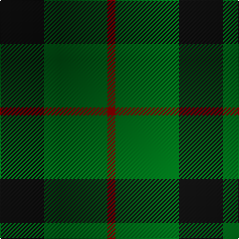

In pattern [KGR](/stripes/kgr/).

This was sourced from tartans-authority.  It is a [3 stripe tartan](/stripes/stripes3/).

Original link http://www.tartansauthority.com/tartan-ferret/display/1106/

## Thread count
K/44 G64 DR/8

## Palette
Each colour and its ΔE from the base-6 reference it is a variant of.

| Colour | Shade | Base | ΔE (OKLab) |
|---|---|---|---|
| DR | <code style="background-color:#880000;">#880000</code> `#880000` | R <code style="background-color:#CC0000;">#CC0000</code> | 0.15 |
| G | <code style="background-color:#006818;">#006818</code> `#006818` | G <code style="background-color:#006100;">#006100</code> | 0.02 |
| K | <code style="background-color:#101010;">#101010</code> `#101010` | K <code style="background-color:#000000;">#000000</code> | 0.17 |

# Sample pattern

## Nearest tartans

The nearest existing variants by ΔTartan distance.

1. [Wilson's No.050](/setts/s3/k5g6t1~x4/) — ΔT 0.84
1. [Red Watch (Fashion) #1](/setts/s4/g6k2r3k1~x4/) — ΔT 1.35
1. [Scotch Tape (Corporate)](/setts/s3/g30k20g3~x2/) — ΔT 1.36
1. [MacArthur-Fox (Personal)](/setts/s5/k8g3k4g20r4~x2/) — ΔT 1.41
1. [Wilson's No 84, Ferguson](/setts/s3/db5g6r1~x4/) — ΔT 1.44
1. [Scotch Tape 2 (Corporate)](/setts/s4/k3g15k20ly3~x2/) — ΔT 1.45
1. [Wilson's No.055](/setts/s3/g6dp5t1~x4/) — ΔT 1.45
1. [Bumbee #1 (Fashion)](/setts/s4/g10k2dp5g1~x8/) — ΔT 1.51
1. [Wilson's No.053 #2](/setts/s4/g4k5g4ly1~x2/) — ΔT 1.52
1. [Kincaid](/setts/s3/k11dg17r3~x2/) — ΔT 1.54

## Neighbour map

Every grey dot is one of 14299 variants placed by the first two principal components of the ΔTartan feature space (44% of its variance). Red is this tartan; blue dots are its nearest — click one to open its page.

<svg viewBox="0 0 640 380" role="img" style="max-width:100%;height:auto;border:1px solid #e0e0e0;border-radius:4px;display:block" xmlns="http://www.w3.org/2000/svg"><image href="/nn/cloud.v1.png" width="640" height="380"/><a href="/setts/s3/k5g6t1~x4/"><circle cx="284.7" cy="325.3" r="4" fill="#3465a4"><title>Wilson's No.050</title></circle></a><a href="/setts/s4/g6k2r3k1~x4/"><circle cx="283.7" cy="301.5" r="4" fill="#3465a4"><title>Red Watch (Fashion) #1</title></circle></a><a href="/setts/s3/g30k20g3~x2/"><circle cx="420.2" cy="323.5" r="4" fill="#3465a4"><title>Scotch Tape (Corporate)</title></circle></a><a href="/setts/s5/k8g3k4g20r4~x2/"><circle cx="355.9" cy="277.8" r="4" fill="#3465a4"><title>MacArthur-Fox (Personal)</title></circle></a><a href="/setts/s3/db5g6r1~x4/"><circle cx="291.6" cy="323.6" r="4" fill="#3465a4"><title>Wilson's No 84, Ferguson</title></circle></a><a href="/setts/s4/k3g15k20ly3~x2/"><circle cx="311.9" cy="278.6" r="4" fill="#3465a4"><title>Scotch Tape 2 (Corporate)</title></circle></a><a href="/setts/s3/g6dp5t1~x4/"><circle cx="289.9" cy="319.0" r="4" fill="#3465a4"><title>Wilson's No.055</title></circle></a><a href="/setts/s4/g10k2dp5g1~x8/"><circle cx="355.8" cy="263.8" r="4" fill="#3465a4"><title>Bumbee #1 (Fashion)</title></circle></a><a href="/setts/s4/g4k5g4ly1~x2/"><circle cx="279.5" cy="327.5" r="4" fill="#3465a4"><title>Wilson's No.053 #2</title></circle></a><a href="/setts/s3/k11dg17r3~x2/"><circle cx="295.0" cy="320.3" r="4" fill="#3465a4"><title>Kincaid</title></circle></a><circle cx="339.1" cy="313.7" r="5" fill="#c00000"/></svg>

ID: /setts/s3/k11g16r2~x4/
