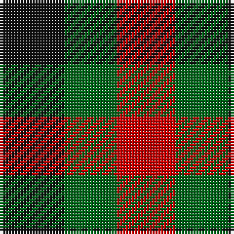

This page is one **sett** — a single exact thread-count. It belongs to the [tartan](/tartans/k11g9r10/)
(the same proportion at any scale), whose colour order is pattern [KGR](/stripes/kgr/).

Sourced from register-of-tartans.  It is a [3 stripe tartan](/stripes/stripes3/).

Original link https://www.tartanregister.gov.uk/tartanDetails.aspx?ref=4736

## Register references

External register numbers recorded for this tartan.

- Scottish Register of Tartans: [4736](https://www.tartanregister.gov.uk/tartanDetails.aspx?ref=4736)
- Scottish Tartans Authority (ITI): 2030
- Scottish Tartans World Register: 2030

## Thread count
K/22 G18 R/20

## Palette

Palette: <strong>Tartan Register</strong>
<table><thead><tr><th>Colour</th><th>Threads</th><th>Shade</th><th>Base</th><th>OKLCh</th></tr></thead><tbody><tr><td>K/</td><td style="text-align:right;font-variant-numeric:tabular-nums">22</td><td><code style="background-color:#101010;">#101010</code> <small style="color:#888">#101010</small></td><td>K <code style="background-color:#000000;">#000000</code></td><td><small style="color:#888">oklch(17.3% 0.000 89.9)</small></td></tr><tr><td>G</td><td style="text-align:right;font-variant-numeric:tabular-nums">18</td><td><code style="background-color:#006818;">#006818</code> <small style="color:#888">#006818</small></td><td>G <code style="background-color:#006100;">#006100</code></td><td><small style="color:#888">oklch(45.0% 0.142 145.0)</small></td></tr><tr><td>R/</td><td style="text-align:right;font-variant-numeric:tabular-nums">20</td><td><code style="background-color:#C80000;">#C80000</code> <small style="color:#888">#C80000</small></td><td>R <code style="background-color:#CC0000;">#CC0000</code></td><td><small style="color:#888">oklch(52.3% 0.215 29.2)</small></td></tr></tbody></table>

# Sample pattern

## Nearest tartans

The nearest existing variants by ΔTartan distance, with this tartan at the top so the swatches line up against it.

ΔTartan

Tartan

Sett

—

<a href="/ttd/edit/#slug=k11g9r10~x2">Wilson's No.204</a> <a class="nn-out" href="/setts/s3/k11g9r10~x2/" title="open its dictionary page">↗</a>

1.13

<a href="/ttd/edit/#slug=r10k11g9~x2">Wilson's, No 204</a> <a class="nn-out" href="/setts/s3/r10k11g9~x2/" title="open its dictionary page">↗</a>

1.46

<a href="/ttd/edit/#slug=k1g1r1~x8">Wilson's, No 187</a> <a class="nn-out" href="/setts/s3/k1g1r1~x8/" title="open its dictionary page">↗</a>

1.54

<a href="/ttd/edit/#slug=k11g9dp10~x2">Wilson's No.185</a> <a class="nn-out" href="/setts/s3/k11g9dp10~x2/" title="open its dictionary page">↗</a>

1.73

<a href="/ttd/edit/#slug=k11p10g9~x2">Wilson's, No 185</a> <a class="nn-out" href="/setts/s3/k11p10g9~x2/" title="open its dictionary page">↗</a>

1.73

<a href="/ttd/edit/#slug=dr1o1dr1o1dg1~x8">Ballindalloch Check</a> <a class="nn-out" href="/setts/s5/dr1o1dr1o1dg1~x8/" title="open its dictionary page">↗</a>

1.78

<a href="/ttd/edit/#slug=lo5db5k3~x4">Kazakhstan Relic (Artefact)</a> <a class="nn-out" href="/setts/s3/lo5db5k3~x4/" title="open its dictionary page">↗</a>

1.81

<a href="/setts/s4/k1g1r1~x8/">Wilson's No.187</a>

1.90

<a href="/ttd/edit/#slug=k1lb1o1~x6">Coigach Tweed</a> <a class="nn-out" href="/setts/s3/k1lb1o1~x6/" title="open its dictionary page">↗</a>

1.97

<a href="/ttd/edit/#slug=r4k7g4~x2">Wilson's No.200</a> <a class="nn-out" href="/setts/s3/r4k7g4~x2/" title="open its dictionary page">↗</a>

2.04

<a href="/ttd/edit/#slug=k1w1r1~x14">Dacre Estate Check</a> <a class="nn-out" href="/setts/s3/k1w1r1~x14/" title="open its dictionary page">↗</a>

## Neighbour map

Every grey dot is one of 14359 variants placed by the first two principal components of the ΔTartan feature space (44% of its variance). Red is this tartan; blue dots are its nearest — click one to open its page.

<svg viewBox="0 0 640 380" role="img" style="max-width:100%;height:auto;border:1px solid #e0e0e0;border-radius:4px;display:block" xmlns="http://www.w3.org/2000/svg"><image href="/nn/cloud.v1.png" width="640" height="380"/><a href="/setts/s3/r10k11g9~x2/"><circle cx="34.8" cy="366.0" r="4" fill="#3465a4"><title>Wilson's, No 204</title></circle></a><a href="/setts/s3/k1g1r1~x8/"><circle cx="14.0" cy="366.0" r="4" fill="#3465a4"><title>Wilson's, No 187</title></circle></a><a href="/setts/s3/k11g9dp10~x2/"><circle cx="78.3" cy="366.0" r="4" fill="#3465a4"><title>Wilson's No.185</title></circle></a><a href="/setts/s3/k11p10g9~x2/"><circle cx="36.2" cy="366.0" r="4" fill="#3465a4"><title>Wilson's, No 185</title></circle></a><a href="/setts/s5/dr1o1dr1o1dg1~x8/"><circle cx="67.6" cy="366.0" r="4" fill="#3465a4"><title>Ballindalloch Check</title></circle></a><a href="/setts/s3/lo5db5k3~x4/"><circle cx="94.2" cy="366.0" r="4" fill="#3465a4"><title>Kazakhstan Relic (Artefact)</title></circle></a><a href="/setts/s4/k1g1r1~x8/"><circle cx="89.9" cy="366.0" r="4" fill="#3465a4"><title>Wilson's No.187</title></circle></a><a href="/setts/s3/k1lb1o1~x6/"><circle cx="14.0" cy="366.0" r="4" fill="#3465a4"><title>Coigach Tweed</title></circle></a><a href="/setts/s3/r4k7g4~x2/"><circle cx="158.9" cy="366.0" r="4" fill="#3465a4"><title>Wilson's No.200</title></circle></a><a href="/setts/s3/k1w1r1~x14/"><circle cx="14.0" cy="366.0" r="4" fill="#3465a4"><title>Dacre Estate Check</title></circle></a><circle cx="64.0" cy="366.0" r="5" fill="#c00000"/></svg>

ID: /setts/s3/k11g9r10~x2/
