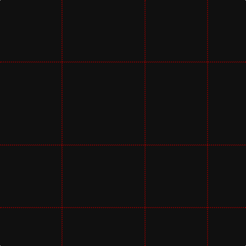

In pattern [KRK](/patterns/krk/).

This was sourced from register-of-tartans.  It is a [3 stripes tartan](/stripes/stripes3/).

Original link https://www.tartanregister.gov.uk/tartanDetails.aspx?ref=10194

## Attestations

This cloth appears in 3 source records; the oldest owns this page.

- 20/03/2010 — Bodog (register-of-tartans, [record](https://www.tartanregister.gov.uk/tartanDetails.aspx?ref=10194))
- 20th March 2010 — Bodog (Corporate) (tartans-authority, [record](http://www.tartansauthority.com/tartan-ferret/display/10194/))
- undated — Bodog Corporate Tartan Tartan Number: 10194. Earliest known date: 20th March 2010 The red stripe which delineates the 3 and 4 inch squares, is intended to be almost invisible in certain lights. This design supercedes the original bodog.com tartan (STR ref: 306, STA ref:6889) to reflect the new brand licensing model that now controls all the intellectual property of bodogbrand.com. See products available Copyright © Blair Urquhart, Comrie, 2015 (house-of-tartan, [record](http://www.house-of-tartan.scotland.net/house/TartanViewjs.asp?colr=Def&tnam=10194))

## Thread count
K/120 DR2 K/160

## Palette
Each colour and its ΔE from the base-6 reference it is a variant of.

| Colour | Shade | Base | ΔE (OKLab) |
|---|---|---|---|
| DR | <code style="background-color:#880000;">#880000</code> `#880000` | R <code style="background-color:#C80000;">#C80000</code> | 0.14 |
| K | <code style="background-color:#101010;">#101010</code> `#101010` | K <code style="background-color:#000000;">#000000</code> | 0.17 |

# Sample pattern

## Nearest tartans

The nearest existing variants by ΔTartan distance.

1. [Black Shadow (Fashion)](/setts/s2/k120b6-b244c74-k101010/) — ΔT 3.18
1. [Castle Fraser Check](/setts/s3/g60r3g12-g004c00-rc02000/) — ΔT 4.62
1. [Staines](/setts/s2/b120k10-b202060-k101010/) — ΔT 4.95
1. [Lochaber, Old..](/setts/s7/b12r4b140r4b64ba4b8-b304080-ba5480b0-rc00000/) — ΔT 5.05
1. [Alich (Personal)](/setts/s4/k200r4b12ba4-b003c64-ba780078-k101010-rc80000/) — ΔT 5.26
1. [Alich (Personal)](/setts/s4/k200r4b12ba4-b000080-ba551a8b-k101010-rd41a1f/) — ΔT 5.43
1. [Lochaber Old](/setts/s7/b12r4b140r4b64ba4b8-b2c4084-ba3c82af-rdc0000/) — ΔT 5.44
1. [Allt Dubh (Black Burn)](/setts/s6/k198r10k8r6k4g2-g5c6428-k101010-r901c38/) — ΔT 5.53
1. [Outlander #4](/setts/s3/b108ba12b68-b4c3428-ba5c5c5c/) — ΔT 5.61
1. [St. David's (District)](/setts/s6/g60r2g8r1g5k2-g003820-k000000-rc80000/) — ΔT 5.63

## Neighbour map

Every grey dot is one of 15726 variants placed by the first two principal components of the ΔTartan feature space (44% of its variance). Red is this tartan; blue dots are its nearest — click one to open its page.

<svg viewBox="0 0 640 380" role="img" style="max-width:100%;height:auto;border:1px solid #e0e0e0;border-radius:4px;display:block" xmlns="http://www.w3.org/2000/svg"><image href="/nn/cloud.v1.png" width="640" height="380"/><a href="/setts/s2/k120b6-b244c74-k101010/"><circle cx="626.0" cy="357.6" r="4" fill="#3465a4"><title>Black Shadow (Fashion)</title></circle></a><a href="/setts/s3/g60r3g12-g004c00-rc02000/"><circle cx="626.0" cy="317.7" r="4" fill="#3465a4"><title>Castle Fraser Check</title></circle></a><a href="/setts/s2/b120k10-b202060-k101010/"><circle cx="626.0" cy="366.0" r="4" fill="#3465a4"><title>Staines</title></circle></a><a href="/setts/s7/b12r4b140r4b64ba4b8-b304080-ba5480b0-rc00000/"><circle cx="626.0" cy="219.8" r="4" fill="#3465a4"><title>Lochaber, Old..</title></circle></a><a href="/setts/s4/k200r4b12ba4-b003c64-ba780078-k101010-rc80000/"><circle cx="626.0" cy="207.4" r="4" fill="#3465a4"><title>Alich (Personal)</title></circle></a><a href="/setts/s4/k200r4b12ba4-b000080-ba551a8b-k101010-rd41a1f/"><circle cx="626.0" cy="204.2" r="4" fill="#3465a4"><title>Alich (Personal)</title></circle></a><a href="/setts/s7/b12r4b140r4b64ba4b8-b2c4084-ba3c82af-rdc0000/"><circle cx="626.0" cy="211.6" r="4" fill="#3465a4"><title>Lochaber Old</title></circle></a><a href="/setts/s6/k198r10k8r6k4g2-g5c6428-k101010-r901c38/"><circle cx="626.0" cy="185.1" r="4" fill="#3465a4"><title>Allt Dubh (Black Burn)</title></circle></a><a href="/setts/s3/b108ba12b68-b4c3428-ba5c5c5c/"><circle cx="626.0" cy="366.0" r="4" fill="#3465a4"><title>Outlander #4</title></circle></a><a href="/setts/s6/g60r2g8r1g5k2-g003820-k000000-rc80000/"><circle cx="626.0" cy="192.2" r="4" fill="#3465a4"><title>St. David's (District)</title></circle></a><circle cx="626.0" cy="348.6" r="5" fill="#c00000"/></svg>

ID: /setts/s3/k160r2k120-k101010-r880000/
