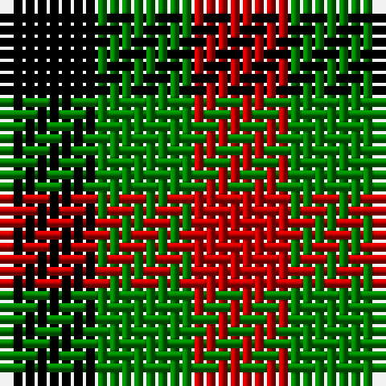

This page is one **sett** — a single exact thread-count. It belongs to the [tartan](/tartans/k1g1r1/)
(the same proportion at any scale), whose colour order is pattern [KGR](/stripes/kgr/).

Sourced from weddslist.  It is a [3 stripe tartan](/stripes/stripes3/).

Original link http://www.weddslist.com/cgi-bin/tartans/pg.pl?source=sts

## Also known as

This cloth is also recorded under:

- Wilson's, No 187

## Thread count
K/8 G8 R/8

## Palette
Each colour and the base-6 reference it is a variant of.

| Colour | Shade | Base |
|---|---|---|
| G | <code style="background-color:#008000;">#008000</code> `oklch(52.0% 0.177 142.5)` <small>#008000</small> | G <code style="background-color:#006100;">#006100</code> |
| K | <code style="background-color:#000000;">#000000</code> `oklch(0.0% 0.000 0.0)` <small>#000000</small> | K <code style="background-color:#000000;">#000000</code> |
| R | <code style="background-color:#C00000;">#C00000</code> `oklch(50.7% 0.208 29.2)` <small>#C00000</small> | R <code style="background-color:#CC0000;">#CC0000</code> |

# Sample pattern

## Nearest tartans

The nearest existing variants by ΔTartan distance, with this tartan at the top so the swatches line up against it.

ΔTartan

Tartan

Sett

—

<a href="/ttd/edit/#slug=k1g1r1~x8">Wilson's, No 187</a> <a class="nn-out" href="/setts/s3/k1g1r1~x8/" title="open its dictionary page">↗</a>

0.97

<a href="/ttd/edit/#slug=r10k11g9~x2">Wilson's, No 204</a> <a class="nn-out" href="/setts/s3/r10k11g9~x2/" title="open its dictionary page">↗</a>

1.34

<a href="/ttd/edit/#slug=k1lb1o1~x6">Coigach Tweed</a> <a class="nn-out" href="/setts/s3/k1lb1o1~x6/" title="open its dictionary page">↗</a>

1.46

<a href="/ttd/edit/#slug=k11g9r10~x2">Wilson's No.204</a> <a class="nn-out" href="/setts/s3/k11g9r10~x2/" title="open its dictionary page">↗</a>

1.75

<a href="/ttd/edit/#slug=k1w1r1~x14">Dacre Estate Check</a> <a class="nn-out" href="/setts/s3/k1w1r1~x14/" title="open its dictionary page">↗</a>

1.79

<a href="/ttd/edit/#slug=k11p10g9~x2">Wilson's, No 185</a> <a class="nn-out" href="/setts/s3/k11p10g9~x2/" title="open its dictionary page">↗</a>

2.10

<a href="/setts/s4/k1g1r1~x8/">Wilson's No.187</a>

2.16

<a href="/ttd/edit/#slug=k8g7db8~x2">Glen Lyon</a> <a class="nn-out" href="/setts/s3/k8g7db8~x2/" title="open its dictionary page">↗</a>

2.20

<a href="/ttd/edit/#slug=db1lr1r1~x4">Usa</a> <a class="nn-out" href="/setts/s3/db1lr1r1~x4/" title="open its dictionary page">↗</a>

2.29

<a href="/ttd/edit/#slug=r1db1ly1~x40">Mothers Pride</a> <a class="nn-out" href="/setts/s3/r1db1ly1~x40/" title="open its dictionary page">↗</a>

2.37

<a href="/ttd/edit/#slug=dr1o1dr1o1dg1~x8">Ballindalloch Check</a> <a class="nn-out" href="/setts/s5/dr1o1dr1o1dg1~x8/" title="open its dictionary page">↗</a>

## Neighbour map

Every grey dot is one of 14299 variants placed by the first two principal components of the ΔTartan feature space (44% of its variance). Red is this tartan; blue dots are its nearest — click one to open its page.

<svg viewBox="0 0 640 380" role="img" style="max-width:100%;height:auto;border:1px solid #e0e0e0;border-radius:4px;display:block" xmlns="http://www.w3.org/2000/svg"><image href="/nn/cloud.v1.png" width="640" height="380"/><a href="/setts/s3/r10k11g9~x2/"><circle cx="34.9" cy="366.0" r="4" fill="#3465a4"><title>Wilson's, No 204</title></circle></a><a href="/setts/s3/k1lb1o1~x6/"><circle cx="14.0" cy="366.0" r="4" fill="#3465a4"><title>Coigach Tweed</title></circle></a><a href="/setts/s3/k11g9r10~x2/"><circle cx="64.1" cy="366.0" r="4" fill="#3465a4"><title>Wilson's No.204</title></circle></a><a href="/setts/s3/k1w1r1~x14/"><circle cx="14.0" cy="366.0" r="4" fill="#3465a4"><title>Dacre Estate Check</title></circle></a><a href="/setts/s3/k11p10g9~x2/"><circle cx="36.2" cy="366.0" r="4" fill="#3465a4"><title>Wilson's, No 185</title></circle></a><a href="/setts/s4/k1g1r1~x8/"><circle cx="90.0" cy="366.0" r="4" fill="#3465a4"><title>Wilson's No.187</title></circle></a><a href="/setts/s3/k8g7db8~x2/"><circle cx="23.0" cy="366.0" r="4" fill="#3465a4"><title>Glen Lyon</title></circle></a><a href="/setts/s3/db1lr1r1~x4/"><circle cx="14.0" cy="366.0" r="4" fill="#3465a4"><title>Usa</title></circle></a><a href="/setts/s3/r1db1ly1~x40/"><circle cx="14.0" cy="366.0" r="4" fill="#3465a4"><title>Mothers Pride</title></circle></a><a href="/setts/s5/dr1o1dr1o1dg1~x8/"><circle cx="67.6" cy="366.0" r="4" fill="#3465a4"><title>Ballindalloch Check</title></circle></a><circle cx="14.0" cy="366.0" r="5" fill="#c00000"/></svg>

ID: /setts/s3/k1g1r1~x8/
