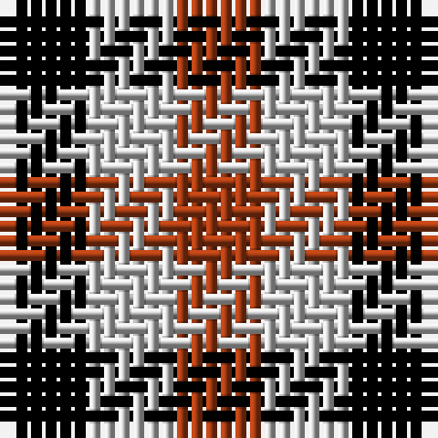

**Bands:** [KWR](/stripes/kwr/) · **Stripes:** [K LB O](/stripes/stripes3/) K LB O

This was sourced from register-of-tartans.  It is a [3 band tartan](/bands/bands3/).

Original link https://www.tartanregister.gov.uk/tartanDetails.aspx?ref=707

## Attestations

This cloth appears in 2 source records; the oldest owns this page.

- 01/01/1847 — Coigach Tweed (register-of-tartans, [record](https://www.tartanregister.gov.uk/tartanDetails.aspx?ref=707))
- 1847 — Coigach Tweed (Estate Check) (tartans-authority, [record](http://www.tartansauthority.com/tartan-ferret/display/4553/))

## Register references

External register numbers recorded for this tartan.

- Scottish Register of Tartans: [707](https://www.tartanregister.gov.uk/tartanDetails.aspx?ref=707)
- Scottish Tartans Authority (ITI): 4553

## Thread count
K/6 N6 T/6

## Palette
Each colour and its ΔE from the base-6 reference it is a variant of.

| Colour | Shade | Base | ΔE (OKLab) |
|---|---|---|---|
| K | <code style="background-color:#000000;">#000000</code> `#000000` | K <code style="background-color:#000000;">#000000</code> | 0.00 |
| N | <code style="background-color:#C8C8C8;">#C8C8C8</code> `#C8C8C8` | W <code style="background-color:#F7F7F7;">#F7F7F7</code> | 0.14 |
| T | <code style="background-color:#A43C14;">#A43C14</code> `#A43C14` | R <code style="background-color:#CC0000;">#CC0000</code> | 0.08 |

# Sample pattern

## Nearest tartans

The nearest existing variants by ΔTartan distance.

1. [Dacre Estate Check](/setts/s3/k1w1r1~x14/) — ΔT 0.51
1. [Usa](/setts/s3/db1lr1r1~x4/) — ΔT 1.19
1. [Wilson's, No 187](/setts/s3/k1g1r1~x8/) — ΔT 1.34
1. [Mothers Pride](/setts/s3/ly1db1r1~x40/) — ΔT 1.58
1. [Wilson's, No 204](/setts/s3/r10k11g9~x2/) — ΔT 1.66
1. [Wilson's, No 185](/setts/s3/k11p10g9~x2/) — ΔT 1.84
1. [Algarve](/setts/s4/db1w1r1dg1~x20/) — ΔT 1.86
1. [Aquascutum](/setts/s3/db1w1r1~x22/) — ΔT 1.86
1. [Wilson's No.204](/setts/s3/k11g9r10~x2/) — ΔT 1.90
1. [Hogg](/setts/s4/k1w1do1w1~x8/) — ΔT 1.91

## Neighbour map

Every grey dot is one of 14313 variants placed by the first two principal components of the ΔTartan feature space (44% of its variance). Red is this tartan; blue dots are its nearest — click one to open its page.

<svg viewBox="0 0 640 380" role="img" style="max-width:100%;height:auto;border:1px solid #e0e0e0;border-radius:4px;display:block" xmlns="http://www.w3.org/2000/svg"><image href="/nn/cloud.v1.png" width="640" height="380"/><a href="/setts/s3/k1w1r1~x14/"><circle cx="14.0" cy="366.0" r="4" fill="#3465a4"><title>Dacre Estate Check</title></circle></a><a href="/setts/s3/db1lr1r1~x4/"><circle cx="14.0" cy="366.0" r="4" fill="#3465a4"><title>Usa</title></circle></a><a href="/setts/s3/k1g1r1~x8/"><circle cx="14.0" cy="366.0" r="4" fill="#3465a4"><title>Wilson's, No 187</title></circle></a><a href="/setts/s3/ly1db1r1~x40/"><circle cx="14.0" cy="366.0" r="4" fill="#3465a4"><title>Mothers Pride</title></circle></a><a href="/setts/s3/r10k11g9~x2/"><circle cx="34.5" cy="366.0" r="4" fill="#3465a4"><title>Wilson's, No 204</title></circle></a><a href="/setts/s3/k11p10g9~x2/"><circle cx="35.6" cy="366.0" r="4" fill="#3465a4"><title>Wilson's, No 185</title></circle></a><a href="/setts/s4/db1w1r1dg1~x20/"><circle cx="14.0" cy="366.0" r="4" fill="#3465a4"><title>Algarve</title></circle></a><a href="/setts/s3/db1w1r1~x22/"><circle cx="14.0" cy="366.0" r="4" fill="#3465a4"><title>Aquascutum</title></circle></a><a href="/setts/s3/k11g9r10~x2/"><circle cx="63.7" cy="366.0" r="4" fill="#3465a4"><title>Wilson's No.204</title></circle></a><a href="/setts/s4/k1w1do1w1~x8/"><circle cx="35.3" cy="366.0" r="4" fill="#3465a4"><title>Hogg</title></circle></a><circle cx="14.0" cy="366.0" r="5" fill="#c00000"/></svg>

ID: /setts/s3/k1lb1o1~x6/
