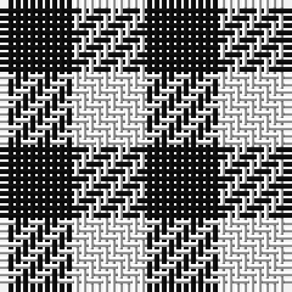

**Bands:** [KWK](/stripes/kwk/) · **Stripes:** [K W K](/stripes/stripes3/) K W K

This was sourced from register-of-tartans.  It is a [3 band tartan](/bands/bands3/).

Original link https://www.tartanregister.gov.uk/tartanDetails.aspx?ref=3162

## Register references

External register numbers recorded for this tartan.

- Scottish Register of Tartans: [3162](https://www.tartanregister.gov.uk/tartanDetails.aspx?ref=3162)
- Scottish Tartans Authority (ITI): 6765
- Scottish Tartans World Register: 2444

## Thread count
K/10 W10 K/10

## Palette
Each colour and its ΔE from the base-6 reference it is a variant of.

| Colour | Shade | Base | ΔE (OKLab) |
|---|---|---|---|
| K | <code style="background-color:#101010;">#101010</code> `#101010` | K <code style="background-color:#000000;">#000000</code> | 0.17 |
| W | <code style="background-color:#F8F8F8;">#F8F8F8</code> `#F8F8F8` | W <code style="background-color:#F7F7F7;">#F7F7F7</code> | 0.00 |

# Sample pattern

## Nearest tartans

The nearest existing variants by ΔTartan distance.

1. [Shepherd](/setts/s2/k1w1~x15/) — ΔT 1.63
1. [Shepherd Check](/setts/s2/k1w1~x28/) — ΔT 1.63
1. [Shepherd](/setts/s2/k1lr1/) — ΔT 1.73
1. [Shepherd or Falkirk](/setts/s4/k1w1~x6/) — ΔT 1.82
1. [Shepherd Check (Universal)](/setts/s2/k1w1~x6/) — ΔT 1.82
1. [Falkirk Tartan](/setts/s2/k1w1~x24/) — ΔT 1.97
1. [Wilson's, No 116](/setts/s2/g1p1~x16/) — ΔT 2.32
1. [Wilson's No.172](/setts/s2/k9t8~x2/) — ΔT 2.35
1. [Justus Check (Personal)](/setts/s2/k1ly1~x40/) — ΔT 2.42
1. [Justus Check (Personal)](/setts/s2/k1ly1~x50/) — ΔT 2.42

## Neighbour map

Every grey dot is one of 14299 variants placed by the first two principal components of the ΔTartan feature space (44% of its variance). Red is this tartan; blue dots are its nearest — click one to open its page.

<svg viewBox="0 0 640 380" role="img" style="max-width:100%;height:auto;border:1px solid #e0e0e0;border-radius:4px;display:block" xmlns="http://www.w3.org/2000/svg"><image href="/nn/cloud.v1.png" width="640" height="380"/><a href="/setts/s2/k1w1~x15/"><circle cx="109.6" cy="366.0" r="4" fill="#3465a4"><title>Shepherd</title></circle></a><a href="/setts/s2/k1w1~x28/"><circle cx="109.6" cy="366.0" r="4" fill="#3465a4"><title>Shepherd Check</title></circle></a><a href="/setts/s2/k1lr1/"><circle cx="118.0" cy="366.0" r="4" fill="#3465a4"><title>Shepherd</title></circle></a><a href="/setts/s4/k1w1~x6/"><circle cx="95.8" cy="366.0" r="4" fill="#3465a4"><title>Shepherd or Falkirk</title></circle></a><a href="/setts/s2/k1w1~x6/"><circle cx="110.8" cy="366.0" r="4" fill="#3465a4"><title>Shepherd Check (Universal)</title></circle></a><a href="/setts/s2/k1w1~x24/"><circle cx="113.8" cy="366.0" r="4" fill="#3465a4"><title>Falkirk Tartan</title></circle></a><a href="/setts/s2/g1p1~x16/"><circle cx="160.7" cy="366.0" r="4" fill="#3465a4"><title>Wilson's, No 116</title></circle></a><a href="/setts/s2/k9t8~x2/"><circle cx="172.0" cy="366.0" r="4" fill="#3465a4"><title>Wilson's No.172</title></circle></a><a href="/setts/s2/k1ly1~x40/"><circle cx="117.6" cy="366.0" r="4" fill="#3465a4"><title>Justus Check (Personal)</title></circle></a><a href="/setts/s2/k1ly1~x50/"><circle cx="117.6" cy="366.0" r="4" fill="#3465a4"><title>Justus Check (Personal)</title></circle></a><circle cx="179.6" cy="366.0" r="5" fill="#c00000"/></svg>

ID: /setts/s3/k1w1k1~x10/
