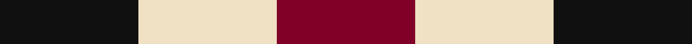
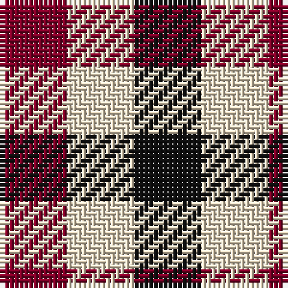

In pattern [KWR](/stripes/kwr/).

This was sourced from register-of-tartans.  It is a [3 stripe tartan](/stripes/stripes3/).

Original link https://www.tartanregister.gov.uk/tartanDetails.aspx?ref=862

## Also known as

This cloth is also recorded under:

- Dacre Estate Check

## Attestations

This cloth appears in 2 source records; the oldest owns this page.

- 01/01/1868 — Dacre Estate Check (register-of-tartans, [record](https://www.tartanregister.gov.uk/tartanDetails.aspx?ref=862))
- pre 1868 — Dacre (Estate Check) (tartans-authority, [record](http://www.tartansauthority.com/tartan-ferret/display/7330/))

## Register references

External register numbers recorded for this tartan.

- Scottish Register of Tartans: [862](https://www.tartanregister.gov.uk/tartanDetails.aspx?ref=862)
- Scottish Tartans Authority (ITI): 7330

## Thread count
K/14 W14 DR/14

## Palette
Each colour and the base-6 reference it is a variant of.

| Colour | Shade | Base |
|---|---|---|
| DR | <code style="background-color:#800028;">#800028</code> `oklch(38.2% 0.152 14.5)` <small>#800028</small> | R <code style="background-color:#CC0000;">#CC0000</code> |
| K | <code style="background-color:#101010;">#101010</code> `oklch(17.3% 0.000 89.9)` <small>#101010</small> | K <code style="background-color:#000000;">#000000</code> |
| W | <code style="background-color:#F0E0C4;">#F0E0C4</code> `oklch(91.2% 0.041 81.7)` <small>#F0E0C4</small> | W <code style="background-color:#F7F7F7;">#F7F7F7</code> |

# Sample pattern

## Nearest tartans

The nearest existing variants by ΔTartan distance.

1. [Coigach Tweed](/setts/s3/k1lb1o1~x6/) — ΔT 0.51
1. [Usa](/setts/s3/db1lr1r1~x4/) — ΔT 1.00
1. [Mothers Pride](/setts/s3/r1db1ly1~x40/) — ΔT 1.20
1. [Aquascutum](/setts/s3/db1w1r1~x22/) — ΔT 1.41
1. [Algarve](/setts/s4/dg1r1w1db1~x20/) — ΔT 1.70
1. [Wilson's, No 187](/setts/s3/k1g1r1~x8/) — ΔT 1.75
1. [Hogg](/setts/s4/k1w1do1~x8/) — ΔT 1.83
1. [Wilson's, No 204](/setts/s3/r10k11g9~x2/) — ΔT 2.01
1. [Wilson's No.204](/setts/s3/k11g9r10~x2/) — ΔT 2.04
1. [Wilson's, No 185](/setts/s3/k11p10g9~x2/) — ΔT 2.16

## Neighbour map

Every grey dot is one of 14299 variants placed by the first two principal components of the ΔTartan feature space (44% of its variance). Red is this tartan; blue dots are its nearest — click one to open its page.

<svg viewBox="0 0 640 380" role="img" style="max-width:100%;height:auto;border:1px solid #e0e0e0;border-radius:4px;display:block" xmlns="http://www.w3.org/2000/svg"><image href="/nn/cloud.v1.png" width="640" height="380"/><a href="/setts/s3/k1lb1o1~x6/"><circle cx="14.0" cy="366.0" r="4" fill="#3465a4"><title>Coigach Tweed</title></circle></a><a href="/setts/s3/db1lr1r1~x4/"><circle cx="14.0" cy="366.0" r="4" fill="#3465a4"><title>Usa</title></circle></a><a href="/setts/s3/r1db1ly1~x40/"><circle cx="14.0" cy="366.0" r="4" fill="#3465a4"><title>Mothers Pride</title></circle></a><a href="/setts/s3/db1w1r1~x22/"><circle cx="14.0" cy="366.0" r="4" fill="#3465a4"><title>Aquascutum</title></circle></a><a href="/setts/s4/dg1r1w1db1~x20/"><circle cx="14.0" cy="366.0" r="4" fill="#3465a4"><title>Algarve</title></circle></a><a href="/setts/s3/k1g1r1~x8/"><circle cx="14.0" cy="366.0" r="4" fill="#3465a4"><title>Wilson's, No 187</title></circle></a><a href="/setts/s4/k1w1do1~x8/"><circle cx="35.5" cy="366.0" r="4" fill="#3465a4"><title>Hogg</title></circle></a><a href="/setts/s3/r10k11g9~x2/"><circle cx="34.9" cy="366.0" r="4" fill="#3465a4"><title>Wilson's, No 204</title></circle></a><a href="/setts/s3/k11g9r10~x2/"><circle cx="64.1" cy="366.0" r="4" fill="#3465a4"><title>Wilson's No.204</title></circle></a><a href="/setts/s3/k11p10g9~x2/"><circle cx="36.2" cy="366.0" r="4" fill="#3465a4"><title>Wilson's, No 185</title></circle></a><circle cx="14.0" cy="366.0" r="5" fill="#c00000"/></svg>

ID: /setts/s3/k1w1r1~x14/
