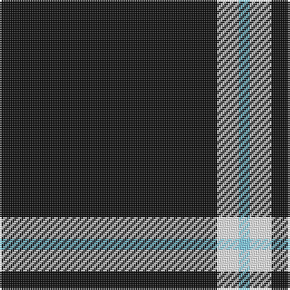

**Bands:** [KWW](/stripes/kww/) · **Stripes:** [K W LT](/stripes/stripes3/) K W LT

This was sourced from register-of-tartans.  It is a [3 band tartan](/bands/bands3/).

Original link https://www.tartanregister.gov.uk/tartanDetails.aspx?ref=10335

## Register references

External register numbers recorded for this tartan.

- Scottish Register of Tartans: [10335](https://www.tartanregister.gov.uk/tartanDetails.aspx?ref=10335)

## Thread count
K/120 W12 LB/6

## Palette
Each colour and its ΔE from the base-6 reference it is a variant of.

| Colour | Shade | Base | ΔE (OKLab) |
|---|---|---|---|
| K | <code style="background-color:#101010;">#101010</code> `#101010` | K <code style="background-color:#000000;">#000000</code> | 0.17 |
| LB | <code style="background-color:#82CFFD;">#82CFFD</code> `#82CFFD` | W <code style="background-color:#F7F7F7;">#F7F7F7</code> | 0.18 |
| W | <code style="background-color:#FFFFFF;">#FFFFFF</code> `#FFFFFF` | W <code style="background-color:#F7F7F7;">#F7F7F7</code> | 0.02 |

# Sample pattern

## Nearest tartans

The nearest existing variants by ΔTartan distance.

1. [Fily (Verneuil L'tang) (Personal)](/setts/s3/k20w2t1~x6/) — ΔT 0.48
1. [Lanoir](/setts/s6/k4r4k20r1k20w4~x6/) — ΔT 1.83
1. [Dhillon (Personal)](/setts/s4/k35lo3w3g3~x4/) — ΔT 1.89
1. [Wallington (Corporate?)](/setts/s4/k60t3k9g7/) — ΔT 1.89
1. [Batson (Personal)](/setts/s3/k69r14ly5~x2/) — ΔT 1.91
1. [Merola (2016)](/setts/s6/k36ly5k1ly1lr5k12~x2/) — ΔT 1.95
1. [London Fog Black](/setts/s6/k10lr2w5lr4k50b2~x2/) — ΔT 1.97
1. [Dobelman (Personal)](/setts/s4/r1k20lb5r1~x4/) — ΔT 2.07
1. [East of Scotland Tartan Army](/setts/s6/dt40ly10dt8r20dt100w5/) — ΔT 2.20
1. [St. Mirren Football Club (Sports)](/setts/s9/k7w2k21r2k34w5k3w2k7~x2/) — ΔT 2.25

## Neighbour map

Every grey dot is one of 14299 variants placed by the first two principal components of the ΔTartan feature space (44% of its variance). Red is this tartan; blue dots are its nearest — click one to open its page.

<svg viewBox="0 0 640 380" role="img" style="max-width:100%;height:auto;border:1px solid #e0e0e0;border-radius:4px;display:block" xmlns="http://www.w3.org/2000/svg"><image href="/nn/cloud.v1.png" width="640" height="380"/><a href="/setts/s3/k20w2t1~x6/"><circle cx="601.0" cy="226.8" r="4" fill="#3465a4"><title>Fily (Verneuil L'tang) (Personal)</title></circle></a><a href="/setts/s6/k4r4k20r1k20w4~x6/"><circle cx="538.4" cy="209.3" r="4" fill="#3465a4"><title>Lanoir</title></circle></a><a href="/setts/s4/k35lo3w3g3~x4/"><circle cx="490.0" cy="202.4" r="4" fill="#3465a4"><title>Dhillon (Personal)</title></circle></a><a href="/setts/s4/k60t3k9g7/"><circle cx="626.0" cy="231.3" r="4" fill="#3465a4"><title>Wallington (Corporate?)</title></circle></a><a href="/setts/s3/k69r14ly5~x2/"><circle cx="514.4" cy="245.1" r="4" fill="#3465a4"><title>Batson (Personal)</title></circle></a><a href="/setts/s6/k36ly5k1ly1lr5k12~x2/"><circle cx="552.1" cy="161.6" r="4" fill="#3465a4"><title>Merola (2016)</title></circle></a><a href="/setts/s6/k10lr2w5lr4k50b2~x2/"><circle cx="539.5" cy="152.5" r="4" fill="#3465a4"><title>London Fog Black</title></circle></a><a href="/setts/s4/r1k20lb5r1~x4/"><circle cx="479.4" cy="198.4" r="4" fill="#3465a4"><title>Dobelman (Personal)</title></circle></a><a href="/setts/s6/dt40ly10dt8r20dt100w5/"><circle cx="518.4" cy="180.8" r="4" fill="#3465a4"><title>East of Scotland Tartan Army</title></circle></a><a href="/setts/s9/k7w2k21r2k34w5k3w2k7~x2/"><circle cx="559.9" cy="180.5" r="4" fill="#3465a4"><title>St. Mirren Football Club (Sports)</title></circle></a><circle cx="588.0" cy="220.6" r="5" fill="#c00000"/></svg>

ID: /setts/s3/k20w2lt1~x6/
