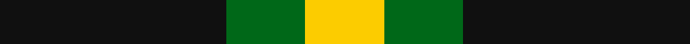

In pattern [KGY](/stripes/kgy/).

This was sourced from tartans-authority.  It is a [3 stripe tartan](/stripes/stripes3/).

Original link http://www.tartansauthority.com/tartan-ferret/display/11096/

## Thread count
K/92 G32 Y/32

## Palette
Each colour and its ΔE from the base-6 reference it is a variant of.

| Colour | Shade | Base | ΔE (OKLab) |
|---|---|---|---|
| G | <code style="background-color:#006818;">#006818</code> `#006818` | G <code style="background-color:#006100;">#006100</code> | 0.02 |
| K | <code style="background-color:#101010;">#101010</code> `#101010` | K <code style="background-color:#000000;">#000000</code> | 0.17 |
| Y | <code style="background-color:#FCCC00;">#FCCC00</code> `#FCCC00` | Y <code style="background-color:#F2BF00;">#F2BF00</code> | 0.04 |

# Sample pattern

## Nearest tartans

The nearest existing variants by ΔTartan distance.

1. [Zwijnenberg, Frans (Personal)](/setts/s3/k23g8lo8~x4/) — ΔT 1.16
1. [Wilson's No.201](/setts/s3/dp2g4ly1~x4/) — ΔT 1.24
1. [Wilson's, No 45](/setts/s3/g4t1k2~x4/) — ΔT 1.41
1. [Kincaid, of Kincaid](/setts/s3/k4g6r1~x10/) — ΔT 1.47
1. [Wilson's, No 2/53 or Mull](/setts/s3/k5g4ly1~x2/) — ΔT 1.49
1. [Glen Lyon](/setts/s3/k6g5r2~x2/) — ΔT 1.57
1. [Kincaid](/setts/s3/k11dg17r3/) — ΔT 1.71
1. [Wilson's, No 201](/setts/s3/p2g4ly1~x4/) — ΔT 1.72
1. [Barclay Dress](/setts/s4/lr1ly6k6ly1~x2/) — ΔT 1.75
1. [Barclay Dress](/setts/s4/lr1ly6k6ly1/) — ΔT 1.75

## Neighbour map

Every grey dot is one of 14299 variants placed by the first two principal components of the ΔTartan feature space (44% of its variance). Red is this tartan; blue dots are its nearest — click one to open its page.

<svg viewBox="0 0 640 380" role="img" style="max-width:100%;height:auto;border:1px solid #e0e0e0;border-radius:4px;display:block" xmlns="http://www.w3.org/2000/svg"><image href="/nn/cloud.v1.png" width="640" height="380"/><a href="/setts/s3/k23g8lo8~x4/"><circle cx="241.6" cy="323.3" r="4" fill="#3465a4"><title>Zwijnenberg, Frans (Personal)</title></circle></a><a href="/setts/s3/dp2g4ly1~x4/"><circle cx="265.0" cy="317.0" r="4" fill="#3465a4"><title>Wilson's No.201</title></circle></a><a href="/setts/s3/g4t1k2~x4/"><circle cx="242.6" cy="318.0" r="4" fill="#3465a4"><title>Wilson's, No 45</title></circle></a><a href="/setts/s3/k4g6r1~x10/"><circle cx="258.1" cy="299.0" r="4" fill="#3465a4"><title>Kincaid, of Kincaid</title></circle></a><a href="/setts/s3/k5g4ly1~x2/"><circle cx="218.0" cy="309.3" r="4" fill="#3465a4"><title>Wilson's, No 2/53 or Mull</title></circle></a><a href="/setts/s3/k6g5r2~x2/"><circle cx="168.7" cy="341.6" r="4" fill="#3465a4"><title>Glen Lyon</title></circle></a><a href="/setts/s3/k11dg17r3/"><circle cx="283.5" cy="314.9" r="4" fill="#3465a4"><title>Kincaid</title></circle></a><a href="/setts/s3/p2g4ly1~x4/"><circle cx="261.6" cy="310.5" r="4" fill="#3465a4"><title>Wilson's, No 201</title></circle></a><a href="/setts/s4/lr1ly6k6ly1~x2/"><circle cx="241.6" cy="255.2" r="4" fill="#3465a4"><title>Barclay Dress</title></circle></a><a href="/setts/s4/lr1ly6k6ly1/"><circle cx="241.6" cy="255.2" r="4" fill="#3465a4"><title>Barclay Dress</title></circle></a><circle cx="241.4" cy="319.0" r="5" fill="#c00000"/></svg>

ID: /setts/s3/k23g8ly8~x4/
