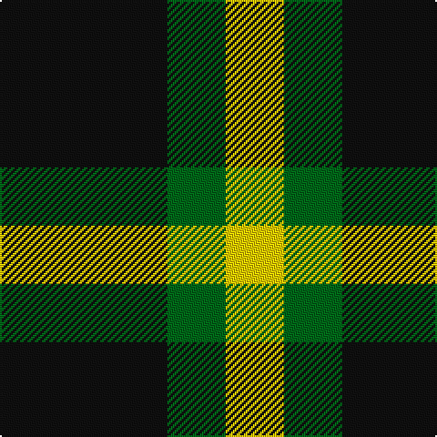

In pattern [KGY](/patterns/kgy/).

This was sourced from tartans-authority.  It is a [3 stripes tartan](/stripes/stripes3/).

Original link http://www.tartansauthority.com/tartan-ferret/display/11096/

## Thread count
K/92 G32 Y/32

## Palette
Each colour and its ΔE from the base-6 reference it is a variant of.

| Colour | Shade | Base | ΔE (OKLab) |
|---|---|---|---|
| G | <code style="background-color:#006818;">#006818</code> `#006818` | G <code style="background-color:#006100;">#006100</code> | 0.02 |
| K | <code style="background-color:#101010;">#101010</code> `#101010` | K <code style="background-color:#000000;">#000000</code> | 0.17 |
| Y | <code style="background-color:#FCCC00;">#FCCC00</code> `#FCCC00` | Y <code style="background-color:#F2BF00;">#F2BF00</code> | 0.04 |

# Sample pattern

## Nearest tartans

The nearest existing variants by ΔTartan distance.

1. [Zwijnenberg, Frans (Personal)](/setts/s3/k23g8y8~g00643c-k000000-ye0a126~x4/) — ΔT 1.15
1. [Wilson's No.201](/setts/s3/b2g4y1~b440044-g006818-ye8c000~x4/) — ΔT 1.24
1. [Wilson's, No 45](/setts/s3/g4b1k2~b5480b0-g008000-k000000~x4/) — ΔT 1.40
1. [Kincaid, of Kincaid](/setts/s3/k4g6r1~g008000-k000000-rc00000~x10/) — ΔT 1.47
1. [Wilson's, No 2/53 or Mull](/setts/s3/k5g4y1~g008000-k000000-yf0c000~x2/) — ΔT 1.49
1. [Glen Lyon](/setts/s3/k6g5r2~g008000-k000000-rc00000~x2/) — ΔT 1.57
1. [Kincaid](/setts/s3/k11g17r3~g004c00-k000000-rc80000/) — ΔT 1.71
1. [Wilson's, No 201](/setts/s3/b2g4y1~b800080-g008000-yf0c000~x4/) — ΔT 1.71
1. [Barclay Dress](/setts/s4/y1k6y6ya1~k000000-yaaaa00-yaaaaaaa~x2/) — ΔT 1.75
1. [Glen Lyon, or Mull (No.53)](/setts/s3/k5g3b2~b5480b0-g008000-k000000~x2/) — ΔT 1.77

## Neighbour map

Every grey dot is one of 15726 variants placed by the first two principal components of the ΔTartan feature space (44% of its variance). Red is this tartan; blue dots are its nearest — click one to open its page.

<svg viewBox="0 0 640 380" role="img" style="max-width:100%;height:auto;border:1px solid #e0e0e0;border-radius:4px;display:block" xmlns="http://www.w3.org/2000/svg"><image href="/nn/cloud.v1.png" width="640" height="380"/><a href="/setts/s3/k23g8y8~g00643c-k000000-ye0a126~x4/"><circle cx="238.8" cy="330.0" r="4" fill="#3465a4"><title>Zwijnenberg, Frans (Personal)</title></circle></a><a href="/setts/s3/b2g4y1~b440044-g006818-ye8c000~x4/"><circle cx="262.8" cy="320.9" r="4" fill="#3465a4"><title>Wilson's No.201</title></circle></a><a href="/setts/s3/g4b1k2~b5480b0-g008000-k000000~x4/"><circle cx="239.3" cy="322.5" r="4" fill="#3465a4"><title>Wilson's, No 45</title></circle></a><a href="/setts/s3/k4g6r1~g008000-k000000-rc00000~x10/"><circle cx="255.1" cy="304.3" r="4" fill="#3465a4"><title>Kincaid, of Kincaid</title></circle></a><a href="/setts/s3/k5g4y1~g008000-k000000-yf0c000~x2/"><circle cx="214.7" cy="314.8" r="4" fill="#3465a4"><title>Wilson's, No 2/53 or Mull</title></circle></a><a href="/setts/s3/k6g5r2~g008000-k000000-rc00000~x2/"><circle cx="165.7" cy="346.5" r="4" fill="#3465a4"><title>Glen Lyon</title></circle></a><a href="/setts/s3/k11g17r3~g004c00-k000000-rc80000/"><circle cx="280.8" cy="317.9" r="4" fill="#3465a4"><title>Kincaid</title></circle></a><a href="/setts/s3/b2g4y1~b800080-g008000-yf0c000~x4/"><circle cx="259.8" cy="315.1" r="4" fill="#3465a4"><title>Wilson's, No 201</title></circle></a><a href="/setts/s4/y1k6y6ya1~k000000-yaaaa00-yaaaaaaa~x2/"><circle cx="239.1" cy="262.3" r="4" fill="#3465a4"><title>Barclay Dress</title></circle></a><a href="/setts/s3/k5g3b2~b5480b0-g008000-k000000~x2/"><circle cx="161.4" cy="358.7" r="4" fill="#3465a4"><title>Glen Lyon, or Mull (No.53)</title></circle></a><circle cx="238.9" cy="325.6" r="5" fill="#c00000"/></svg>

ID: /setts/s3/k23g8y8~g006818-k101010-yfccc00~x4/
