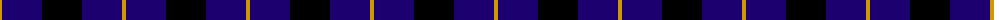
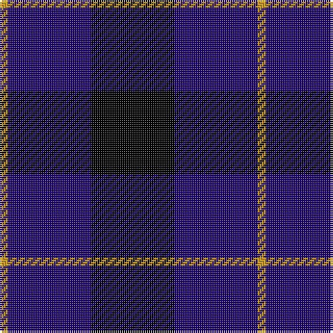

In pattern [KBY](/patterns/kby/).

This was sourced from tartans-authority.  It is a [3 stripes tartan](/stripes/stripes3/).

Original link http://www.tartansauthority.com/tartan-ferret/display/2312/

## Thread count
DY/4 DB40 K/40

## Palette
Each colour and its ΔE from the base-6 reference it is a variant of.

| Colour | Shade | Base | ΔE (OKLab) |
|---|---|---|---|
| DB | <code style="background-color:#1C0070;">#1C0070</code> `#1C0070` | B <code style="background-color:#2A418A;">#2A418A</code> | 0.14 |
| DY | <code style="background-color:#D09800;">#D09800</code> `#D09800` | Y <code style="background-color:#F2BF00;">#F2BF00</code> | 0.12 |
| K | <code style="background-color:#000000;">#000000</code> `#000000` | K <code style="background-color:#000000;">#000000</code> | 0.00 |
| LN | <code style="background-color:#E0E0E0;">#E0E0E0</code> `#E0E0E0` | W <code style="background-color:#F7F7F7;">#F7F7F7</code> | 0.07 |

# Sample pattern

## Nearest tartans

The nearest existing variants by ΔTartan distance.

1. [Wallace Blue](/setts/s4/k1b8k8y1-b000052-k000000-yaaaa00/) — ΔT 1.21
1. [Wallace (Personal)](/setts/s4/k10b70k70y10-b200084-k101010-yfccc3c/) — ΔT 1.41
1. [MacKay, Blue](/setts/s5/k30b8k30b56r4-b304080-k000000-rc00000/) — ΔT 1.44
1. [College of Radiographers](/setts/s5/k30y4k20b36w6-b00008c-k101010-wc8c8c8-yc88c00/) — ΔT 1.81
1. [Grampian T.V. Corporate Tartan Tartan Number: 1058. Earliest known date: pre 1992 Created by Johnstons of Elgin See products available Copyright © Blair Urquhart, Comrie, 2015](/setts/s5/k10b2k10b14w4-b2c2c80-k101010-we0e0e0/) — ΔT 1.89
1. [Grampian, T.V.](/setts/s5/k10b2k10b14w4-b304080-k000000-we0e0e0/) — ΔT 1.91
1. [Wcwm 1106-2](/setts/s5/k8g6b36k36w4-b4c1864-g004c00-k000000-wc8c8c8/) — ΔT 1.92
1. [Scottish Express International](/setts/s6/b6k29ba6k29b50ka6-b304080-ba8080d0-k000000-ka000030/) — ΔT 1.95
1. [College of Radiographers](/setts/s5/k30g4k20b36w6-b304080-g908000-k000000-we0e0e0/) — ΔT 1.97
1. [Old Brigade](/setts/s6/b36k36r12b36k36y4-b000080-k101010-rff0000-yffe600/) — ΔT 2.03

## Neighbour map

Every grey dot is one of 15726 variants placed by the first two principal components of the ΔTartan feature space (44% of its variance). Red is this tartan; blue dots are its nearest — click one to open its page.

<svg viewBox="0 0 640 380" role="img" style="max-width:100%;height:auto;border:1px solid #e0e0e0;border-radius:4px;display:block" xmlns="http://www.w3.org/2000/svg"><image href="/nn/cloud.v1.png" width="640" height="380"/><a href="/setts/s4/k1b8k8y1-b000052-k000000-yaaaa00/"><circle cx="321.8" cy="282.1" r="4" fill="#3465a4"><title>Wallace Blue</title></circle></a><a href="/setts/s4/k10b70k70y10-b200084-k101010-yfccc3c/"><circle cx="306.9" cy="278.9" r="4" fill="#3465a4"><title>Wallace (Personal)</title></circle></a><a href="/setts/s5/k30b8k30b56r4-b304080-k000000-rc00000/"><circle cx="323.8" cy="244.1" r="4" fill="#3465a4"><title>MacKay, Blue</title></circle></a><a href="/setts/s5/k30y4k20b36w6-b00008c-k101010-wc8c8c8-yc88c00/"><circle cx="271.3" cy="250.2" r="4" fill="#3465a4"><title>College of Radiographers</title></circle></a><a href="/setts/s5/k10b2k10b14w4-b2c2c80-k101010-we0e0e0/"><circle cx="255.5" cy="279.9" r="4" fill="#3465a4"><title>Grampian T.V. Corporate Tartan Tartan Number: 1058. Earliest known date: pre 1992 Created by Johnstons of Elgin See products available Copyright © Blair Urquhart, Comrie, 2015</title></circle></a><a href="/setts/s5/k10b2k10b14w4-b304080-k000000-we0e0e0/"><circle cx="234.6" cy="274.1" r="4" fill="#3465a4"><title>Grampian, T.V.</title></circle></a><a href="/setts/s5/k8g6b36k36w4-b4c1864-g004c00-k000000-wc8c8c8/"><circle cx="269.4" cy="229.9" r="4" fill="#3465a4"><title>Wcwm 1106-2</title></circle></a><a href="/setts/s6/b6k29ba6k29b50ka6-b304080-ba8080d0-k000000-ka000030/"><circle cx="252.6" cy="232.3" r="4" fill="#3465a4"><title>Scottish Express International</title></circle></a><a href="/setts/s5/k30g4k20b36w6-b304080-g908000-k000000-we0e0e0/"><circle cx="248.6" cy="239.8" r="4" fill="#3465a4"><title>College of Radiographers</title></circle></a><a href="/setts/s6/b36k36r12b36k36y4-b000080-k101010-rff0000-yffe600/"><circle cx="231.3" cy="261.2" r="4" fill="#3465a4"><title>Old Brigade</title></circle></a><circle cx="306.7" cy="295.9" r="5" fill="#c00000"/></svg>

ID: /setts/s3/k40b40y4-b1c0070-k000000-yd09800/
