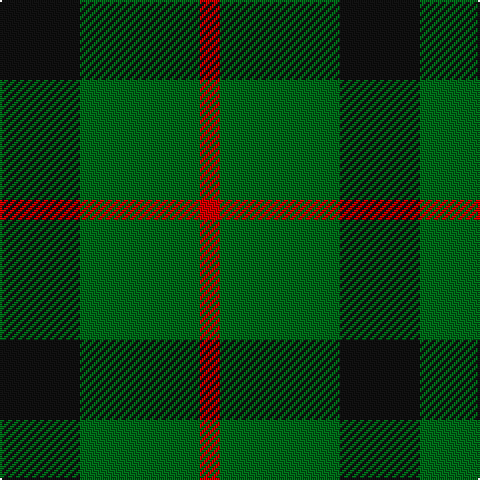

In pattern [KGR](/patterns/kgr/).

This was sourced from house-of-tartan.  It is a [3 stripes tartan](/stripes/stripes3/).

Original link http://www.house-of-tartan.scotland.net/house/TartanViewjs.asp?colr=Def&tnam=1106

## Thread count
K/40 G60 R/10

## Palette
Each colour and its ΔE from the base-6 reference it is a variant of.

| Colour | Shade | Base | ΔE (OKLab) |
|---|---|---|---|
| G | <code style="background-color:#006818;">#006818</code> `#006818` | G <code style="background-color:#006100;">#006100</code> | 0.02 |
| K | <code style="background-color:#101010;">#101010</code> `#101010` | K <code style="background-color:#000000;">#000000</code> | 0.17 |
| R | <code style="background-color:#C80000;">#C80000</code> `#C80000` | R <code style="background-color:#CC0000;">#CC0000</code> | 0.01 |

# Sample pattern

## Nearest tartans

The nearest existing variants by ΔTartan distance.

1. [Wilson's No.050](/setts/s3/k20g24b4-b5c8ca8-g006818-k101010/) — ΔT 0.62
1. [Kincaid of Kincaid (Clan)](/setts/s3/k44g64r8-g006818-k101010-r880000/) — ΔT 0.67
1. [Wilson's No.053 #2](/setts/s4/g8k10g8y2-g006818-k101010-yd8b000/) — ΔT 1.13
1. [Red Watch (Fashion) #1](/setts/s4/g24k8r12k4-g006818-k101010-r880000/) — ΔT 1.20
1. [Wilson's No.055](/setts/s3/g24b20ba4-b440044-ba5c8ca8-g006818/) — ΔT 1.22
1. [Kincaid](/setts/s3/k22g34r6-g11450d-k000000-raa0000/) — ΔT 1.24
1. [Kincaid](/setts/s3/k11g17r3-g11450d-k000000-raa0000/) — ΔT 1.24
1. [Scotch Tape 2 (Corporate)](/setts/s4/k6g30k40y6-g006818-k101010-ye8c000/) — ΔT 1.25
1. [Kincaid](/setts/s3/k11g17r3-g004c00-k000000-rc80000/) — ΔT 1.26
1. [Wilson's No.201](/setts/s3/b8g16y4-b440044-g006818-ye8c000/) — ΔT 1.33

## Neighbour map

Every grey dot is one of 15726 variants placed by the first two principal components of the ΔTartan feature space (44% of its variance). Red is this tartan; blue dots are its nearest — click one to open its page.

<svg viewBox="0 0 640 380" role="img" style="max-width:100%;height:auto;border:1px solid #e0e0e0;border-radius:4px;display:block" xmlns="http://www.w3.org/2000/svg"><image href="/nn/cloud.v1.png" width="640" height="380"/><a href="/setts/s3/k20g24b4-b5c8ca8-g006818-k101010/"><circle cx="284.4" cy="322.6" r="4" fill="#3465a4"><title>Wilson's No.050</title></circle></a><a href="/setts/s3/k44g64r8-g006818-k101010-r880000/"><circle cx="339.0" cy="310.4" r="4" fill="#3465a4"><title>Kincaid of Kincaid (Clan)</title></circle></a><a href="/setts/s4/g8k10g8y2-g006818-k101010-yd8b000/"><circle cx="280.2" cy="326.2" r="4" fill="#3465a4"><title>Wilson's No.053 #2</title></circle></a><a href="/setts/s4/g24k8r12k4-g006818-k101010-r880000/"><circle cx="283.5" cy="298.5" r="4" fill="#3465a4"><title>Red Watch (Fashion) #1</title></circle></a><a href="/setts/s3/g24b20ba4-b440044-ba5c8ca8-g006818/"><circle cx="290.1" cy="317.0" r="4" fill="#3465a4"><title>Wilson's No.055</title></circle></a><a href="/setts/s3/k22g34r6-g11450d-k000000-raa0000/"><circle cx="295.3" cy="318.9" r="4" fill="#3465a4"><title>Kincaid</title></circle></a><a href="/setts/s3/k11g17r3-g11450d-k000000-raa0000/"><circle cx="295.3" cy="318.9" r="4" fill="#3465a4"><title>Kincaid</title></circle></a><a href="/setts/s4/k6g30k40y6-g006818-k101010-ye8c000/"><circle cx="311.4" cy="277.6" r="4" fill="#3465a4"><title>Scotch Tape 2 (Corporate)</title></circle></a><a href="/setts/s3/k11g17r3-g004c00-k000000-rc80000/"><circle cx="283.8" cy="314.3" r="4" fill="#3465a4"><title>Kincaid</title></circle></a><a href="/setts/s3/b8g16y4-b440044-g006818-ye8c000/"><circle cx="266.3" cy="317.7" r="4" fill="#3465a4"><title>Wilson's No.201</title></circle></a><circle cx="305.4" cy="317.3" r="5" fill="#c00000"/></svg>

ID: /setts/s3/k40g60r10-g006818-k101010-rc80000/
