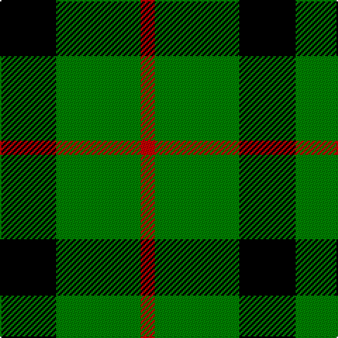

In pattern [KGR](/patterns/kgr/).

This was sourced from weddslist.  It is a [3 stripes tartan](/stripes/stripes3/).

Original link http://www.weddslist.com/cgi-bin/tartans/pg.pl?source=sts

## Thread count
K/40 G60 R/10

## Palette
Each colour and its ΔE from the base-6 reference it is a variant of.

| Colour | Shade | Base | ΔE (OKLab) |
|---|---|---|---|
| G | <code style="background-color:#008000;">#008000</code> `#008000` | G <code style="background-color:#006100;">#006100</code> | 0.10 |
| K | <code style="background-color:#000000;">#000000</code> `#000000` | K <code style="background-color:#000000;">#000000</code> | 0.00 |
| R | <code style="background-color:#C00000;">#C00000</code> `#C00000` | R <code style="background-color:#CC0000;">#CC0000</code> | 0.03 |

# Sample pattern

## Nearest tartans

The nearest existing variants by ΔTartan distance.

1. [Wilson's, No 2/53 or Mull](/setts/s3/k10g8y2-g008000-k000000-yf0c000/) — ΔT 0.72
1. [Wilson's, No 197](/setts/s3/g24y4k24-g008000-k000000-yf0c000/) — ΔT 0.75
1. [Wilson's, No 50](/setts/s3/g20k24b4-b5480b0-g008000-k000000/) — ΔT 0.91
1. [Wilson's, No 45](/setts/s3/g16b4k8-b5480b0-g008000-k000000/) — ΔT 1.03
1. [Kincaid](/setts/s3/k11g17r3-g004c00-k000000-rc80000/) — ΔT 1.19
1. [Innes, hunting](/setts/s4/k60b14g72k10-b304080-g008000-k000000/) — ΔT 1.34
1. [Wallace, hunting](/setts/s4/k8g66k66y8-g008000-k000000-yf0c000/) — ΔT 1.35
1. [Cowie, Justine (Personal)](/setts/s3/g36k72r8-g289c18-k101010-rc80000/) — ΔT 1.39
1. [Scotch Tape 2 (Corporate)](/setts/s4/k6g30k40y6-g006818-k101010-ye8c000/) — ΔT 1.44
1. [Barclay Dress](/setts/s4/y2k12y12ya2-k000000-yaaaa00-yaaaaaaa/) — ΔT 1.46

## Neighbour map

Every grey dot is one of 15726 variants placed by the first two principal components of the ΔTartan feature space (44% of its variance). Red is this tartan; blue dots are its nearest — click one to open its page.

<svg viewBox="0 0 640 380" role="img" style="max-width:100%;height:auto;border:1px solid #e0e0e0;border-radius:4px;display:block" xmlns="http://www.w3.org/2000/svg"><image href="/nn/cloud.v1.png" width="640" height="380"/><a href="/setts/s3/k10g8y2-g008000-k000000-yf0c000/"><circle cx="218.2" cy="310.9" r="4" fill="#3465a4"><title>Wilson's, No 2/53 or Mull</title></circle></a><a href="/setts/s3/g24y4k24-g008000-k000000-yf0c000/"><circle cx="221.1" cy="301.6" r="4" fill="#3465a4"><title>Wilson's, No 197</title></circle></a><a href="/setts/s3/g20k24b4-b5480b0-g008000-k000000/"><circle cx="238.2" cy="306.3" r="4" fill="#3465a4"><title>Wilson's, No 50</title></circle></a><a href="/setts/s3/g16b4k8-b5480b0-g008000-k000000/"><circle cx="242.9" cy="318.8" r="4" fill="#3465a4"><title>Wilson's, No 45</title></circle></a><a href="/setts/s3/k11g17r3-g004c00-k000000-rc80000/"><circle cx="283.8" cy="314.3" r="4" fill="#3465a4"><title>Kincaid</title></circle></a><a href="/setts/s4/k60b14g72k10-b304080-g008000-k000000/"><circle cx="241.8" cy="270.9" r="4" fill="#3465a4"><title>Innes, hunting</title></circle></a><a href="/setts/s4/k8g66k66y8-g008000-k000000-yf0c000/"><circle cx="272.1" cy="256.3" r="4" fill="#3465a4"><title>Wallace, hunting</title></circle></a><a href="/setts/s3/g36k72r8-g289c18-k101010-rc80000/"><circle cx="343.7" cy="278.1" r="4" fill="#3465a4"><title>Cowie, Justine (Personal)</title></circle></a><a href="/setts/s4/k6g30k40y6-g006818-k101010-ye8c000/"><circle cx="311.4" cy="277.6" r="4" fill="#3465a4"><title>Scotch Tape 2 (Corporate)</title></circle></a><a href="/setts/s4/y2k12y12ya2-k000000-yaaaa00-yaaaaaaa/"><circle cx="241.9" cy="258.2" r="4" fill="#3465a4"><title>Barclay Dress</title></circle></a><circle cx="258.5" cy="300.2" r="5" fill="#c00000"/></svg>

ID: /setts/s3/k40g60r10-g008000-k000000-rc00000/
