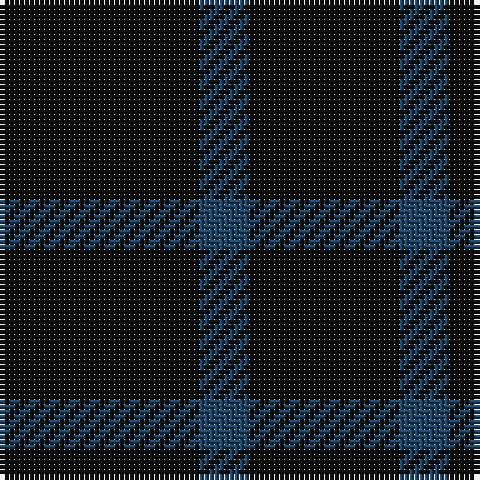

**Bands:** [KBK](/stripes/kbk/) · **Stripes:** [K DT K](/stripes/stripes3/) K DT K

This was sourced from tartans-authority.  It is a [3 band tartan](/bands/bands3/).

Original link http://www.tartansauthority.com/tartan-ferret/display/6681/

## Thread count
K/40 B10 K/30

## Palette
Each colour and its ΔE from the base-6 reference it is a variant of.

| Colour | Shade | Base | ΔE (OKLab) |
|---|---|---|---|
| B | <code style="background-color:#204468;">#204468</code> `#204468` | B <code style="background-color:#2A418A;">#2A418A</code> | 0.06 |
| K | <code style="background-color:#101010;">#101010</code> `#101010` | K <code style="background-color:#000000;">#000000</code> | 0.17 |

# Sample pattern

## Nearest tartans

The nearest existing variants by ΔTartan distance.

1. [Campbell Simpson](/setts/s4/dg22k3dg25k4~x2/) — ΔT 2.97
1. [Leonard Hunting (Name)](/setts/s4/k30dp5k10dp9~x4/) — ΔT 3.41
1. [Black Shadow Fashion Tartan Tartan Number: 3193. Earliest known date: 01/01/2007 Designed as a combination of two shades of black, shown here as black and dark grey to illustrate the sett. See products available Copyright © Blair Urquhart, Comrie, 2015](/setts/s11/do9k3do17k6do4k4do12k3do12k3do7~x2/) — ΔT 3.47
1. [Black Shadow](/setts/s11/do18k5do34k12do8k8do24k5do24k5do14/) — ΔT 3.54
1. [Black Shadow (Fashion)](/setts/s2/k20n1~x6/) — ΔT 3.69
1. [Leonard Hunting](/setts/s6/k10dp5k30dp5k10dp9~x4/) — ΔT 3.83
1. [Elliot Clan Tartan Tartan Number: 596. Earliest known date: pre 1906 The Elliot tartan was first recorded by H. Whyte in his book, 'The Tartans of the Clans and Septs of Scotland' (1906), along with many others in use at the time. The colouring is unique among traditional tartans, being described as maroon and blue. The Elliots are a 'Border Clan', founders of the Minto family. The Chiefship once belonged to to the Elliots of Redheugh but passed to the Elliots of Stobs near Hawick in Roxburghshire. The present Chief is Mrs Margaret Elliot of that Ilk. See products available Copyright © Blair Urquhart, Comrie, 2015](/setts/s4/db16dr4db3r1~x6/) — ΔT 3.86
1. [Wcwm 9275-1333-1](/setts/s4/k20dp3k20dp20~x2/) — ΔT 3.87
1. [Auchincloss (Personal)](/setts/s4/k34db13k7db14~x2/) — ΔT 3.97
1. [Staines (2013)](/setts/s3/db1k12db1~x10/) — ΔT 4.12

## Neighbour map

Every grey dot is one of 14299 variants placed by the first two principal components of the ΔTartan feature space (44% of its variance). Red is this tartan; blue dots are its nearest — click one to open its page.

<svg viewBox="0 0 640 380" role="img" style="max-width:100%;height:auto;border:1px solid #e0e0e0;border-radius:4px;display:block" xmlns="http://www.w3.org/2000/svg"><image href="/nn/cloud.v1.png" width="640" height="380"/><a href="/setts/s4/dg22k3dg25k4~x2/"><circle cx="626.0" cy="362.6" r="4" fill="#3465a4"><title>Campbell Simpson</title></circle></a><a href="/setts/s4/k30dp5k10dp9~x4/"><circle cx="530.7" cy="339.8" r="4" fill="#3465a4"><title>Leonard Hunting (Name)</title></circle></a><a href="/setts/s11/do9k3do17k6do4k4do12k3do12k3do7~x2/"><circle cx="579.1" cy="351.8" r="4" fill="#3465a4"><title>Black Shadow Fashion Tartan Tartan Number: 3193. Earliest known date: 01/01/2007 Designed as a combination of two shades of black, shown here as black and dark grey to illustrate the sett. See products available Copyright © Blair Urquhart, Comrie, 2015</title></circle></a><a href="/setts/s11/do18k5do34k12do8k8do24k5do24k5do14/"><circle cx="599.9" cy="341.0" r="4" fill="#3465a4"><title>Black Shadow</title></circle></a><a href="/setts/s2/k20n1~x6/"><circle cx="626.0" cy="366.0" r="4" fill="#3465a4"><title>Black Shadow (Fashion)</title></circle></a><a href="/setts/s6/k10dp5k30dp5k10dp9~x4/"><circle cx="511.7" cy="318.8" r="4" fill="#3465a4"><title>Leonard Hunting</title></circle></a><a href="/setts/s4/db16dr4db3r1~x6/"><circle cx="626.0" cy="305.3" r="4" fill="#3465a4"><title>Elliot Clan Tartan Tartan Number: 596. Earliest known date: pre 1906 The Elliot tartan was first recorded by H. Whyte in his book, 'The Tartans of the Clans and Septs of Scotland' (1906), along with many others in use at the time. The colouring is unique among traditional tartans, being described as maroon and blue. The Elliots are a 'Border Clan', founders of the Minto family. The Chiefship once belonged to to the Elliots of Redheugh but passed to the Elliots of Stobs near Hawick in Roxburghshire. The present Chief is Mrs Margaret Elliot of that Ilk. See products available Copyright © Blair Urquhart, Comrie, 2015</title></circle></a><a href="/setts/s4/k20dp3k20dp20~x2/"><circle cx="531.5" cy="366.0" r="4" fill="#3465a4"><title>Wcwm 9275-1333-1</title></circle></a><a href="/setts/s4/k34db13k7db14~x2/"><circle cx="440.8" cy="366.0" r="4" fill="#3465a4"><title>Auchincloss (Personal)</title></circle></a><a href="/setts/s3/db1k12db1~x10/"><circle cx="626.0" cy="299.7" r="4" fill="#3465a4"><title>Staines (2013)</title></circle></a><circle cx="626.0" cy="366.0" r="5" fill="#c00000"/></svg>

ID: /setts/s3/k4dt1k3~x10/
