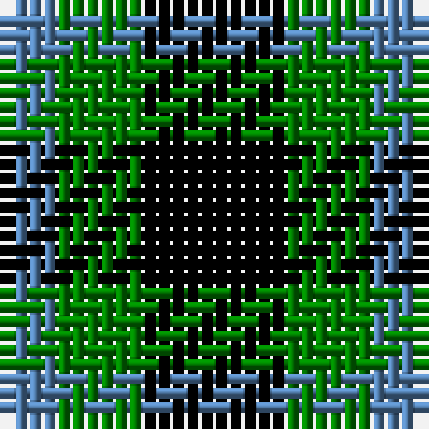

In pattern [BGK](/patterns/bgk/).

This was sourced from weddslist.  It is a [3 stripes tartan](/stripes/stripes3/).

Original link http://www.weddslist.com/cgi-bin/tartans/pg.pl?source=sts

## Thread count
B/4 G6 K/10

## Palette
Each colour and its ΔE from the base-6 reference it is a variant of.

| Colour | Shade | Base | ΔE (OKLab) |
|---|---|---|---|
| B | <code style="background-color:#5480B0;">#5480B0</code> `#5480B0` | B <code style="background-color:#2A418A;">#2A418A</code> | 0.19 |
| G | <code style="background-color:#008000;">#008000</code> `#008000` | G <code style="background-color:#006100;">#006100</code> | 0.10 |
| K | <code style="background-color:#000000;">#000000</code> `#000000` | K <code style="background-color:#000000;">#000000</code> | 0.00 |

# Sample pattern

## Nearest tartans

The nearest existing variants by ΔTartan distance.

1. [Mull, or Glenlyon](/setts/s3/k5g4b2x2~b5480b0-g008000-k000000/) — ΔT 0.52
1. [Glen Lyon](/setts/s3/k6g5r2x2~g008000-k000000-rc00000/) — ΔT 1.07
1. [Wilson's, No 94](/setts/s3/k5g4r2x2~g008000-k000000-rc00000/) — ΔT 1.16
1. [Glen Lyon or Mull (No.53) District Tartan Tartan Number: 24. Earliest known date: 1820 Appears to be No 185 in Wilson's '1819' See products available Copyright © Blair Urquhart, Comrie, 2015](/setts/s3/k5g3b2x2~b5c8ca8-g006818-k101010/) — ΔT 1.39
1. [Wilson's, No 52](/setts/s3/g7k4b4x2~b5480b0-g008000-k000000/) — ΔT 1.51
1. [Zwijnenberg, Frans (Personal)](/setts/s3/k23g8y8x4~g00643c-k000000-ye0a126/) — ΔT 1.56
1. [Mull](/setts/s3/k5g4b2x2~b5c8ca8-g006818-k101010/) — ΔT 1.58
1. [Wilson's, No 2/53 or Mull](/setts/s3/k5g4y1x2~g008000-k000000-yf0c000/) — ΔT 1.65
1. [Unnamed 1](/setts/s5/k5g14k16b12g4x2~b000050-g008000-k000000/) — ΔT 1.66
1. [Wilson's, No 200](/setts/s3/g4k7r4x2~g008000-k000000-rc00000/) — ΔT 1.74

## Neighbour map

Every grey dot is one of 15726 variants placed by the first two principal components of the ΔTartan feature space (44% of its variance). Red is this tartan; blue dots are its nearest — click one to open its page.

<svg viewBox="0 0 640 380" role="img" style="max-width:100%;height:auto;border:1px solid #e0e0e0;border-radius:4px;display:block" xmlns="http://www.w3.org/2000/svg"><image href="/nn/cloud.v1.png" width="640" height="380"/><a href="/setts/s3/k5g4b2x2~b5480b0-g008000-k000000/"><circle cx="137.4" cy="362.9" r="4" fill="#3465a4"><title>Mull, or Glenlyon</title></circle></a><a href="/setts/s3/k6g5r2x2~g008000-k000000-rc00000/"><circle cx="165.7" cy="346.5" r="4" fill="#3465a4"><title>Glen Lyon</title></circle></a><a href="/setts/s3/k5g4r2x2~g008000-k000000-rc00000/"><circle cx="145.2" cy="359.1" r="4" fill="#3465a4"><title>Wilson's, No 94</title></circle></a><a href="/setts/s3/k5g3b2x2~b5c8ca8-g006818-k101010/"><circle cx="195.8" cy="366.0" r="4" fill="#3465a4"><title>Glen Lyon or Mull (No.53) District Tartan Tartan Number: 24. Earliest known date: 1820 Appears to be No 185 in Wilson's '1819' See products available Copyright © Blair Urquhart, Comrie, 2015</title></circle></a><a href="/setts/s3/g7k4b4x2~b5480b0-g008000-k000000/"><circle cx="114.4" cy="366.0" r="4" fill="#3465a4"><title>Wilson's, No 52</title></circle></a><a href="/setts/s3/k23g8y8x4~g00643c-k000000-ye0a126/"><circle cx="238.8" cy="330.0" r="4" fill="#3465a4"><title>Zwijnenberg, Frans (Personal)</title></circle></a><a href="/setts/s3/k5g4b2x2~b5c8ca8-g006818-k101010/"><circle cx="175.1" cy="366.0" r="4" fill="#3465a4"><title>Mull</title></circle></a><a href="/setts/s3/k5g4y1x2~g008000-k000000-yf0c000/"><circle cx="214.7" cy="314.8" r="4" fill="#3465a4"><title>Wilson's, No 2/53 or Mull</title></circle></a><a href="/setts/s5/k5g14k16b12g4x2~b000050-g008000-k000000/"><circle cx="152.8" cy="311.9" r="4" fill="#3465a4"><title>Unnamed 1</title></circle></a><a href="/setts/s3/g4k7r4x2~g008000-k000000-rc00000/"><circle cx="126.5" cy="366.0" r="4" fill="#3465a4"><title>Wilson's, No 200</title></circle></a><circle cx="161.4" cy="358.7" r="5" fill="#c00000"/></svg>

ID: /setts/s3/k5g3b2x2~b5480b0-g008000-k000000/
