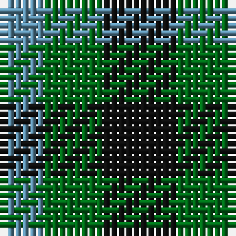

In pattern [BGK](/patterns/bgk/).

This was sourced from tartans-authority.  It is a [3 stripes tartan](/stripes/stripes3/).

Original link http://www.tartansauthority.com/tartan-ferret/display/162/

## Thread count
B/6 G8 K/10

## Palette
Each colour and its ΔE from the base-6 reference it is a variant of.

| Colour | Shade | Base | ΔE (OKLab) |
|---|---|---|---|
| B | <code style="background-color:#5C8CA8;">#5C8CA8</code> `#5C8CA8` | B <code style="background-color:#2A418A;">#2A418A</code> | 0.23 |
| G | <code style="background-color:#006818;">#006818</code> `#006818` | G <code style="background-color:#006100;">#006100</code> | 0.02 |
| K | <code style="background-color:#101010;">#101010</code> `#101010` | K <code style="background-color:#000000;">#000000</code> | 0.17 |

# Sample pattern

## Nearest tartans

The nearest existing variants by ΔTartan distance.

1. [Glen Lyon (District)](/setts/s3/k5g4b3~b2888c4-g006818-k101010~x2/) — ΔT 0.31
1. [Wilson's No.052](/setts/s3/g7k4b4~b2888c4-g006818-k101010~x2/) — ΔT 0.96
1. [Glenlyon #2](/setts/s3/g3k2b2~b0000cd-g008b00-k101010~x4/) — ΔT 1.20
1. [Mull](/setts/s3/k5g4b2~b5c8ca8-g006818-k101010~x2/) — ΔT 1.23
1. [Glen Lyon](/setts/s3/g3k2b2~b304080-g30a010-k000000~x4/) — ΔT 1.26
1. [Wilson's, No 52](/setts/s3/g7k4b4~b5480b0-g008000-k000000~x2/) — ΔT 1.38
1. [Kazakhstan Relic (Artefact)](/setts/s3/y5b5k3~b202060-k101010-ybc8c00~x4/) — ΔT 1.48
1. [Glen Lyon or Mull (No.53) District Tartan Tartan Number: 24. Earliest known date: 1820 Appears to be No 185 in Wilson's '1819' See products available Copyright © Blair Urquhart, Comrie, 2015](/setts/s3/k5g3b2~b5c8ca8-g006818-k101010~x2/) — ΔT 1.53
1. [Wilson's No.061](/setts/s3/b4g7r4~b5c8ca8-g003820-rc80000~x2/) — ΔT 1.58
1. [Wilson's No.202](/setts/s3/g7k4r4~g006818-k101010-rc80000~x2/) — ΔT 1.62

## Neighbour map

Every grey dot is one of 15726 variants placed by the first two principal components of the ΔTartan feature space (44% of its variance). Red is this tartan; blue dots are its nearest — click one to open its page.

<svg viewBox="0 0 640 380" role="img" style="max-width:100%;height:auto;border:1px solid #e0e0e0;border-radius:4px;display:block" xmlns="http://www.w3.org/2000/svg"><image href="/nn/cloud.v1.png" width="640" height="380"/><a href="/setts/s3/k5g4b3~b2888c4-g006818-k101010~x2/"><circle cx="108.6" cy="366.0" r="4" fill="#3465a4"><title>Glen Lyon (District)</title></circle></a><a href="/setts/s3/g7k4b4~b2888c4-g006818-k101010~x2/"><circle cx="150.4" cy="366.0" r="4" fill="#3465a4"><title>Wilson's No.052</title></circle></a><a href="/setts/s3/g3k2b2~b0000cd-g008b00-k101010~x4/"><circle cx="85.4" cy="366.0" r="4" fill="#3465a4"><title>Glenlyon #2</title></circle></a><a href="/setts/s3/k5g4b2~b5c8ca8-g006818-k101010~x2/"><circle cx="175.1" cy="366.0" r="4" fill="#3465a4"><title>Mull</title></circle></a><a href="/setts/s3/g3k2b2~b304080-g30a010-k000000~x4/"><circle cx="73.4" cy="366.0" r="4" fill="#3465a4"><title>Glen Lyon</title></circle></a><a href="/setts/s3/g7k4b4~b5480b0-g008000-k000000~x2/"><circle cx="114.4" cy="366.0" r="4" fill="#3465a4"><title>Wilson's, No 52</title></circle></a><a href="/setts/s3/y5b5k3~b202060-k101010-ybc8c00~x4/"><circle cx="91.9" cy="366.0" r="4" fill="#3465a4"><title>Kazakhstan Relic (Artefact)</title></circle></a><a href="/setts/s3/k5g3b2~b5c8ca8-g006818-k101010~x2/"><circle cx="195.8" cy="366.0" r="4" fill="#3465a4"><title>Glen Lyon or Mull (No.53) District Tartan Tartan Number: 24. Earliest known date: 1820 Appears to be No 185 in Wilson's '1819' See products available Copyright © Blair Urquhart, Comrie, 2015</title></circle></a><a href="/setts/s3/b4g7r4~b5c8ca8-g003820-rc80000~x2/"><circle cx="160.2" cy="366.0" r="4" fill="#3465a4"><title>Wilson's No.061</title></circle></a><a href="/setts/s3/g7k4r4~g006818-k101010-rc80000~x2/"><circle cx="158.3" cy="366.0" r="4" fill="#3465a4"><title>Wilson's No.202</title></circle></a><circle cx="110.8" cy="366.0" r="5" fill="#c00000"/></svg>

ID: /setts/s3/k5g4b3~b5c8ca8-g006818-k101010~x2/
