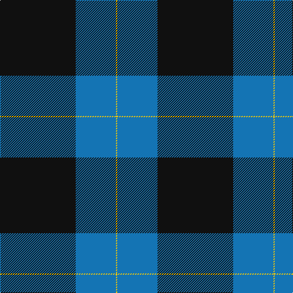

This page is one **sett** — a single exact thread-count. It belongs to the [tartan](/tartans/k62b33y1/)
(the same proportion at any scale), whose colour order is pattern [KBY](/stripes/kby/).

Sourced from tartans-authority.  It is a [3 stripe tartan](/stripes/stripes3/).

Original link http://www.tartansauthority.com/tartan-ferret/display/10547/

## Thread count
K/124 B66 Y/2

## Palette
Each colour and the base-6 reference it is a variant of.

| Colour | Shade | Base |
|---|---|---|
| B | <code style="background-color:#1474B4;">#1474B4</code> `oklch(54.0% 0.129 245.1)` <small>#1474B4</small> | B <code style="background-color:#2A418A;">#2A418A</code> |
| K | <code style="background-color:#101010;">#101010</code> `oklch(17.3% 0.000 89.9)` <small>#101010</small> | K <code style="background-color:#000000;">#000000</code> |
| Y | <code style="background-color:#FCCC00;">#FCCC00</code> `oklch(86.2% 0.176 91.5)` <small>#FCCC00</small> | Y <code style="background-color:#F2BF00;">#F2BF00</code> |

# Sample pattern

## Nearest tartans

The nearest existing variants by ΔTartan distance, with this tartan at the top so the swatches line up against it.

ΔTartan

Tartan

Sett

—

<a href="/ttd/edit/#slug=k62b33ly1~x2">Westwater (Personal)</a> <a class="nn-out" href="/setts/s3/k62b33ly1~x2/" title="open its dictionary page">↗</a>

0.74

<a href="/ttd/edit/#slug=k62t33ly1~x2">Westwater (Edinburgh, 2012)</a> <a class="nn-out" href="/setts/s3/k62t33ly1~x2/" title="open its dictionary page">↗</a>

1.46

<a href="/ttd/edit/#slug=n124k60w1k2~x2">Pride of New Zealand, The</a> <a class="nn-out" href="/setts/s4/n124k60w1k2~x2/" title="open its dictionary page">↗</a>

1.84

<a href="/ttd/edit/#slug=n62k30w1k1~x2">Pride of New Zealand</a> <a class="nn-out" href="/setts/s4/n62k30w1k1~x2/" title="open its dictionary page">↗</a>

2.09

<a href="/ttd/edit/#slug=db60dg16w8lo3~x2">MaleHsuHK (Hong Kong) (Personal)</a> <a class="nn-out" href="/setts/s4/db60dg16w8lo3~x2/" title="open its dictionary page">↗</a>

2.18

<a href="/ttd/edit/#slug=g20r7db40w2~x2">McNiff, Kevin (Personal)</a> <a class="nn-out" href="/setts/s4/g20r7db40w2~x2/" title="open its dictionary page">↗</a>

2.18

<a href="/ttd/edit/#slug=db39lo8r3w1~x4">Norwich University</a> <a class="nn-out" href="/setts/s4/db39lo8r3w1~x4/" title="open its dictionary page">↗</a>

2.27

<a href="/ttd/edit/#slug=k75y26y3k4ly6~x2">Perry Ancient (Personal)</a> <a class="nn-out" href="/setts/s5/k75y26y3k4ly6~x2/" title="open its dictionary page">↗</a>

2.29

<a href="/ttd/edit/#slug=k53o22k10o10k2o4~x2">Black Isle</a> <a class="nn-out" href="/setts/s6/k53o22k10o10k2o4~x2/" title="open its dictionary page">↗</a>

2.38

<a href="/ttd/edit/#slug=k41lg16dg14w2~x2">Hamworthy Association</a> <a class="nn-out" href="/setts/s4/k41lg16dg14w2~x2/" title="open its dictionary page">↗</a>

2.40

<a href="/ttd/edit/#slug=k62dt24lo5w3~x2">Perry (Calgary), Alex (Personal)</a> <a class="nn-out" href="/setts/s4/k62dt24lo5w3~x2/" title="open its dictionary page">↗</a>

## Neighbour map

Every grey dot is one of 14299 variants placed by the first two principal components of the ΔTartan feature space (44% of its variance). Red is this tartan; blue dots are its nearest — click one to open its page.

<svg viewBox="0 0 640 380" role="img" style="max-width:100%;height:auto;border:1px solid #e0e0e0;border-radius:4px;display:block" xmlns="http://www.w3.org/2000/svg"><image href="/nn/cloud.v1.png" width="640" height="380"/><a href="/setts/s3/k62t33ly1~x2/"><circle cx="470.7" cy="220.2" r="4" fill="#3465a4"><title>Westwater (Edinburgh, 2012)</title></circle></a><a href="/setts/s4/n124k60w1k2~x2/"><circle cx="484.0" cy="179.8" r="4" fill="#3465a4"><title>Pride of New Zealand, The</title></circle></a><a href="/setts/s4/n62k30w1k1~x2/"><circle cx="512.8" cy="193.0" r="4" fill="#3465a4"><title>Pride of New Zealand</title></circle></a><a href="/setts/s4/db60dg16w8lo3~x2/"><circle cx="421.6" cy="198.4" r="4" fill="#3465a4"><title>MaleHsuHK (Hong Kong) (Personal)</title></circle></a><a href="/setts/s4/g20r7db40w2~x2/"><circle cx="346.3" cy="211.5" r="4" fill="#3465a4"><title>McNiff, Kevin (Personal)</title></circle></a><a href="/setts/s4/db39lo8r3w1~x4/"><circle cx="520.1" cy="164.2" r="4" fill="#3465a4"><title>Norwich University</title></circle></a><a href="/setts/s5/k75y26y3k4ly6~x2/"><circle cx="462.9" cy="182.4" r="4" fill="#3465a4"><title>Perry Ancient (Personal)</title></circle></a><a href="/setts/s6/k53o22k10o10k2o4~x2/"><circle cx="450.5" cy="198.3" r="4" fill="#3465a4"><title>Black Isle</title></circle></a><a href="/setts/s4/k41lg16dg14w2~x2/"><circle cx="312.6" cy="213.7" r="4" fill="#3465a4"><title>Hamworthy Association</title></circle></a><a href="/setts/s4/k62dt24lo5w3~x2/"><circle cx="421.6" cy="203.4" r="4" fill="#3465a4"><title>Perry (Calgary), Alex (Personal)</title></circle></a><circle cx="459.6" cy="220.7" r="5" fill="#c00000"/></svg>

ID: /setts/s3/k62b33ly1~x2/
