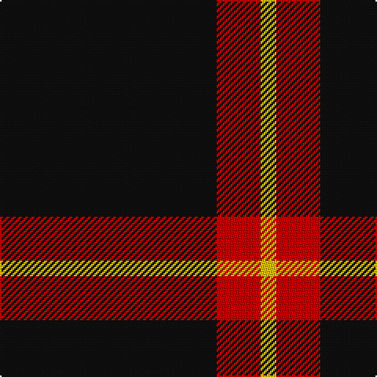

This page is one **sett** — a single exact thread-count. It belongs to the [tartan](/tartans/k69r14ly5/)
(the same proportion at any scale), whose colour order is pattern [KRY](/stripes/kry/).

Sourced from register-of-tartans.  It is a [3 stripe tartan](/stripes/stripes3/).

Original link https://www.tartanregister.gov.uk/tartanDetails.aspx?ref=5755

2 attestations — the source records this cloth was collapsed from (oldest owns this page)

<ul>
<li>01/10/2008 — Batson (Personal) (register-of-tartans, <a href="https://www.tartanregister.gov.uk/tartanDetails.aspx?ref=5755">record</a>)</li>
<li>October 2008 — Batson (Personal) (tartans-authority, <a href="http://www.tartansauthority.com/tartan-ferret/display/7789/">record</a>)</li>
</ul>

## Register references

External register numbers recorded for this tartan.

- Scottish Register of Tartans: [5755](https://www.tartanregister.gov.uk/tartanDetails.aspx?ref=5755)
- Scottish Tartans Authority (ITI): 7789

## Thread count
K/138 R28 Y/10

## Palette

Palette: <strong>Tartan Register</strong>
<table><thead><tr><th>Colour</th><th>Threads</th><th>Shade</th><th>Base</th><th>OKLCh</th></tr></thead><tbody><tr><td>K/</td><td style="text-align:right;font-variant-numeric:tabular-nums">138</td><td><code style="background-color:#101010;">#101010</code> <small style="color:#888">#101010</small></td><td>K <code style="background-color:#000000;">#000000</code></td><td><small style="color:#888">oklch(17.3% 0.000 89.9)</small></td></tr><tr><td>R</td><td style="text-align:right;font-variant-numeric:tabular-nums">28</td><td><code style="background-color:#C80000;">#C80000</code> <small style="color:#888">#C80000</small></td><td>R <code style="background-color:#CC0000;">#CC0000</code></td><td><small style="color:#888">oklch(52.3% 0.215 29.2)</small></td></tr><tr><td>Y/</td><td style="text-align:right;font-variant-numeric:tabular-nums">10</td><td><code style="background-color:#E8C000;">#E8C000</code> <small style="color:#888">#E8C000</small></td><td>Y <code style="background-color:#F2BF00;">#F2BF00</code></td><td><small style="color:#888">oklch(81.9% 0.168 93.7)</small></td></tr></tbody></table>

# Sample pattern

## Nearest tartans

The nearest existing variants by ΔTartan distance, with this tartan at the top so the swatches line up against it.

ΔTartan

Tartan

Sett

—

<a href="/ttd/edit/#slug=k69r14ly5~x2">Batson (Personal)</a> <a class="nn-out" href="/setts/s3/k69r14ly5~x2/" title="open its dictionary page">↗</a>

1.45

<a href="/ttd/edit/#slug=r1k20lb5r1~x4">Dobelman (Personal)</a> <a class="nn-out" href="/setts/s4/r1k20lb5r1~x4/" title="open its dictionary page">↗</a>

1.54

<a href="/ttd/edit/#slug=y14k80y14ly5~x2">Westgate Fashion Tartan Tartan Number: 6019. Earliest known date: pre 2003 A fashion tartan See products available Copyright © Blair Urquhart, Comrie, 2015</a> <a class="nn-out" href="/setts/s4/y14k80y14ly5~x2/" title="open its dictionary page">↗</a>

1.55

<a href="/ttd/edit/#slug=r3n12k50ly3~x2">Rogues (United States), The</a> <a class="nn-out" href="/setts/s4/r3n12k50ly3~x2/" title="open its dictionary page">↗</a>

1.58

<a href="/ttd/edit/#slug=k35lo3w3g3~x4">Dhillon (Personal)</a> <a class="nn-out" href="/setts/s4/k35lo3w3g3~x4/" title="open its dictionary page">↗</a>

1.63

<a href="/ttd/edit/#slug=r3t12k50ly3~x2">Rogues, The (Corporate)</a> <a class="nn-out" href="/setts/s4/r3t12k50ly3~x2/" title="open its dictionary page">↗</a>

1.70

<a href="/ttd/edit/#slug=k4r11k32ly1k4~x2">Harvie</a> <a class="nn-out" href="/setts/s5/k4r11k32ly1k4~x2/" title="open its dictionary page">↗</a>

1.73

<a href="/ttd/edit/#slug=k4r4k20r1k20w4~x6">Lanoir</a> <a class="nn-out" href="/setts/s6/k4r4k20r1k20w4~x6/" title="open its dictionary page">↗</a>

1.74

<a href="/ttd/edit/#slug=ly9k4ly4k45r4~x2">Gwynn (Name)</a> <a class="nn-out" href="/setts/s5/ly9k4ly4k45r4~x2/" title="open its dictionary page">↗</a>

1.77

<a href="/ttd/edit/#slug=ly7k4ly4k39r4~x2">Welsh National #3</a> <a class="nn-out" href="/setts/s5/ly7k4ly4k39r4~x2/" title="open its dictionary page">↗</a>

1.78

<a href="/ttd/edit/#slug=k20w2t1~x6">Fily (Verneuil L'tang) (Personal)</a> <a class="nn-out" href="/setts/s3/k20w2t1~x6/" title="open its dictionary page">↗</a>

## Neighbour map

Every grey dot is one of 14299 variants placed by the first two principal components of the ΔTartan feature space (44% of its variance). Red is this tartan; blue dots are its nearest — click one to open its page.

<svg viewBox="0 0 640 380" role="img" style="max-width:100%;height:auto;border:1px solid #e0e0e0;border-radius:4px;display:block" xmlns="http://www.w3.org/2000/svg"><image href="/nn/cloud.v1.png" width="640" height="380"/><a href="/setts/s4/r1k20lb5r1~x4/"><circle cx="479.4" cy="198.4" r="4" fill="#3465a4"><title>Dobelman (Personal)</title></circle></a><a href="/setts/s4/y14k80y14ly5~x2/"><circle cx="475.7" cy="229.6" r="4" fill="#3465a4"><title>Westgate Fashion Tartan Tartan Number: 6019. Earliest known date: pre 2003 A fashion tartan See products available Copyright © Blair Urquhart, Comrie, 2015</title></circle></a><a href="/setts/s4/r3n12k50ly3~x2/"><circle cx="465.9" cy="200.3" r="4" fill="#3465a4"><title>Rogues (United States), The</title></circle></a><a href="/setts/s4/k35lo3w3g3~x4/"><circle cx="490.0" cy="202.4" r="4" fill="#3465a4"><title>Dhillon (Personal)</title></circle></a><a href="/setts/s4/r3t12k50ly3~x2/"><circle cx="456.2" cy="196.1" r="4" fill="#3465a4"><title>Rogues, The (Corporate)</title></circle></a><a href="/setts/s5/k4r11k32ly1k4~x2/"><circle cx="539.6" cy="185.1" r="4" fill="#3465a4"><title>Harvie</title></circle></a><a href="/setts/s6/k4r4k20r1k20w4~x6/"><circle cx="538.4" cy="209.3" r="4" fill="#3465a4"><title>Lanoir</title></circle></a><a href="/setts/s5/ly9k4ly4k45r4~x2/"><circle cx="453.3" cy="201.2" r="4" fill="#3465a4"><title>Gwynn (Name)</title></circle></a><a href="/setts/s5/ly7k4ly4k39r4~x2/"><circle cx="445.0" cy="207.2" r="4" fill="#3465a4"><title>Welsh National #3</title></circle></a><a href="/setts/s3/k20w2t1~x6/"><circle cx="601.0" cy="226.8" r="4" fill="#3465a4"><title>Fily (Verneuil L'tang) (Personal)</title></circle></a><circle cx="514.4" cy="245.1" r="5" fill="#c00000"/></svg>

ID: /setts/s3/k69r14ly5~x2/
