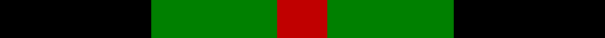
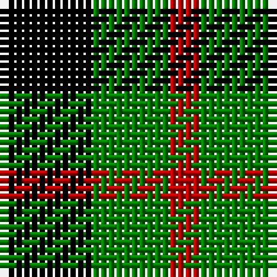

In pattern [KGR](/stripes/kgr/).

This was sourced from weddslist.  It is a [3 stripe tartan](/stripes/stripes3/).

Original link http://www.weddslist.com/cgi-bin/tartans/pg.pl?source=sts

## Also known as

This cloth is also recorded under:

- Glen Lyon #1

## Attestations

This cloth appears in 2 source records; the oldest owns this page.

- undated — Glen Lyon (weddslist, [record](http://www.weddslist.com/cgi-bin/tartans/pg.pl?source=sts))
- undated — Glen Lyon District Tartan Tartan Number: 23. Earliest known date: 1820 Appears to be No 185 in Wilson's '1819' See products available Copyright © Blair Urquhart, Comrie, 2015 (house-of-tartan, [record](http://www.house-of-tartan.scotland.net/house/TartanViewjs.asp?colr=Def&tnam=23))

## Thread count
K/12 G10 R/4

## Palette
Each colour and the base-6 reference it is a variant of.

| Colour | Shade | Base |
|---|---|---|
| G | <code style="background-color:#008000;">#008000</code> `oklch(52.0% 0.177 142.5)` <small>#008000</small> | G <code style="background-color:#006100;">#006100</code> |
| K | <code style="background-color:#000000;">#000000</code> `oklch(0.0% 0.000 0.0)` <small>#000000</small> | K <code style="background-color:#000000;">#000000</code> |
| R | <code style="background-color:#C00000;">#C00000</code> `oklch(50.7% 0.208 29.2)` <small>#C00000</small> | R <code style="background-color:#CC0000;">#CC0000</code> |

# Sample pattern

## Nearest tartans

The nearest existing variants by ΔTartan distance.

1. [Wilson's, No 94](/setts/s3/k5g4r2~x2/) — ΔT 0.47
1. [Glen Lyon, or Mull (No.53)](/setts/s3/k5g3t2~x2/) — ΔT 1.07
1. [Wilson's, No 2/53 or Mull](/setts/s3/k5g4ly1~x2/) — ΔT 1.30
1. [Zwijnenberg, Frans (Personal)](/setts/s3/k23g8lo8~x4/) — ΔT 1.48
1. [Zwijnenberg, Frans (Personal)](/setts/s3/k23g8ly8~x4/) — ΔT 1.57
1. [Wilson's, No 50](/setts/s3/g5k6t1~x4/) — ΔT 1.65
1. [Wilson's, No 197](/setts/s3/k6ly1g6~x4/) — ΔT 1.65
1. [Kincaid](/setts/s3/k11dg17r3/) — ΔT 1.77
1. [Mull](/setts/s3/k5g4t2~x2/) — ΔT 1.79
1. [Kincaid, of Kincaid](/setts/s3/k4g6r1~x10/) — ΔT 1.83

## Neighbour map

Every grey dot is one of 14299 variants placed by the first two principal components of the ΔTartan feature space (44% of its variance). Red is this tartan; blue dots are its nearest — click one to open its page.

<svg viewBox="0 0 640 380" role="img" style="max-width:100%;height:auto;border:1px solid #e0e0e0;border-radius:4px;display:block" xmlns="http://www.w3.org/2000/svg"><image href="/nn/cloud.v1.png" width="640" height="380"/><a href="/setts/s3/k5g4r2~x2/"><circle cx="148.0" cy="354.0" r="4" fill="#3465a4"><title>Wilson's, No 94</title></circle></a><a href="/setts/s3/k5g3t2~x2/"><circle cx="165.0" cy="354.5" r="4" fill="#3465a4"><title>Glen Lyon, or Mull (No.53)</title></circle></a><a href="/setts/s3/k5g4ly1~x2/"><circle cx="218.0" cy="309.3" r="4" fill="#3465a4"><title>Wilson's, No 2/53 or Mull</title></circle></a><a href="/setts/s3/k23g8lo8~x4/"><circle cx="241.6" cy="323.3" r="4" fill="#3465a4"><title>Zwijnenberg, Frans (Personal)</title></circle></a><a href="/setts/s3/k23g8ly8~x4/"><circle cx="241.4" cy="319.0" r="4" fill="#3465a4"><title>Zwijnenberg, Frans (Personal)</title></circle></a><a href="/setts/s3/g5k6t1~x4/"><circle cx="238.7" cy="305.7" r="4" fill="#3465a4"><title>Wilson's, No 50</title></circle></a><a href="/setts/s3/k6ly1g6~x4/"><circle cx="221.3" cy="300.3" r="4" fill="#3465a4"><title>Wilson's, No 197</title></circle></a><a href="/setts/s3/k11dg17r3/"><circle cx="283.5" cy="314.9" r="4" fill="#3465a4"><title>Kincaid</title></circle></a><a href="/setts/s3/k5g4t2~x2/"><circle cx="178.2" cy="366.0" r="4" fill="#3465a4"><title>Mull</title></circle></a><a href="/setts/s3/k4g6r1~x10/"><circle cx="258.1" cy="299.0" r="4" fill="#3465a4"><title>Kincaid, of Kincaid</title></circle></a><circle cx="168.7" cy="341.6" r="5" fill="#c00000"/></svg>

ID: /setts/s3/k6g5r2~x2/
