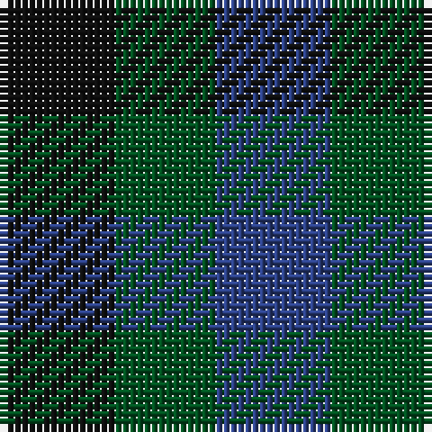

**Bands:** [KGB](/stripes/kgb/) · **Stripes:** [K DG DB](/stripes/stripes3/) K DG DB

This was sourced from register-of-tartans.  It is a [3 band tartan](/bands/bands3/).

Original link https://www.tartanregister.gov.uk/tartanDetails.aspx?ref=1423

## Also known as

This cloth is also recorded under:

- Glen Lyon

## Register references

External register numbers recorded for this tartan.

- Scottish Register of Tartans: [1423](https://www.tartanregister.gov.uk/tartanDetails.aspx?ref=1423)
- Scottish Tartans World Register: 1928

## Thread count
K/16 G14 B/16

## Palette
Each colour and its ΔE from the base-6 reference it is a variant of.

| Colour | Shade | Base | ΔE (OKLab) |
|---|---|---|---|
| B | <code style="background-color:#2C4084;">#2C4084</code> `#2C4084` | B <code style="background-color:#2A418A;">#2A418A</code> | 0.01 |
| G | <code style="background-color:#005020;">#005020</code> `#005020` | G <code style="background-color:#006100;">#006100</code> | 0.07 |
| K | <code style="background-color:#101010;">#101010</code> `#101010` | K <code style="background-color:#000000;">#000000</code> | 0.17 |

# Sample pattern

## Nearest tartans

The nearest existing variants by ΔTartan distance.

1. [Wilson's No.185](/setts/s3/k11g9dp10~x2/) — ΔT 2.19
1. [Wandering Shepherd (Personal)](/setts/s5/db2k2g2db1k1~x20/) — ΔT 2.64
1. [Glen Lyon (District)](/setts/s3/k5g4t3~x2/) — ΔT 2.90
1. [Algarve (Fashion)](/setts/s4/k1db1~x20/) — ΔT 2.97
1. [Ballindalloch Check](/setts/s5/dr1o1dr1o1dg1~x8/) — ΔT 3.01
1. [Macintosh, Charles Rennie (Commem)](/setts/s6/k5n5k9db5k5db5~x2/) — ΔT 3.10
1. [MacKillen Hunting](/setts/s2/k1g1~x168/) — ΔT 3.12
1. [Glen Lyon](/setts/s3/k8g7db8~x2/) — ΔT 3.12
1. [Wilson's No.116 (light)](/setts/s2/y9dp8~x2/) — ΔT 3.14
1. [St. Combs Fisher Plaid](/setts/s2/db1b1~x14/) — ΔT 3.21

## Neighbour map

Every grey dot is one of 14299 variants placed by the first two principal components of the ΔTartan feature space (44% of its variance). Red is this tartan; blue dots are its nearest — click one to open its page.

<svg viewBox="0 0 640 380" role="img" style="max-width:100%;height:auto;border:1px solid #e0e0e0;border-radius:4px;display:block" xmlns="http://www.w3.org/2000/svg"><image href="/nn/cloud.v1.png" width="640" height="380"/><a href="/setts/s3/k11g9dp10~x2/"><circle cx="78.1" cy="366.0" r="4" fill="#3465a4"><title>Wilson's No.185</title></circle></a><a href="/setts/s5/db2k2g2db1k1~x20/"><circle cx="154.9" cy="366.0" r="4" fill="#3465a4"><title>Wandering Shepherd (Personal)</title></circle></a><a href="/setts/s3/k5g4t3~x2/"><circle cx="111.9" cy="366.0" r="4" fill="#3465a4"><title>Glen Lyon (District)</title></circle></a><a href="/setts/s4/k1db1~x20/"><circle cx="14.0" cy="366.0" r="4" fill="#3465a4"><title>Algarve (Fashion)</title></circle></a><a href="/setts/s5/dr1o1dr1o1dg1~x8/"><circle cx="67.6" cy="366.0" r="4" fill="#3465a4"><title>Ballindalloch Check</title></circle></a><a href="/setts/s6/k5n5k9db5k5db5~x2/"><circle cx="254.3" cy="366.0" r="4" fill="#3465a4"><title>Macintosh, Charles Rennie (Commem)</title></circle></a><a href="/setts/s2/k1g1~x168/"><circle cx="224.1" cy="366.0" r="4" fill="#3465a4"><title>MacKillen Hunting</title></circle></a><a href="/setts/s3/k8g7db8~x2/"><circle cx="23.0" cy="366.0" r="4" fill="#3465a4"><title>Glen Lyon</title></circle></a><a href="/setts/s2/y9dp8~x2/"><circle cx="234.1" cy="366.0" r="4" fill="#3465a4"><title>Wilson's No.116 (light)</title></circle></a><a href="/setts/s2/db1b1~x14/"><circle cx="210.9" cy="366.0" r="4" fill="#3465a4"><title>St. Combs Fisher Plaid</title></circle></a><circle cx="110.2" cy="366.0" r="5" fill="#c00000"/></svg>

ID: /setts/s3/k8dg7db8~x2/
