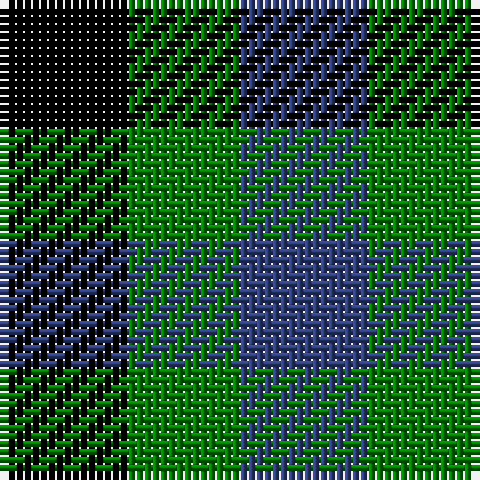

In pattern [BGK](/stripes/bgk/).

This was sourced from weddslist.  It is a [3 stripe tartan](/stripes/stripes3/).

Original link http://www.weddslist.com/cgi-bin/tartans/pg.pl?source=sts

## Also known as

This cloth is also recorded under:

- Glen Lyon

## Thread count
K/16 G14 B/16

## Palette
Each colour and the base-6 reference it is a variant of.

| Colour | Shade | Base |
|---|---|---|
| B | <code style="background-color:#304080;">#304080</code> `oklch(39.4% 0.109 270.2)` <small>#304080</small> | B <code style="background-color:#2A418A;">#2A418A</code> |
| G | <code style="background-color:#008000;">#008000</code> `oklch(52.0% 0.177 142.5)` <small>#008000</small> | G <code style="background-color:#006100;">#006100</code> |
| K | <code style="background-color:#000000;">#000000</code> `oklch(0.0% 0.000 0.0)` <small>#000000</small> | K <code style="background-color:#000000;">#000000</code> |

# Sample pattern

## Nearest tartans

The nearest existing variants by ΔTartan distance, with this tartan at the top so the swatches line up against it.

ΔTartan

Tartan

Sett

—

<a href="/ttd/edit/#slug=k8g7db8~x2">Glen Lyon</a> <a class="nn-out" href="/setts/s3/k8g7db8~x2/" title="open its dictionary page">↗</a>

1.26

<a href="/ttd/edit/#slug=k11p10g9~x2">Wilson's, No 185</a> <a class="nn-out" href="/setts/s3/k11p10g9~x2/" title="open its dictionary page">↗</a>

1.83

<a href="/ttd/edit/#slug=k5g4t3~x2">Glen Lyon (District)</a> <a class="nn-out" href="/setts/s3/k5g4t3~x2/" title="open its dictionary page">↗</a>

1.83

<a href="/ttd/edit/#slug=k11g9dp10~x2">Wilson's No.185</a> <a class="nn-out" href="/setts/s3/k11g9dp10~x2/" title="open its dictionary page">↗</a>

1.87

<a href="/ttd/edit/#slug=g3k2db2~x4">Glenlyon #2</a> <a class="nn-out" href="/setts/s3/g3k2db2~x4/" title="open its dictionary page">↗</a>

2.05

<a href="/ttd/edit/#slug=r10k11g9~x2">Wilson's, No 204</a> <a class="nn-out" href="/setts/s3/r10k11g9~x2/" title="open its dictionary page">↗</a>

2.16

<a href="/ttd/edit/#slug=k1g1r1~x8">Wilson's, No 187</a> <a class="nn-out" href="/setts/s3/k1g1r1~x8/" title="open its dictionary page">↗</a>

2.17

<a href="/ttd/edit/#slug=lo5db5k3~x4">Kazakhstan Relic (Artefact)</a> <a class="nn-out" href="/setts/s3/lo5db5k3~x4/" title="open its dictionary page">↗</a>

2.25

<a href="/ttd/edit/#slug=k11g9r10~x2">Wilson's No.204</a> <a class="nn-out" href="/setts/s3/k11g9r10~x2/" title="open its dictionary page">↗</a>

2.49

<a href="/ttd/edit/#slug=k1lb1o1~x6">Coigach Tweed</a> <a class="nn-out" href="/setts/s3/k1lb1o1~x6/" title="open its dictionary page">↗</a>

2.59

<a href="/ttd/edit/#slug=db1lr1r1~x4">Usa</a> <a class="nn-out" href="/setts/s3/db1lr1r1~x4/" title="open its dictionary page">↗</a>

## Neighbour map

Every grey dot is one of 14299 variants placed by the first two principal components of the ΔTartan feature space (44% of its variance). Red is this tartan; blue dots are its nearest — click one to open its page.

<svg viewBox="0 0 640 380" role="img" style="max-width:100%;height:auto;border:1px solid #e0e0e0;border-radius:4px;display:block" xmlns="http://www.w3.org/2000/svg"><image href="/nn/cloud.v1.png" width="640" height="380"/><a href="/setts/s3/k11p10g9~x2/"><circle cx="36.2" cy="366.0" r="4" fill="#3465a4"><title>Wilson's, No 185</title></circle></a><a href="/setts/s3/k5g4t3~x2/"><circle cx="111.9" cy="366.0" r="4" fill="#3465a4"><title>Glen Lyon (District)</title></circle></a><a href="/setts/s3/k11g9dp10~x2/"><circle cx="78.1" cy="366.0" r="4" fill="#3465a4"><title>Wilson's No.185</title></circle></a><a href="/setts/s3/g3k2db2~x4/"><circle cx="89.4" cy="366.0" r="4" fill="#3465a4"><title>Glenlyon #2</title></circle></a><a href="/setts/s3/r10k11g9~x2/"><circle cx="34.9" cy="366.0" r="4" fill="#3465a4"><title>Wilson's, No 204</title></circle></a><a href="/setts/s3/k1g1r1~x8/"><circle cx="14.0" cy="366.0" r="4" fill="#3465a4"><title>Wilson's, No 187</title></circle></a><a href="/setts/s3/lo5db5k3~x4/"><circle cx="94.3" cy="366.0" r="4" fill="#3465a4"><title>Kazakhstan Relic (Artefact)</title></circle></a><a href="/setts/s3/k11g9r10~x2/"><circle cx="64.1" cy="366.0" r="4" fill="#3465a4"><title>Wilson's No.204</title></circle></a><a href="/setts/s3/k1lb1o1~x6/"><circle cx="14.0" cy="366.0" r="4" fill="#3465a4"><title>Coigach Tweed</title></circle></a><a href="/setts/s3/db1lr1r1~x4/"><circle cx="14.0" cy="366.0" r="4" fill="#3465a4"><title>Usa</title></circle></a><circle cx="23.0" cy="366.0" r="5" fill="#c00000"/></svg>

ID: /setts/s3/k8g7db8~x2/
