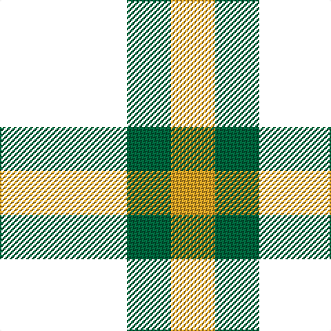

In pattern [KGY](/patterns/kgy/).

This was sourced from register-of-tartans.  It is a [3 stripes tartan](/stripes/stripes3/).

Original link https://www.tartanregister.gov.uk/tartanDetails.aspx?ref=11096

## Thread count
K/92 G32 Y/32

## Palette
Each colour and its ΔE from the base-6 reference it is a variant of.

| Colour | Shade | Base | ΔE (OKLab) |
|---|---|---|---|
| G | <code style="background-color:#00643C;">#00643C</code> `#00643C` | G <code style="background-color:#006100;">#006100</code> | 0.05 |
| Y | <code style="background-color:#E0A126;">#E0A126</code> `#E0A126` | Y <code style="background-color:#F2BF00;">#F2BF00</code> | 0.08 |

# Sample pattern

## Nearest tartans

The nearest existing variants by ΔTartan distance.

1. [Zwijnenberg, Frans (Personal)](/setts/s3/k92g32y32-g006818-k101010-yfccc00/) — ΔT 1.15
1. [Glen Lyon](/setts/s3/k12g10r4-g008000-k000000-rc00000/) — ΔT 1.48
1. [Wilson's, No 2/53 or Mull](/setts/s3/k10g8y2-g008000-k000000-yf0c000/) — ΔT 1.56
1. [Glen Lyon, or Mull (No.53)](/setts/s3/k10g6b4-b5480b0-g008000-k000000/) — ΔT 1.56
1. [Kincaid](/setts/s3/k11g17r3-g004c00-k000000-rc80000/) — ΔT 1.57
1. [Wilson's, No 50](/setts/s3/g20k24b4-b5480b0-g008000-k000000/) — ΔT 1.68
1. [Wilson's, No 118](/setts/s3/k10b8y2-b5480b0-k000000-yf0c000/) — ΔT 1.69
1. [Wilson's, No 94](/setts/s3/k10g8r4-g008000-k000000-rc00000/) — ΔT 1.75
1. [Kincaid](/setts/s3/k22g34r6-g11450d-k000000-raa0000/) — ΔT 1.76
1. [Kincaid](/setts/s3/k11g17r3-g11450d-k000000-raa0000/) — ΔT 1.76

## Neighbour map

Every grey dot is one of 15726 variants placed by the first two principal components of the ΔTartan feature space (44% of its variance). Red is this tartan; blue dots are its nearest — click one to open its page.

<svg viewBox="0 0 640 380" role="img" style="max-width:100%;height:auto;border:1px solid #e0e0e0;border-radius:4px;display:block" xmlns="http://www.w3.org/2000/svg"><image href="/nn/cloud.v1.png" width="640" height="380"/><a href="/setts/s3/k92g32y32-g006818-k101010-yfccc00/"><circle cx="243.0" cy="321.4" r="4" fill="#3465a4"><title>Zwijnenberg, Frans (Personal)</title></circle></a><a href="/setts/s3/k12g10r4-g008000-k000000-rc00000/"><circle cx="169.7" cy="343.3" r="4" fill="#3465a4"><title>Glen Lyon</title></circle></a><a href="/setts/s3/k10g8y2-g008000-k000000-yf0c000/"><circle cx="218.2" cy="310.9" r="4" fill="#3465a4"><title>Wilson's, No 2/53 or Mull</title></circle></a><a href="/setts/s3/k10g6b4-b5480b0-g008000-k000000/"><circle cx="165.5" cy="355.5" r="4" fill="#3465a4"><title>Glen Lyon, or Mull (No.53)</title></circle></a><a href="/setts/s3/k11g17r3-g004c00-k000000-rc80000/"><circle cx="283.8" cy="314.3" r="4" fill="#3465a4"><title>Kincaid</title></circle></a><a href="/setts/s3/g20k24b4-b5480b0-g008000-k000000/"><circle cx="238.2" cy="306.3" r="4" fill="#3465a4"><title>Wilson's, No 50</title></circle></a><a href="/setts/s3/k10b8y2-b5480b0-k000000-yf0c000/"><circle cx="218.7" cy="305.7" r="4" fill="#3465a4"><title>Wilson's, No 118</title></circle></a><a href="/setts/s3/k10g8r4-g008000-k000000-rc00000/"><circle cx="149.5" cy="356.0" r="4" fill="#3465a4"><title>Wilson's, No 94</title></circle></a><a href="/setts/s3/k22g34r6-g11450d-k000000-raa0000/"><circle cx="295.3" cy="318.9" r="4" fill="#3465a4"><title>Kincaid</title></circle></a><a href="/setts/s3/k11g17r3-g11450d-k000000-raa0000/"><circle cx="295.3" cy="318.9" r="4" fill="#3465a4"><title>Kincaid</title></circle></a><circle cx="242.8" cy="325.4" r="5" fill="#c00000"/></svg>

ID: /setts/s3/k92g32y32-g00643c-k000000-ye0a126/
