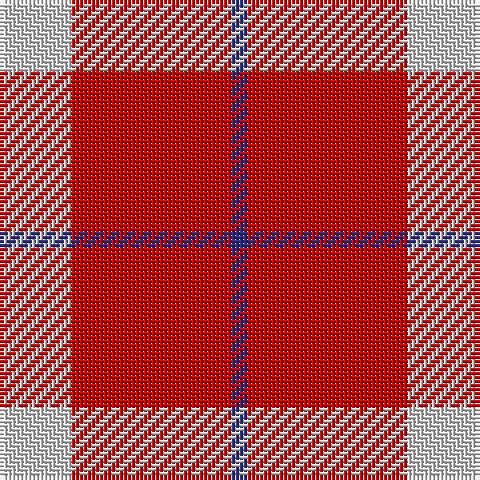

This page is one **sett** — a single exact thread-count. It belongs to the [tartan](/tartans/ln9r20db2/)
(the same proportion at any scale), whose colour order is pattern [BRW](/stripes/brw/).

Sourced from tartans-authority.  It is a [3 stripe tartan](/stripes/stripes3/).

Original link http://www.tartansauthority.com/tartan-ferret/display/7288/

## Thread count
LN/18 R40 DB/4

## Palette
Each colour and the base-6 reference it is a variant of.

| Colour | Shade | Base |
|---|---|---|
| DB | <code style="background-color:#2C2C80;">#2C2C80</code> `oklch(35.0% 0.138 276.6)` <small>#2C2C80</small> | B <code style="background-color:#2A418A;">#2A418A</code> |
| LN | <code style="background-color:#D4D4D4;">#D4D4D4</code> `oklch(87.0% 0.000 89.9)` <small>#D4D4D4</small> | W <code style="background-color:#F7F7F7;">#F7F7F7</code> |
| R | <code style="background-color:#C80000;">#C80000</code> `oklch(52.3% 0.215 29.2)` <small>#C80000</small> | R <code style="background-color:#CC0000;">#CC0000</code> |

# Sample pattern

## Nearest tartans

The nearest existing variants by ΔTartan distance, with this tartan at the top so the swatches line up against it.

ΔTartan

Tartan

Sett

—

<a href="/ttd/edit/#slug=lb9r20db2~x2">Masai Shuka 28 (Artefact)</a> <a class="nn-out" href="/setts/s3/lb9r20db2~x2/" title="open its dictionary page">↗</a>

1.53

<a href="/ttd/edit/#slug=ly3k2r10k1~x4">Masai Shuka 26 (Artefact)</a> <a class="nn-out" href="/setts/s4/ly3k2r10k1~x4/" title="open its dictionary page">↗</a>

1.53

<a href="/ttd/edit/#slug=r30k10ly3~x4">Masai Shuka 20 (Artefact)</a> <a class="nn-out" href="/setts/s3/r30k10ly3~x4/" title="open its dictionary page">↗</a>

1.63

<a href="/ttd/edit/#slug=r125k26lb20lo16">McPeek (Fashion)</a> <a class="nn-out" href="/setts/s4/r125k26lb20lo16/" title="open its dictionary page">↗</a>

1.66

<a href="/ttd/edit/#slug=r13k1lb13~x4">Hose (Dunmore)</a> <a class="nn-out" href="/setts/s3/r13k1lb13~x4/" title="open its dictionary page">↗</a>

1.68

<a href="/ttd/edit/#slug=r38w9r3do9w3~x2">Loch Morar Trade Tartan Tartan Number: 1701. Earliest known date: pre 2003 Nothing See products available Copyright © Blair Urquhart, Comrie, 2015</a> <a class="nn-out" href="/setts/s5/r38w9r3do9w3~x2/" title="open its dictionary page">↗</a>

1.70

<a href="/ttd/edit/#slug=r38w9r3dr9w3~x2">Loch Morar</a> <a class="nn-out" href="/setts/s5/r38w9r3dr9w3~x2/" title="open its dictionary page">↗</a>

1.80

<a href="/ttd/edit/#slug=r34w4t7ly10t7r18~x2">Ploysongsang, Edward Thiravej (Pers</a> <a class="nn-out" href="/setts/s6/r34w4t7ly10t7r18~x2/" title="open its dictionary page">↗</a>

1.81

<a href="/ttd/edit/#slug=r3dg20r25w3~x4">MacKinnon #6</a> <a class="nn-out" href="/setts/s4/r3dg20r25w3~x4/" title="open its dictionary page">↗</a>

1.88

<a href="/ttd/edit/#slug=r4w35r31w4~x2">Lewis, Red (Dance)</a> <a class="nn-out" href="/setts/s4/r4w35r31w4~x2/" title="open its dictionary page">↗</a>

1.91

<a href="/ttd/edit/#slug=r24dp16w3~x4">National Autistic Society Scotland</a> <a class="nn-out" href="/setts/s3/r24dp16w3~x4/" title="open its dictionary page">↗</a>

## Neighbour map

Every grey dot is one of 14299 variants placed by the first two principal components of the ΔTartan feature space (44% of its variance). Red is this tartan; blue dots are its nearest — click one to open its page.

<svg viewBox="0 0 640 380" role="img" style="max-width:100%;height:auto;border:1px solid #e0e0e0;border-radius:4px;display:block" xmlns="http://www.w3.org/2000/svg"><image href="/nn/cloud.v1.png" width="640" height="380"/><a href="/setts/s4/ly3k2r10k1~x4/"><circle cx="367.3" cy="212.0" r="4" fill="#3465a4"><title>Masai Shuka 26 (Artefact)</title></circle></a><a href="/setts/s3/r30k10ly3~x4/"><circle cx="434.4" cy="240.2" r="4" fill="#3465a4"><title>Masai Shuka 20 (Artefact)</title></circle></a><a href="/setts/s4/r125k26lb20lo16/"><circle cx="376.6" cy="200.7" r="4" fill="#3465a4"><title>McPeek (Fashion)</title></circle></a><a href="/setts/s3/r13k1lb13~x4/"><circle cx="305.4" cy="234.5" r="4" fill="#3465a4"><title>Hose (Dunmore)</title></circle></a><a href="/setts/s5/r38w9r3do9w3~x2/"><circle cx="414.5" cy="182.1" r="4" fill="#3465a4"><title>Loch Morar Trade Tartan Tartan Number: 1701. Earliest known date: pre 2003 Nothing See products available Copyright © Blair Urquhart, Comrie, 2015</title></circle></a><a href="/setts/s5/r38w9r3dr9w3~x2/"><circle cx="412.6" cy="182.4" r="4" fill="#3465a4"><title>Loch Morar</title></circle></a><a href="/setts/s6/r34w4t7ly10t7r18~x2/"><circle cx="353.4" cy="200.3" r="4" fill="#3465a4"><title>Ploysongsang, Edward Thiravej (Pers</title></circle></a><a href="/setts/s4/r3dg20r25w3~x4/"><circle cx="335.1" cy="239.8" r="4" fill="#3465a4"><title>MacKinnon #6</title></circle></a><a href="/setts/s4/r4w35r31w4~x2/"><circle cx="349.0" cy="233.0" r="4" fill="#3465a4"><title>Lewis, Red (Dance)</title></circle></a><a href="/setts/s3/r24dp16w3~x4/"><circle cx="343.7" cy="267.1" r="4" fill="#3465a4"><title>National Autistic Society Scotland</title></circle></a><circle cx="386.5" cy="238.4" r="5" fill="#c00000"/></svg>

ID: /setts/s3/lb9r20db2~x2/
