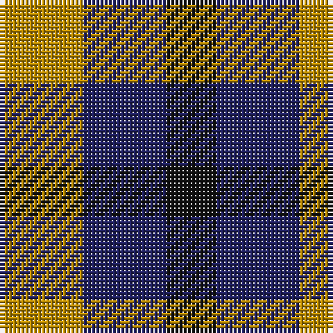

In pattern [KBY](/stripes/kby/).

This was sourced from tartans-authority.  It is a [3 stripe tartan](/stripes/stripes3/).

Original link http://www.tartansauthority.com/tartan-ferret/display/3096/

## Thread count
DY/20 DB20 K/12

## Palette
Each colour and the base-6 reference it is a variant of.

| Colour | Shade | Base |
|---|---|---|
| DB | <code style="background-color:#202060;">#202060</code> `oklch(28.9% 0.111 276.9)` <small>#202060</small> | B <code style="background-color:#2A418A;">#2A418A</code> |
| DY | <code style="background-color:#BC8C00;">#BC8C00</code> `oklch(66.8% 0.137 84.1)` <small>#BC8C00</small> | Y <code style="background-color:#F2BF00;">#F2BF00</code> |
| K | <code style="background-color:#101010;">#101010</code> `oklch(17.3% 0.000 89.9)` <small>#101010</small> | K <code style="background-color:#000000;">#000000</code> |

# Sample pattern

## Nearest tartans

The nearest existing variants by ΔTartan distance, with this tartan at the top so the swatches line up against it.

ΔTartan

Tartan

Sett

—

<a href="/ttd/edit/#slug=lo5db5k3~x4">Kazakhstan Relic (Artefact)</a> <a class="nn-out" href="/setts/s3/lo5db5k3~x4/" title="open its dictionary page">↗</a>

1.02

<a href="/ttd/edit/#slug=r4k7t4~x2">Wilson's No.198</a> <a class="nn-out" href="/setts/s3/r4k7t4~x2/" title="open its dictionary page">↗</a>

1.27

<a href="/ttd/edit/#slug=r4dg7t4~x2">Wilson's No.061</a> <a class="nn-out" href="/setts/s3/r4dg7t4~x2/" title="open its dictionary page">↗</a>

1.41

<a href="/ttd/edit/#slug=r4k7g4~x2">Wilson's No.200</a> <a class="nn-out" href="/setts/s3/r4k7g4~x2/" title="open its dictionary page">↗</a>

1.59

<a href="/ttd/edit/#slug=k5g4t3~x2">Glen Lyon (District)</a> <a class="nn-out" href="/setts/s3/k5g4t3~x2/" title="open its dictionary page">↗</a>

1.63

<a href="/ttd/edit/#slug=g7k4r4~x2">Wilson's No.202</a> <a class="nn-out" href="/setts/s3/g7k4r4~x2/" title="open its dictionary page">↗</a>

1.67

<a href="/ttd/edit/#slug=k11p10g9~x2">Wilson's, No 185</a> <a class="nn-out" href="/setts/s3/k11p10g9~x2/" title="open its dictionary page">↗</a>

1.77

<a href="/ttd/edit/#slug=do12k8t15w8~x2">Equity Vision Ltd</a> <a class="nn-out" href="/setts/s4/do12k8t15w8~x2/" title="open its dictionary page">↗</a>

1.77

<a href="/ttd/edit/#slug=db18t18lo28dt13~x2">Gold Country (California)</a> <a class="nn-out" href="/setts/s4/db18t18lo28dt13~x2/" title="open its dictionary page">↗</a>

1.77

<a href="/setts/s4/lo5db5k3~x4/">Kazakhstan Relic</a>

1.78

<a href="/ttd/edit/#slug=k11g9r10~x2">Wilson's No.204</a> <a class="nn-out" href="/setts/s3/k11g9r10~x2/" title="open its dictionary page">↗</a>

## Neighbour map

Every grey dot is one of 14299 variants placed by the first two principal components of the ΔTartan feature space (44% of its variance). Red is this tartan; blue dots are its nearest — click one to open its page.

<svg viewBox="0 0 640 380" role="img" style="max-width:100%;height:auto;border:1px solid #e0e0e0;border-radius:4px;display:block" xmlns="http://www.w3.org/2000/svg"><image href="/nn/cloud.v1.png" width="640" height="380"/><a href="/setts/s3/r4k7t4~x2/"><circle cx="142.3" cy="366.0" r="4" fill="#3465a4"><title>Wilson's No.198</title></circle></a><a href="/setts/s3/r4dg7t4~x2/"><circle cx="161.9" cy="366.0" r="4" fill="#3465a4"><title>Wilson's No.061</title></circle></a><a href="/setts/s3/r4k7g4~x2/"><circle cx="159.1" cy="366.0" r="4" fill="#3465a4"><title>Wilson's No.200</title></circle></a><a href="/setts/s3/k5g4t3~x2/"><circle cx="111.9" cy="366.0" r="4" fill="#3465a4"><title>Glen Lyon (District)</title></circle></a><a href="/setts/s3/g7k4r4~x2/"><circle cx="160.0" cy="366.0" r="4" fill="#3465a4"><title>Wilson's No.202</title></circle></a><a href="/setts/s3/k11p10g9~x2/"><circle cx="36.2" cy="366.0" r="4" fill="#3465a4"><title>Wilson's, No 185</title></circle></a><a href="/setts/s4/do12k8t15w8~x2/"><circle cx="24.5" cy="332.5" r="4" fill="#3465a4"><title>Equity Vision Ltd</title></circle></a><a href="/setts/s4/db18t18lo28dt13~x2/"><circle cx="54.8" cy="329.7" r="4" fill="#3465a4"><title>Gold Country (California)</title></circle></a><a href="/setts/s4/lo5db5k3~x4/"><circle cx="171.7" cy="366.0" r="4" fill="#3465a4"><title>Kazakhstan Relic</title></circle></a><a href="/setts/s3/k11g9r10~x2/"><circle cx="64.1" cy="366.0" r="4" fill="#3465a4"><title>Wilson's No.204</title></circle></a><circle cx="94.3" cy="366.0" r="5" fill="#c00000"/></svg>

ID: /setts/s3/lo5db5k3~x4/
