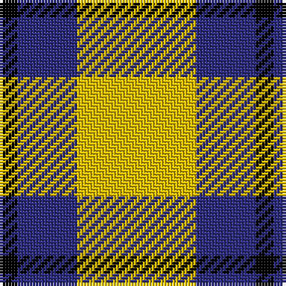

In pattern [KBY](/stripes/kby/).

This was sourced from tartans-authority.  It is a [3 stripe tartan](/stripes/stripes3/).

Original link http://www.tartansauthority.com/tartan-ferret/display/7191/

## Thread count
Y/40 DB20 K/6

## Palette
Each colour and the base-6 reference it is a variant of.

| Colour | Shade | Base |
|---|---|---|
| DB | <code style="background-color:#2C2C80;">#2C2C80</code> `oklch(35.0% 0.138 276.6)` <small>#2C2C80</small> | B <code style="background-color:#2A418A;">#2A418A</code> |
| K | <code style="background-color:#000000;">#000000</code> `oklch(0.0% 0.000 0.0)` <small>#000000</small> | K <code style="background-color:#000000;">#000000</code> |
| R | <code style="background-color:#C80000;">#C80000</code> `oklch(52.3% 0.215 29.2)` <small>#C80000</small> | R <code style="background-color:#CC0000;">#CC0000</code> |
| Y | <code style="background-color:#E8C000;">#E8C000</code> `oklch(81.9% 0.168 93.7)` <small>#E8C000</small> | Y <code style="background-color:#F2BF00;">#F2BF00</code> |

# Sample pattern

## Nearest tartans

The nearest existing variants by ΔTartan distance, with this tartan at the top so the swatches line up against it.

ΔTartan

Tartan

Sett

—

<a href="/ttd/edit/#slug=ly20db10k3~x2">Masai Shuka 04 (Artefact)</a> <a class="nn-out" href="/setts/s3/ly20db10k3~x2/" title="open its dictionary page">↗</a>

0.99

<a href="/ttd/edit/#slug=k15ly20w3~x2">Silvicola (Corporate)</a> <a class="nn-out" href="/setts/s3/k15ly20w3~x2/" title="open its dictionary page">↗</a>

1.25

<a href="/ttd/edit/#slug=w5ly32dt32ly5~x2">Barclay Dress</a> <a class="nn-out" href="/setts/s4/w5ly32dt32ly5~x2/" title="open its dictionary page">↗</a>

1.30

<a href="/ttd/edit/#slug=w1ly6k6ly1~x8">Barclay Dress Clan Tartan Tartan Number: 1879. Earliest known date: 1906 Based on the earlier hunting sett which appeared in the Vestiarium Scoticum in 1842. Barclay's appear to have no 'regular' tartan. The dress version assumes this role and is the sett most commonly associated with the name. The Aberdeenshire Barclays of Tolly held lands for over 600 years, and their descendant, Michael Andreas Barclay, was made Prince Barclay de Tolly for his part in the defeat of Napoleon. There is also a green hunting version of the same pattern. See products available Copyright © Blair Urquhart, Comrie, 2015</a> <a class="nn-out" href="/setts/s4/w1ly6k6ly1~x8/" title="open its dictionary page">↗</a>

1.53

<a href="/setts/s4/dg20w5r3~x2/">Juchter (Personal)</a>

1.61

<a href="/ttd/edit/#slug=k4lo15k4w2~x2">Takla Makan #2 (Artefact)</a> <a class="nn-out" href="/setts/s4/k4lo15k4w2~x2/" title="open its dictionary page">↗</a>

1.64

<a href="/ttd/edit/#slug=ly49r16k11~x2">Quenouille (2011)</a> <a class="nn-out" href="/setts/s3/ly49r16k11~x2/" title="open its dictionary page">↗</a>

1.71

<a href="/ttd/edit/#slug=p2g4ly1~x4">Wilson's, No 201</a> <a class="nn-out" href="/setts/s3/p2g4ly1~x4/" title="open its dictionary page">↗</a>

1.72

<a href="/ttd/edit/#slug=o22ly10w3k8~x2">Louisburg Canadian District Tartan Tartan Number: 5500. Earliest known date: 1994 Louisburg is a tiny seaside town in Nova Scotia about 20 miles southeast of Sydney and site of the 1758 Battle of Louisburgh. It was designed by Edith MacIntyre of Louisbourg with the assistance of Jean Kyte and Jean composed the following poem about the colours. CIDD count slightly different - RB/20 W8 Y20 LN/34 (John Fitzpatrick's July 2008 review of Canadian tartans). Gray fog and sea and rocks. The yellow sun. white spindrift on the harbour restless beneath an azure sky. Curent owners (2008): The Louisbourg Heritage Society P.O. Box 396 Louisbourg, B0A 1M0 Nova Scotia, Canada See products available Copyright © Blair Urquhart, Comrie, 2015</a> <a class="nn-out" href="/setts/s4/o22ly10w3k8~x2/" title="open its dictionary page">↗</a>

1.74

<a href="/ttd/edit/#slug=dg4w35g31w4~x2">Lewis, Green (Dance)</a> <a class="nn-out" href="/setts/s4/dg4w35g31w4~x2/" title="open its dictionary page">↗</a>

1.76

<a href="/ttd/edit/#slug=w1ly6k6ly1~x2">Barclay Dress</a> <a class="nn-out" href="/setts/s4/w1ly6k6ly1~x2/" title="open its dictionary page">↗</a>

## Neighbour map

Every grey dot is one of 14299 variants placed by the first two principal components of the ΔTartan feature space (44% of its variance). Red is this tartan; blue dots are its nearest — click one to open its page.

<svg viewBox="0 0 640 380" role="img" style="max-width:100%;height:auto;border:1px solid #e0e0e0;border-radius:4px;display:block" xmlns="http://www.w3.org/2000/svg"><image href="/nn/cloud.v1.png" width="640" height="380"/><a href="/setts/s3/k15ly20w3~x2/"><circle cx="243.8" cy="267.3" r="4" fill="#3465a4"><title>Silvicola (Corporate)</title></circle></a><a href="/setts/s4/w5ly32dt32ly5~x2/"><circle cx="249.2" cy="241.2" r="4" fill="#3465a4"><title>Barclay Dress</title></circle></a><a href="/setts/s4/w1ly6k6ly1~x8/"><circle cx="241.6" cy="244.5" r="4" fill="#3465a4"><title>Barclay Dress Clan Tartan Tartan Number: 1879. Earliest known date: 1906 Based on the earlier hunting sett which appeared in the Vestiarium Scoticum in 1842. Barclay's appear to have no 'regular' tartan. The dress version assumes this role and is the sett most commonly associated with the name. The Aberdeenshire Barclays of Tolly held lands for over 600 years, and their descendant, Michael Andreas Barclay, was made Prince Barclay de Tolly for his part in the defeat of Napoleon. There is also a green hunting version of the same pattern. See products available Copyright © Blair Urquhart, Comrie, 2015</title></circle></a><a href="/setts/s4/dg20w5r3~x2/"><circle cx="306.5" cy="242.5" r="4" fill="#3465a4"><title>Juchter (Personal)</title></circle></a><a href="/setts/s4/k4lo15k4w2~x2/"><circle cx="308.2" cy="235.5" r="4" fill="#3465a4"><title>Takla Makan #2 (Artefact)</title></circle></a><a href="/setts/s3/ly49r16k11~x2/"><circle cx="301.2" cy="261.2" r="4" fill="#3465a4"><title>Quenouille (2011)</title></circle></a><a href="/setts/s3/p2g4ly1~x4/"><circle cx="261.6" cy="310.5" r="4" fill="#3465a4"><title>Wilson's, No 201</title></circle></a><a href="/setts/s4/o22ly10w3k8~x2/"><circle cx="201.0" cy="227.7" r="4" fill="#3465a4"><title>Louisburg Canadian District Tartan Tartan Number: 5500. Earliest known date: 1994 Louisburg is a tiny seaside town in Nova Scotia about 20 miles southeast of Sydney and site of the 1758 Battle of Louisburgh. It was designed by Edith MacIntyre of Louisbourg with the assistance of Jean Kyte and Jean composed the following poem about the colours. CIDD count slightly different - RB/20 W8 Y20 LN/34 (John Fitzpatrick's July 2008 review of Canadian tartans). Gray fog and sea and rocks. The yellow sun. white spindrift on the harbour restless beneath an azure sky. Curent owners (2008): The Louisbourg Heritage Society P.O. Box 396 Louisbourg, B0A 1M0 Nova Scotia, Canada See products available Copyright © Blair Urquhart, Comrie, 2015</title></circle></a><a href="/setts/s4/dg4w35g31w4~x2/"><circle cx="281.9" cy="230.7" r="4" fill="#3465a4"><title>Lewis, Green (Dance)</title></circle></a><a href="/setts/s4/w1ly6k6ly1~x2/"><circle cx="234.6" cy="249.2" r="4" fill="#3465a4"><title>Barclay Dress</title></circle></a><circle cx="288.1" cy="259.9" r="5" fill="#c00000"/></svg>

ID: /setts/s3/ly20db10k3~x2/
