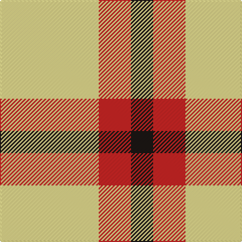

In pattern [KRY](/stripes/kry/).

This was sourced from register-of-tartans.  It is a [3 stripe tartan](/stripes/stripes3/).

Original link https://www.tartanregister.gov.uk/tartanDetails.aspx?ref=10479

## Register references

External register numbers recorded for this tartan.

- Scottish Register of Tartans: [10479](https://www.tartanregister.gov.uk/tartanDetails.aspx?ref=10479)

## Thread count
LY/98 R32 K/22

## Palette
Each colour and the base-6 reference it is a variant of.

| Colour | Shade | Base |
|---|---|---|
| K | <code style="background-color:#1C1714;">#1C1714</code> `oklch(20.9% 0.010 52.9)` <small>#1C1714</small> | K <code style="background-color:#000000;">#000000</code> |
| LY | <code style="background-color:#F8E38C;">#F8E38C</code> `oklch(91.4% 0.110 96.2)` <small>#F8E38C</small> | Y <code style="background-color:#F2BF00;">#F2BF00</code> |
| R | <code style="background-color:#CA2625;">#CA2625</code> `oklch(54.4% 0.199 27.2)` <small>#CA2625</small> | R <code style="background-color:#CC0000;">#CC0000</code> |

# Sample pattern

## Nearest tartans

The nearest existing variants by ΔTartan distance.

1. [Sands-Pingot Family, Alabama (Personal)](/setts/s5/ly6r1ly4r4db2~x5/) — ΔT 1.57
1. [Masai Shuka 04 (Artefact)](/setts/s3/ly20db10k3~x2/) — ΔT 1.64
1. [Burt's Highlanders (Fashion)](/setts/s5/lo40g13lo6db13lo22~x2/) — ΔT 1.72
1. [Silvicola](/setts/s4/ly20k15ly20w3~x2/) — ΔT 1.83
1. [Hogan (2014)](/setts/s4/g10w7ly41k7~x2/) — ΔT 1.94
1. [Silvicola (Corporate)](/setts/s3/k15ly20w3~x2/) — ΔT 2.06
1. [Barclay Dress](/setts/s4/w5ly32dt32ly5~x2/) — ΔT 2.18
1. [MacRae of Conchra #2](/setts/s4/k5w37r37w5~x2/) — ΔT 2.21
1. [Clayton Dress (Dance)](/setts/s6/w8r14w8r14w35k4~x2/) — ΔT 2.27
1. [Barclay Dress Clan Tartan Tartan Number: 1879. Earliest known date: 1906 Based on the earlier hunting sett which appeared in the Vestiarium Scoticum in 1842. Barclay's appear to have no 'regular' tartan. The dress version assumes this role and is the sett most commonly associated with the name. The Aberdeenshire Barclays of Tolly held lands for over 600 years, and their descendant, Michael Andreas Barclay, was made Prince Barclay de Tolly for his part in the defeat of Napoleon. There is also a green hunting version of the same pattern. See products available Copyright © Blair Urquhart, Comrie, 2015](/setts/s4/w1ly6k6ly1~x8/) — ΔT 2.29

## Neighbour map

Every grey dot is one of 14299 variants placed by the first two principal components of the ΔTartan feature space (44% of its variance). Red is this tartan; blue dots are its nearest — click one to open its page.

<svg viewBox="0 0 640 380" role="img" style="max-width:100%;height:auto;border:1px solid #e0e0e0;border-radius:4px;display:block" xmlns="http://www.w3.org/2000/svg"><image href="/nn/cloud.v1.png" width="640" height="380"/><a href="/setts/s5/ly6r1ly4r4db2~x5/"><circle cx="257.0" cy="242.3" r="4" fill="#3465a4"><title>Sands-Pingot Family, Alabama (Personal)</title></circle></a><a href="/setts/s3/ly20db10k3~x2/"><circle cx="288.1" cy="259.9" r="4" fill="#3465a4"><title>Masai Shuka 04 (Artefact)</title></circle></a><a href="/setts/s5/lo40g13lo6db13lo22~x2/"><circle cx="374.5" cy="244.7" r="4" fill="#3465a4"><title>Burt's Highlanders (Fashion)</title></circle></a><a href="/setts/s4/ly20k15ly20w3~x2/"><circle cx="322.2" cy="265.6" r="4" fill="#3465a4"><title>Silvicola</title></circle></a><a href="/setts/s4/g10w7ly41k7~x2/"><circle cx="292.6" cy="213.0" r="4" fill="#3465a4"><title>Hogan (2014)</title></circle></a><a href="/setts/s3/k15ly20w3~x2/"><circle cx="243.8" cy="267.3" r="4" fill="#3465a4"><title>Silvicola (Corporate)</title></circle></a><a href="/setts/s4/w5ly32dt32ly5~x2/"><circle cx="249.2" cy="241.2" r="4" fill="#3465a4"><title>Barclay Dress</title></circle></a><a href="/setts/s4/k5w37r37w5~x2/"><circle cx="281.3" cy="221.5" r="4" fill="#3465a4"><title>MacRae of Conchra #2</title></circle></a><a href="/setts/s6/w8r14w8r14w35k4~x2/"><circle cx="303.4" cy="198.2" r="4" fill="#3465a4"><title>Clayton Dress (Dance)</title></circle></a><a href="/setts/s4/w1ly6k6ly1~x8/"><circle cx="241.6" cy="244.5" r="4" fill="#3465a4"><title>Barclay Dress Clan Tartan Tartan Number: 1879. Earliest known date: 1906 Based on the earlier hunting sett which appeared in the Vestiarium Scoticum in 1842. Barclay's appear to have no 'regular' tartan. The dress version assumes this role and is the sett most commonly associated with the name. The Aberdeenshire Barclays of Tolly held lands for over 600 years, and their descendant, Michael Andreas Barclay, was made Prince Barclay de Tolly for his part in the defeat of Napoleon. There is also a green hunting version of the same pattern. See products available Copyright © Blair Urquhart, Comrie, 2015</title></circle></a><circle cx="301.2" cy="261.2" r="5" fill="#c00000"/></svg>

ID: /setts/s3/ly49r16k11~x2/
