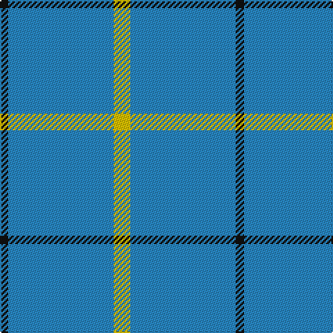

In pattern [KBY](/stripes/kby/).

This was sourced from tartans-authority.  It is a [3 stripe tartan](/stripes/stripes3/).

Original link http://www.tartansauthority.com/tartan-ferret/display/2539/

## Attestations

This cloth appears in 2 source records; the oldest owns this page.

- pre 1994 — Poulain League (Corporate) (tartans-authority, [record](http://www.tartansauthority.com/tartan-ferret/display/2539/))
- 01/01/1995 — Poulain League (register-of-tartans, [record](https://www.tartanregister.gov.uk/tartanDetails.aspx?ref=3365))

## Register references

External register numbers recorded for this tartan.

- Scottish Register of Tartans: [3365](https://www.tartanregister.gov.uk/tartanDetails.aspx?ref=3365)
- Scottish Tartans Authority (ITI): 2539
- Scottish Tartans World Register: 2539

## Thread count
Y/12 B76 K/6

## Palette
Each colour and the base-6 reference it is a variant of.

| Colour | Shade | Base |
|---|---|---|
| B | <code style="background-color:#2888C4;">#2888C4</code> `oklch(60.1% 0.125 241.5)` <small>#2888C4</small> | B <code style="background-color:#2A418A;">#2A418A</code> |
| K | <code style="background-color:#101010;">#101010</code> `oklch(17.3% 0.000 89.9)` <small>#101010</small> | K <code style="background-color:#000000;">#000000</code> |
| Y | <code style="background-color:#E8C000;">#E8C000</code> `oklch(81.9% 0.168 93.7)` <small>#E8C000</small> | Y <code style="background-color:#F2BF00;">#F2BF00</code> |

# Sample pattern

## Nearest tartans

The nearest existing variants by ΔTartan distance.

1. [Varrie](/setts/s4/t11db1w1ly1~x20/) — ΔT 1.50
1. [Varrie Commemorative Tartan Tartan Number: 9113. Earliest known date: 2009 November I have designed this tartan in remembrance of my mother Jean Alexander Varrie and for her Scottish Heritage, and all the Varrie Family's can used this design. See products available Copyright © Blair Urquhart, Comrie, 2015](/setts/s4/t9db1w1ly1~x20/) — ΔT 1.66
1. [Gyle (Corporate)](/setts/s3/t8dg1r2~x20/) — ΔT 1.72
1. [Westfield (Corporate?)](/setts/s4/dt102lr11dt14w11/) — ΔT 1.95
1. [The Poulain League](/setts/s5/ly6b38k3b38ly6~x2/) — ΔT 1.97
1. [Loevenstein Castle #2](/setts/s4/lr20db1lr4db3~x4/) — ΔT 2.17
1. [MacLaine of Lochbuie](/setts/s4/db32r3db4ly3~x2/) — ΔT 2.23
1. [Laidlaw's Highland Drovers](/setts/s6/b35k10b4w2b3r2~x2/) — ΔT 2.32
1. [Coinean Dubh](/setts/s4/dt50k12dt21w5~x2/) — ΔT 2.34
1. [Gyle](/setts/s4/t8dg1r2~x20/) — ΔT 2.39

## Neighbour map

Every grey dot is one of 14299 variants placed by the first two principal components of the ΔTartan feature space (44% of its variance). Red is this tartan; blue dots are its nearest — click one to open its page.

<svg viewBox="0 0 640 380" role="img" style="max-width:100%;height:auto;border:1px solid #e0e0e0;border-radius:4px;display:block" xmlns="http://www.w3.org/2000/svg"><image href="/nn/cloud.v1.png" width="640" height="380"/><a href="/setts/s4/t11db1w1ly1~x20/"><circle cx="512.0" cy="219.8" r="4" fill="#3465a4"><title>Varrie</title></circle></a><a href="/setts/s4/t9db1w1ly1~x20/"><circle cx="461.9" cy="225.5" r="4" fill="#3465a4"><title>Varrie Commemorative Tartan Tartan Number: 9113. Earliest known date: 2009 November I have designed this tartan in remembrance of my mother Jean Alexander Varrie and for her Scottish Heritage, and all the Varrie Family's can used this design. See products available Copyright © Blair Urquhart, Comrie, 2015</title></circle></a><a href="/setts/s3/t8dg1r2~x20/"><circle cx="453.2" cy="280.6" r="4" fill="#3465a4"><title>Gyle (Corporate)</title></circle></a><a href="/setts/s4/dt102lr11dt14w11/"><circle cx="540.7" cy="240.4" r="4" fill="#3465a4"><title>Westfield (Corporate?)</title></circle></a><a href="/setts/s5/ly6b38k3b38ly6~x2/"><circle cx="540.9" cy="225.6" r="4" fill="#3465a4"><title>The Poulain League</title></circle></a><a href="/setts/s4/lr20db1lr4db3~x4/"><circle cx="600.9" cy="214.9" r="4" fill="#3465a4"><title>Loevenstein Castle #2</title></circle></a><a href="/setts/s4/db32r3db4ly3~x2/"><circle cx="590.7" cy="239.4" r="4" fill="#3465a4"><title>MacLaine of Lochbuie</title></circle></a><a href="/setts/s6/b35k10b4w2b3r2~x2/"><circle cx="472.6" cy="175.0" r="4" fill="#3465a4"><title>Laidlaw's Highland Drovers</title></circle></a><a href="/setts/s4/dt50k12dt21w5~x2/"><circle cx="508.5" cy="276.5" r="4" fill="#3465a4"><title>Coinean Dubh</title></circle></a><a href="/setts/s4/t8dg1r2~x20/"><circle cx="406.1" cy="255.2" r="4" fill="#3465a4"><title>Gyle</title></circle></a><circle cx="529.8" cy="248.3" r="5" fill="#c00000"/></svg>

ID: /setts/s3/ly6t38k3~x2/
