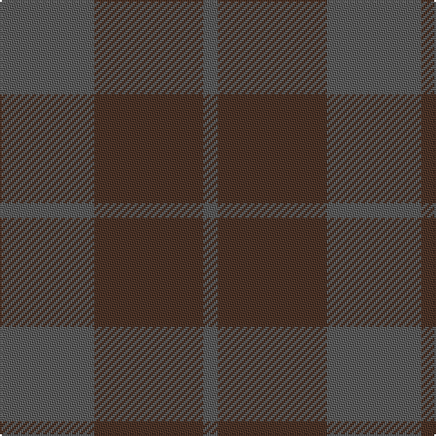

In pattern [BBB](/stripes/bbb/).

This was sourced from register-of-tartans.  It is a [3 stripe tartan](/stripes/stripes3/).

Original link https://www.tartanregister.gov.uk/tartanDetails.aspx?ref=11117

## Register references

External register numbers recorded for this tartan.

- Scottish Register of Tartans: [11117](https://www.tartanregister.gov.uk/tartanDetails.aspx?ref=11117)

## Thread count
N/52 T60 N/8

## Palette
Each colour and the base-6 reference it is a variant of.

| Colour | Shade | Base |
|---|---|---|
| N | <code style="background-color:#5C5C5C;">#5C5C5C</code> `oklch(47.5% 0.000 89.9)` <small>#5C5C5C</small> | B <code style="background-color:#2A418A;">#2A418A</code> |
| T | <code style="background-color:#4C3428;">#4C3428</code> `oklch(34.9% 0.040 47.5)` <small>#4C3428</small> | B <code style="background-color:#2A418A;">#2A418A</code> |

# Sample pattern

## Nearest tartans

The nearest existing variants by ΔTartan distance.

1. [Cairns, David (Personal)](/setts/s5/do11n1do4n8r1~x8/) — ΔT 1.96
1. [Outlander #3](/setts/s4/y14n7lo6n2~x8/) — ΔT 2.20
1. [Outlander #3](/setts/s4/o14n7lo7n2~x8/) — ΔT 2.34
1. [Sanix Muted](/setts/s4/dg3dy30dg40r3~x2/) — ΔT 2.36
1. [Bryce](/setts/s4/r5n35r46o5~x2/) — ΔT 2.66
1. [Brown Watch (single) (Fashion)](/setts/s6/do7k2do12k10dg12k3~x2/) — ΔT 2.79
1. [Cairns, David (Personal)](/setts/s5/n11o1n4o8r1~x8/) — ΔT 2.86
1. [Wcwm 9275-1333-1](/setts/s4/k20dp3k20dp20~x2/) — ΔT 2.88
1. [Brown Heather (Fashion)](/setts/s6/do1dy6do6dy1n6dy1~x8/) — ΔT 2.90
1. [Taiheiyo Club, Inc.](/setts/s7/k46dg6k6dg6k42dg47k12/) — ΔT 3.02

## Neighbour map

Every grey dot is one of 14299 variants placed by the first two principal components of the ΔTartan feature space (44% of its variance). Red is this tartan; blue dots are its nearest — click one to open its page.

<svg viewBox="0 0 640 380" role="img" style="max-width:100%;height:auto;border:1px solid #e0e0e0;border-radius:4px;display:block" xmlns="http://www.w3.org/2000/svg"><image href="/nn/cloud.v1.png" width="640" height="380"/><a href="/setts/s5/do11n1do4n8r1~x8/"><circle cx="545.1" cy="340.1" r="4" fill="#3465a4"><title>Cairns, David (Personal)</title></circle></a><a href="/setts/s4/y14n7lo6n2~x8/"><circle cx="436.9" cy="366.0" r="4" fill="#3465a4"><title>Outlander #3</title></circle></a><a href="/setts/s4/o14n7lo7n2~x8/"><circle cx="407.0" cy="366.0" r="4" fill="#3465a4"><title>Outlander #3</title></circle></a><a href="/setts/s4/dg3dy30dg40r3~x2/"><circle cx="536.7" cy="335.3" r="4" fill="#3465a4"><title>Sanix Muted</title></circle></a><a href="/setts/s4/r5n35r46o5~x2/"><circle cx="529.3" cy="337.7" r="4" fill="#3465a4"><title>Bryce</title></circle></a><a href="/setts/s6/do7k2do12k10dg12k3~x2/"><circle cx="377.1" cy="366.0" r="4" fill="#3465a4"><title>Brown Watch (single) (Fashion)</title></circle></a><a href="/setts/s5/n11o1n4o8r1~x8/"><circle cx="504.7" cy="311.4" r="4" fill="#3465a4"><title>Cairns, David (Personal)</title></circle></a><a href="/setts/s4/k20dp3k20dp20~x2/"><circle cx="531.5" cy="366.0" r="4" fill="#3465a4"><title>Wcwm 9275-1333-1</title></circle></a><a href="/setts/s6/do1dy6do6dy1n6dy1~x8/"><circle cx="365.3" cy="340.5" r="4" fill="#3465a4"><title>Brown Heather (Fashion)</title></circle></a><a href="/setts/s7/k46dg6k6dg6k42dg47k12/"><circle cx="576.1" cy="366.0" r="4" fill="#3465a4"><title>Taiheiyo Club, Inc.</title></circle></a><circle cx="522.3" cy="366.0" r="5" fill="#c00000"/></svg>

ID: /setts/s3/n13do15n2~x4/
