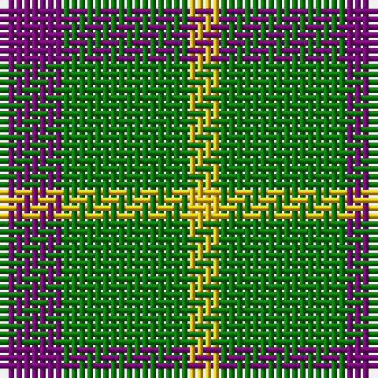

In pattern [BGY](/stripes/bgy/).

This was sourced from weddslist.  It is a [3 stripe tartan](/stripes/stripes3/).

Original link http://www.weddslist.com/cgi-bin/tartans/pg.pl?source=sts

## Thread count
P/8 G16 Y/4

## Palette
Each colour and the base-6 reference it is a variant of.

| Colour | Shade | Base |
|---|---|---|
| G | <code style="background-color:#008000;">#008000</code> `oklch(52.0% 0.177 142.5)` <small>#008000</small> | G <code style="background-color:#006100;">#006100</code> |
| P | <code style="background-color:#800080;">#800080</code> `oklch(42.1% 0.193 328.4)` <small>#800080</small> | B <code style="background-color:#2A418A;">#2A418A</code> |
| Y | <code style="background-color:#F0C000;">#F0C000</code> `oklch(82.7% 0.169 90.5)` <small>#F0C000</small> | Y <code style="background-color:#F2BF00;">#F2BF00</code> |

# Sample pattern

## Nearest tartans

The nearest existing variants by ΔTartan distance.

1. [Wilson's No.201](/setts/s3/dp2g4ly1~x4/) — ΔT 0.72
1. [Wilson's, No 81](/setts/s3/p5g6ly1~x4/) — ΔT 1.28
1. [Wilson's, No 208](/setts/s3/g7t2r4~x2/) — ΔT 1.41
1. [Wilson's, No 55](/setts/s3/g6p5t1~x4/) — ΔT 1.63
1. [Silvicola (Corporate)](/setts/s3/k15ly20w3~x2/) — ΔT 1.70
1. [Masai Shuka 04 (Artefact)](/setts/s3/ly20db10k3~x2/) — ΔT 1.71
1. [Zwijnenberg, Frans (Personal)](/setts/s3/k23g8ly8~x4/) — ΔT 1.72
1. [Wilson's No.208](/setts/s4/g7t2r4~x2/) — ΔT 1.72
1. [Wilson's, No 45](/setts/s3/g4t1k2~x4/) — ΔT 1.83
1. [Wilson's No.053 #2](/setts/s4/g4k5g4ly1~x2/) — ΔT 1.87

## Neighbour map

Every grey dot is one of 14299 variants placed by the first two principal components of the ΔTartan feature space (44% of its variance). Red is this tartan; blue dots are its nearest — click one to open its page.

<svg viewBox="0 0 640 380" role="img" style="max-width:100%;height:auto;border:1px solid #e0e0e0;border-radius:4px;display:block" xmlns="http://www.w3.org/2000/svg"><image href="/nn/cloud.v1.png" width="640" height="380"/><a href="/setts/s3/dp2g4ly1~x4/"><circle cx="265.0" cy="317.0" r="4" fill="#3465a4"><title>Wilson's No.201</title></circle></a><a href="/setts/s3/p5g6ly1~x4/"><circle cx="259.7" cy="294.9" r="4" fill="#3465a4"><title>Wilson's, No 81</title></circle></a><a href="/setts/s3/g7t2r4~x2/"><circle cx="268.7" cy="339.0" r="4" fill="#3465a4"><title>Wilson's, No 208</title></circle></a><a href="/setts/s3/g6p5t1~x4/"><circle cx="273.8" cy="304.5" r="4" fill="#3465a4"><title>Wilson's, No 55</title></circle></a><a href="/setts/s3/k15ly20w3~x2/"><circle cx="243.8" cy="267.3" r="4" fill="#3465a4"><title>Silvicola (Corporate)</title></circle></a><a href="/setts/s3/ly20db10k3~x2/"><circle cx="288.1" cy="259.9" r="4" fill="#3465a4"><title>Masai Shuka 04 (Artefact)</title></circle></a><a href="/setts/s3/k23g8ly8~x4/"><circle cx="241.4" cy="319.0" r="4" fill="#3465a4"><title>Zwijnenberg, Frans (Personal)</title></circle></a><a href="/setts/s4/g7t2r4~x2/"><circle cx="225.9" cy="316.4" r="4" fill="#3465a4"><title>Wilson's No.208</title></circle></a><a href="/setts/s3/g4t1k2~x4/"><circle cx="242.6" cy="318.0" r="4" fill="#3465a4"><title>Wilson's, No 45</title></circle></a><a href="/setts/s4/g4k5g4ly1~x2/"><circle cx="279.5" cy="327.5" r="4" fill="#3465a4"><title>Wilson's No.053 #2</title></circle></a><circle cx="261.6" cy="310.5" r="5" fill="#c00000"/></svg>

ID: /setts/s3/p2g4ly1~x4/
