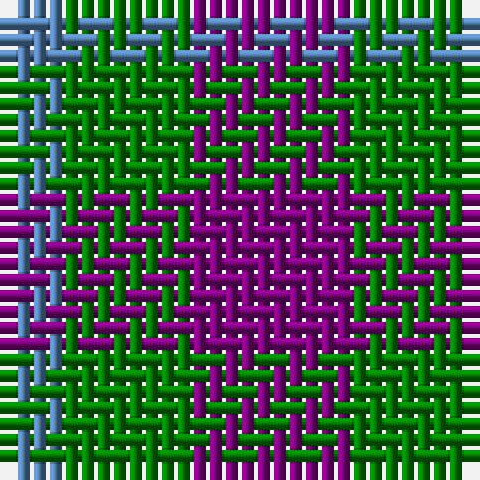

In pattern [BGB](/stripes/bgb/).

This was sourced from weddslist.  It is a [3 stripe tartan](/stripes/stripes3/).

Original link http://www.weddslist.com/cgi-bin/tartans/pg.pl?source=sts

## Thread count
P/10 G8 B/4

## Palette
Each colour and the base-6 reference it is a variant of.

| Colour | Shade | Base |
|---|---|---|
| B | <code style="background-color:#5480B0;">#5480B0</code> `oklch(58.8% 0.089 251.5)` <small>#5480B0</small> | B <code style="background-color:#2A418A;">#2A418A</code> |
| G | <code style="background-color:#008000;">#008000</code> `oklch(52.0% 0.177 142.5)` <small>#008000</small> | G <code style="background-color:#006100;">#006100</code> |
| P | <code style="background-color:#800080;">#800080</code> `oklch(42.1% 0.193 328.4)` <small>#800080</small> | B <code style="background-color:#2A418A;">#2A418A</code> |

# Sample pattern

## Nearest tartans

The nearest existing variants by ΔTartan distance.

1. [Coleman, Sarah-Louise (Personal)](/setts/s4/dp3o1g2~x10/) — ΔT 1.13
1. [Wilson's No.061](/setts/s3/r4dg7t4~x2/) — ΔT 1.27
1. [Bedford Check](/setts/s4/t3o6k4t2~x2/) — ΔT 1.32
1. [Agnew](/setts/s3/db53g42r14~x2/) — ΔT 1.45
1. [Kucher, Gregory (Personal)](/setts/s4/n2r1k1lr1~x10/) — ΔT 1.57
1. [Wilson's No.198](/setts/s3/r4k7t4~x2/) — ΔT 1.58
1. [Agnew](/setts/s3/db53g42r14/) — ΔT 1.63
1. [Wilson's No.209](/setts/s4/g4dp5g4t2~x2/) — ΔT 1.78
1. [Allen, Nicholas (Personal)](/setts/s3/dt1k2r1~x42/) — ΔT 1.78
1. [Masai Shuka 19 (Artefact)](/setts/s3/b10r10r3~x2/) — ΔT 1.79

## Neighbour map

Every grey dot is one of 14299 variants placed by the first two principal components of the ΔTartan feature space (44% of its variance). Red is this tartan; blue dots are its nearest — click one to open its page.

<svg viewBox="0 0 640 380" role="img" style="max-width:100%;height:auto;border:1px solid #e0e0e0;border-radius:4px;display:block" xmlns="http://www.w3.org/2000/svg"><image href="/nn/cloud.v1.png" width="640" height="380"/><a href="/setts/s4/dp3o1g2~x10/"><circle cx="195.5" cy="324.5" r="4" fill="#3465a4"><title>Coleman, Sarah-Louise (Personal)</title></circle></a><a href="/setts/s3/r4dg7t4~x2/"><circle cx="161.9" cy="366.0" r="4" fill="#3465a4"><title>Wilson's No.061</title></circle></a><a href="/setts/s4/t3o6k4t2~x2/"><circle cx="149.4" cy="333.8" r="4" fill="#3465a4"><title>Bedford Check</title></circle></a><a href="/setts/s3/db53g42r14~x2/"><circle cx="252.2" cy="348.1" r="4" fill="#3465a4"><title>Agnew</title></circle></a><a href="/setts/s4/n2r1k1lr1~x10/"><circle cx="104.8" cy="338.8" r="4" fill="#3465a4"><title>Kucher, Gregory (Personal)</title></circle></a><a href="/setts/s3/r4k7t4~x2/"><circle cx="142.3" cy="366.0" r="4" fill="#3465a4"><title>Wilson's No.198</title></circle></a><a href="/setts/s3/db53g42r14/"><circle cx="248.0" cy="346.2" r="4" fill="#3465a4"><title>Agnew</title></circle></a><a href="/setts/s4/g4dp5g4t2~x2/"><circle cx="217.4" cy="366.0" r="4" fill="#3465a4"><title>Wilson's No.209</title></circle></a><a href="/setts/s3/dt1k2r1~x42/"><circle cx="207.6" cy="366.0" r="4" fill="#3465a4"><title>Allen, Nicholas (Personal)</title></circle></a><a href="/setts/s3/b10r10r3~x2/"><circle cx="237.7" cy="338.1" r="4" fill="#3465a4"><title>Masai Shuka 19 (Artefact)</title></circle></a><circle cx="185.7" cy="361.2" r="5" fill="#c00000"/></svg>

ID: /setts/s3/p5g4t2~x2/
