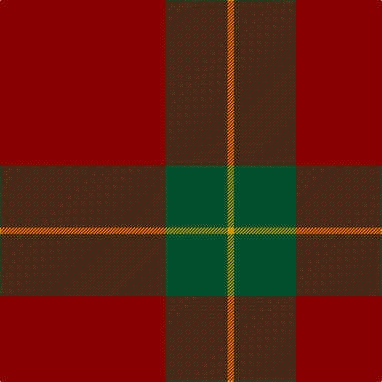

In pattern [RGY](/stripes/rgy/).

This was sourced from tartans-authority.  It is a [3 stripe tartan](/stripes/stripes3/).

Original link http://www.tartansauthority.com/tartan-ferret/display/1561/

## Thread count
DR/208 G78 DY/8

## Palette
Each colour and the base-6 reference it is a variant of.

| Colour | Shade | Base |
|---|---|---|
| DR | <code style="background-color:#880000;">#880000</code> `oklch(39.4% 0.162 29.2)` <small>#880000</small> | R <code style="background-color:#CC0000;">#CC0000</code> |
| DY | <code style="background-color:#D09800;">#D09800</code> `oklch(71.4% 0.147 82.1)` <small>#D09800</small> | Y <code style="background-color:#F2BF00;">#F2BF00</code> |
| G | <code style="background-color:#00502C;">#00502C</code> `oklch(37.9% 0.092 155.7)` <small>#00502C</small> | G <code style="background-color:#006100;">#006100</code> |

# Sample pattern

## Nearest tartans

The nearest existing variants by ΔTartan distance.

1. [MacDonald Lord of the Isles](/setts/s4/r38dg2r5dg16~x2/) — ΔT 1.43
1. [Scottish Watch](/setts/s4/r104dg39lo4~x2/) — ΔT 1.72
1. [MacLaine of Lochbuie](/setts/s4/r32dg8b4ly1~x2/) — ΔT 1.77
1. [MacLaine of Lochbuie](/setts/s4/r32dg8b4ly1/) — ΔT 1.77
1. [Hunt (Personal)](/setts/s5/r9y2r45y20lo3~x2/) — ΔT 1.85
1. [MacDonald of Sleat - 1810 (Clan)](/setts/s4/r36dg2r5dg16~x2/) — ΔT 1.97
1. [Glen Shee](/setts/s5/r37o9r3g9o3~x2/) — ΔT 2.02
1. [Scottish Watch](/setts/s3/r104g39ly4/) — ΔT 2.08
1. [Glen Shee Trade Tartan Tartan Number: 1662. Earliest known date: pre 2003 May have been obtained from a hand made design procured in the Highlands for The Highland Society of London. See products available Copyright © Blair Urquhart, Comrie, 2015](/setts/s5/m37dy9m3g9dy3~x2/) — ΔT 2.13
1. [MacDonald of Sleat](/setts/s4/r36g2r5g16~x2/) — ΔT 2.13

## Neighbour map

Every grey dot is one of 14299 variants placed by the first two principal components of the ΔTartan feature space (44% of its variance). Red is this tartan; blue dots are its nearest — click one to open its page.

<svg viewBox="0 0 640 380" role="img" style="max-width:100%;height:auto;border:1px solid #e0e0e0;border-radius:4px;display:block" xmlns="http://www.w3.org/2000/svg"><image href="/nn/cloud.v1.png" width="640" height="380"/><a href="/setts/s4/r38dg2r5dg16~x2/"><circle cx="556.3" cy="250.8" r="4" fill="#3465a4"><title>MacDonald Lord of the Isles</title></circle></a><a href="/setts/s4/r104dg39lo4~x2/"><circle cx="459.3" cy="248.7" r="4" fill="#3465a4"><title>Scottish Watch</title></circle></a><a href="/setts/s4/r32dg8b4ly1~x2/"><circle cx="529.3" cy="182.5" r="4" fill="#3465a4"><title>MacLaine of Lochbuie</title></circle></a><a href="/setts/s4/r32dg8b4ly1/"><circle cx="529.3" cy="182.5" r="4" fill="#3465a4"><title>MacLaine of Lochbuie</title></circle></a><a href="/setts/s5/r9y2r45y20lo3~x2/"><circle cx="516.5" cy="209.0" r="4" fill="#3465a4"><title>Hunt (Personal)</title></circle></a><a href="/setts/s4/r36dg2r5dg16~x2/"><circle cx="531.7" cy="241.3" r="4" fill="#3465a4"><title>MacDonald of Sleat - 1810 (Clan)</title></circle></a><a href="/setts/s5/r37o9r3g9o3~x2/"><circle cx="488.1" cy="239.7" r="4" fill="#3465a4"><title>Glen Shee</title></circle></a><a href="/setts/s3/r104g39ly4/"><circle cx="514.0" cy="221.3" r="4" fill="#3465a4"><title>Scottish Watch</title></circle></a><a href="/setts/s5/m37dy9m3g9dy3~x2/"><circle cx="494.9" cy="241.4" r="4" fill="#3465a4"><title>Glen Shee Trade Tartan Tartan Number: 1662. Earliest known date: pre 2003 May have been obtained from a hand made design procured in the Highlands for The Highland Society of London. See products available Copyright © Blair Urquhart, Comrie, 2015</title></circle></a><a href="/setts/s4/r36g2r5g16~x2/"><circle cx="522.3" cy="237.6" r="4" fill="#3465a4"><title>MacDonald of Sleat</title></circle></a><circle cx="562.3" cy="256.5" r="5" fill="#c00000"/></svg>

ID: /setts/s3/r104dg39lo4~x2/
