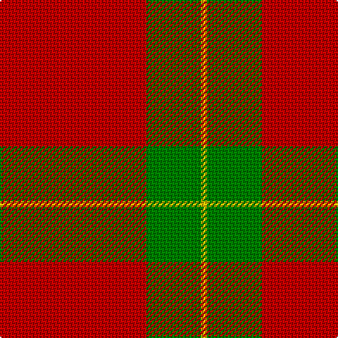

This page is one **sett** — a single exact thread-count. It belongs to the [tartan](/tartans/r104g39ly4/)
(the same proportion at any scale), whose colour order is pattern [RGY](/stripes/rgy/).

Sourced from weddslist.  It is a [3 stripe tartan](/stripes/stripes3/).

Original link http://www.weddslist.com/cgi-bin/tartans/pg.pl?source=sts

## Also known as

This cloth is also recorded under:

- Scottish Watch General

2 attestations — the source records this cloth was collapsed from (oldest owns this page)

<ul>
<li>undated — Scottish Watch (weddslist, <a href="http://www.weddslist.com/cgi-bin/tartans/pg.pl?source=sts">record</a>)</li>
<li>undated — Scottish Watch General Tartan Tartan Number: 1561. Earliest known date: pre 2003 Half actual count See products available Copyright © Blair Urquhart, Comrie, 2015 (house-of-tartan, <a href="http://www.house-of-tartan.scotland.net/house/TartanViewjs.asp?colr=Def&tnam=1561">record</a>)</li>
</ul>

## Thread count
R/104 G39 Y/4

## Palette

Palette: <strong>custom</strong>
<table><thead><tr><th>Colour</th><th>Threads</th><th>Shade</th><th>Base</th><th>OKLCh</th></tr></thead><tbody><tr><td>R/</td><td style="text-align:right;font-variant-numeric:tabular-nums">104</td><td><code style="background-color:#C00000;">#C00000</code> <small style="color:#888">#C00000</small></td><td>R <code style="background-color:#CC0000;">#CC0000</code></td><td><small style="color:#888">oklch(50.7% 0.208 29.2)</small></td></tr><tr><td>G</td><td style="text-align:right;font-variant-numeric:tabular-nums">39</td><td><code style="background-color:#008000;">#008000</code> <small style="color:#888">#008000</small></td><td>G <code style="background-color:#006100;">#006100</code></td><td><small style="color:#888">oklch(52.0% 0.177 142.5)</small></td></tr><tr><td>Y/</td><td style="text-align:right;font-variant-numeric:tabular-nums">4</td><td><code style="background-color:#F0C000;">#F0C000</code> <small style="color:#888">#F0C000</small></td><td>Y <code style="background-color:#F2BF00;">#F2BF00</code></td><td><small style="color:#888">oklch(82.7% 0.169 90.5)</small></td></tr></tbody></table>

# Sample pattern

## Nearest tartans

The nearest existing variants by ΔTartan distance, with this tartan at the top so the swatches line up against it.

ΔTartan

Tartan

Sett

—

<a href="/ttd/edit/#slug=r104g39ly4">Scottish Watch</a> <a class="nn-out" href="/setts/s3/r104g39ly4/" title="open its dictionary page">↗</a>

1.23

<a href="/ttd/edit/#slug=r36g2r5g16~x2">MacDonald of Sleat</a> <a class="nn-out" href="/setts/s4/r36g2r5g16~x2/" title="open its dictionary page">↗</a>

1.26

<a href="/ttd/edit/#slug=r38dg2r5dg16">MacDonald Lord of the Isles</a> <a class="nn-out" href="/setts/s4/r38dg2r5dg16/" title="open its dictionary page">↗</a>

1.35

<a href="/ttd/edit/#slug=r36dg2r5dg16~x2">MacDonald of Sleat - 1810 (Clan)</a> <a class="nn-out" href="/setts/s4/r36dg2r5dg16~x2/" title="open its dictionary page">↗</a>

1.39

<a href="/ttd/edit/#slug=r32g8t4ly1~x2">MacLaine of Lochbuie</a> <a class="nn-out" href="/setts/s4/r32g8t4ly1~x2/" title="open its dictionary page">↗</a>

1.49

<a href="/ttd/edit/#slug=r32dg8t4ly1~x2">MacLaine of Lochbuie (Coburn)</a> <a class="nn-out" href="/setts/s4/r32dg8t4ly1~x2/" title="open its dictionary page">↗</a>

1.59

<a href="/ttd/edit/#slug=r32dg8lb4ly1">MacLaine of Lochbuie</a> <a class="nn-out" href="/setts/s4/r32dg8lb4ly1/" title="open its dictionary page">↗</a>

1.63

<a href="/ttd/edit/#slug=r24g5r3g9r3db1~x4">MacKintosh, Red</a> <a class="nn-out" href="/setts/s6/r24g5r3g9r3db1~x4/" title="open its dictionary page">↗</a>

1.71

<a href="/ttd/edit/#slug=db4r50g25w2~x2">Unidentified, Locket</a> <a class="nn-out" href="/setts/s4/db4r50g25w2~x2/" title="open its dictionary page">↗</a>

1.75

<a href="/ttd/edit/#slug=r32dg8b4ly1~x2">MacLaine of Lochbuie</a> <a class="nn-out" href="/setts/s4/r32dg8b4ly1~x2/" title="open its dictionary page">↗</a>

1.75

<a href="/ttd/edit/#slug=r32dg8b4ly1">MacLaine of Lochbuie</a> <a class="nn-out" href="/setts/s4/r32dg8b4ly1/" title="open its dictionary page">↗</a>

## Neighbour map

Every grey dot is one of 14359 variants placed by the first two principal components of the ΔTartan feature space (44% of its variance). Red is this tartan; blue dots are its nearest — click one to open its page.

<svg viewBox="0 0 640 380" role="img" style="max-width:100%;height:auto;border:1px solid #e0e0e0;border-radius:4px;display:block" xmlns="http://www.w3.org/2000/svg"><image href="/nn/cloud.v1.png" width="640" height="380"/><a href="/setts/s4/r36g2r5g16~x2/"><circle cx="520.9" cy="238.2" r="4" fill="#3465a4"><title>MacDonald of Sleat</title></circle></a><a href="/setts/s4/r38dg2r5dg16/"><circle cx="526.6" cy="232.2" r="4" fill="#3465a4"><title>MacDonald Lord of the Isles</title></circle></a><a href="/setts/s4/r36dg2r5dg16~x2/"><circle cx="530.3" cy="241.9" r="4" fill="#3465a4"><title>MacDonald of Sleat - 1810 (Clan)</title></circle></a><a href="/setts/s4/r32g8t4ly1~x2/"><circle cx="510.4" cy="169.7" r="4" fill="#3465a4"><title>MacLaine of Lochbuie</title></circle></a><a href="/setts/s4/r32dg8t4ly1~x2/"><circle cx="518.4" cy="171.6" r="4" fill="#3465a4"><title>MacLaine of Lochbuie (Coburn)</title></circle></a><a href="/setts/s4/r32dg8lb4ly1/"><circle cx="488.9" cy="155.7" r="4" fill="#3465a4"><title>MacLaine of Lochbuie</title></circle></a><a href="/setts/s6/r24g5r3g9r3db1~x4/"><circle cx="488.5" cy="184.0" r="4" fill="#3465a4"><title>MacKintosh, Red</title></circle></a><a href="/setts/s4/db4r50g25w2~x2/"><circle cx="418.6" cy="182.2" r="4" fill="#3465a4"><title>Unidentified, Locket</title></circle></a><a href="/setts/s4/r32dg8b4ly1~x2/"><circle cx="528.0" cy="182.8" r="4" fill="#3465a4"><title>MacLaine of Lochbuie</title></circle></a><a href="/setts/s4/r32dg8b4ly1/"><circle cx="528.0" cy="182.8" r="4" fill="#3465a4"><title>MacLaine of Lochbuie</title></circle></a><circle cx="512.5" cy="221.8" r="5" fill="#c00000"/></svg>

ID: /setts/s3/r104g39ly4/
