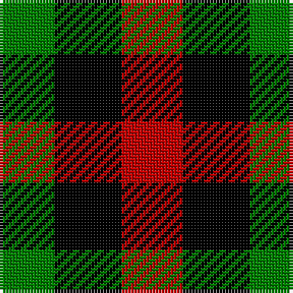

In pattern [GKR](/patterns/gkr/).

This was sourced from weddslist.  It is a [3 stripes tartan](/stripes/stripes3/).

Original link http://www.weddslist.com/cgi-bin/tartans/pg.pl?source=sts

## Thread count
G/18 K22 R/20

## Palette
Each colour and its ΔE from the base-6 reference it is a variant of.

| Colour | Shade | Base | ΔE (OKLab) |
|---|---|---|---|
| G | <code style="background-color:#008000;">#008000</code> `#008000` | G <code style="background-color:#006100;">#006100</code> | 0.10 |
| K | <code style="background-color:#000000;">#000000</code> `#000000` | K <code style="background-color:#000000;">#000000</code> | 0.00 |
| R | <code style="background-color:#C00000;">#C00000</code> `#C00000` | R <code style="background-color:#CC0000;">#CC0000</code> | 0.03 |

# Sample pattern

## Nearest tartans

The nearest existing variants by ΔTartan distance.

1. [Wilson's, No 187](/setts/s3/k1g1r1~g008000-k000000-rc00000~x8/) — ΔT 0.97
1. [Wilson's No.204](/setts/s3/k11g9r10~g006818-k101010-rc80000~x2/) — ΔT 1.14
1. [Wilson's, No 185](/setts/s3/k11b10g9~b800080-g008000-k000000~x2/) — ΔT 1.43
1. [Coigach Tweed](/setts/s3/k1w1r1~k000000-ra43c14-wc8c8c8~x6/) — ΔT 1.66
1. [Kazakhstan Relic (Artefact)](/setts/s3/y5b5k3~b202060-k101010-ybc8c00~x4/) — ΔT 1.94
1. [Wilson's, No 200](/setts/s3/g4k7r4~g008000-k000000-rc00000~x2/) — ΔT 1.99
1. [Dacre Estate Check](/setts/s3/k1w1r1~k101010-r800028-wf0e0c4~x14/) — ΔT 2.01
1. [Glen Lyon](/setts/s3/b8g7k8~b304080-g008000-k000000~x2/) — ΔT 2.04
1. [Wilson's, No 202](/setts/s3/g7k4r4~g008000-k000000-rc00000~x2/) — ΔT 2.13
1. [Wilson's No.185](/setts/s3/k11g9b10~b780078-g006818-k101010~x2/) — ΔT 2.20

## Neighbour map

Every grey dot is one of 15726 variants placed by the first two principal components of the ΔTartan feature space (44% of its variance). Red is this tartan; blue dots are its nearest — click one to open its page.

<svg viewBox="0 0 640 380" role="img" style="max-width:100%;height:auto;border:1px solid #e0e0e0;border-radius:4px;display:block" xmlns="http://www.w3.org/2000/svg"><image href="/nn/cloud.v1.png" width="640" height="380"/><a href="/setts/s3/k1g1r1~g008000-k000000-rc00000~x8/"><circle cx="14.0" cy="366.0" r="4" fill="#3465a4"><title>Wilson's, No 187</title></circle></a><a href="/setts/s3/k11g9r10~g006818-k101010-rc80000~x2/"><circle cx="62.5" cy="366.0" r="4" fill="#3465a4"><title>Wilson's No.204</title></circle></a><a href="/setts/s3/k11b10g9~b800080-g008000-k000000~x2/"><circle cx="33.2" cy="366.0" r="4" fill="#3465a4"><title>Wilson's, No 185</title></circle></a><a href="/setts/s3/k1w1r1~k000000-ra43c14-wc8c8c8~x6/"><circle cx="14.0" cy="366.0" r="4" fill="#3465a4"><title>Coigach Tweed</title></circle></a><a href="/setts/s3/y5b5k3~b202060-k101010-ybc8c00~x4/"><circle cx="91.9" cy="366.0" r="4" fill="#3465a4"><title>Kazakhstan Relic (Artefact)</title></circle></a><a href="/setts/s3/g4k7r4~g008000-k000000-rc00000~x2/"><circle cx="126.5" cy="366.0" r="4" fill="#3465a4"><title>Wilson's, No 200</title></circle></a><a href="/setts/s3/k1w1r1~k101010-r800028-wf0e0c4~x14/"><circle cx="14.0" cy="366.0" r="4" fill="#3465a4"><title>Dacre Estate Check</title></circle></a><a href="/setts/s3/b8g7k8~b304080-g008000-k000000~x2/"><circle cx="19.2" cy="366.0" r="4" fill="#3465a4"><title>Glen Lyon</title></circle></a><a href="/setts/s3/g7k4r4~g008000-k000000-rc00000~x2/"><circle cx="123.6" cy="366.0" r="4" fill="#3465a4"><title>Wilson's, No 202</title></circle></a><a href="/setts/s3/k11g9b10~b780078-g006818-k101010~x2/"><circle cx="75.8" cy="366.0" r="4" fill="#3465a4"><title>Wilson's No.185</title></circle></a><circle cx="32.8" cy="366.0" r="5" fill="#c00000"/></svg>

ID: /setts/s3/r10k11g9~g008000-k000000-rc00000~x2/
