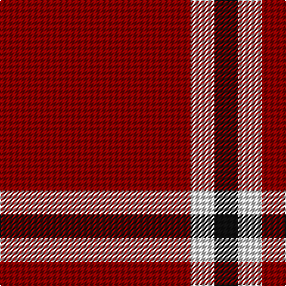

In pattern [KWR](/patterns/kwr/).

This was sourced from tartans-authority.  It is a [3 stripes tartan](/stripes/stripes3/).

Original link http://www.tartansauthority.com/tartan-ferret/display/7543/

## Attestations

This cloth appears in 2 source records; the oldest owns this page.

- pre 2008 — International Karate Fed. (Corporat) (tartans-authority, [record](http://www.tartansauthority.com/tartan-ferret/display/7543/))
- undated — International Karate Alliance (register-of-tartans, [record](https://www.tartanregister.gov.uk/tartanDetails.aspx?ref=5577))

## Thread count
DR/160 LN20 K/20

## Palette
Each colour and its ΔE from the base-6 reference it is a variant of.

| Colour | Shade | Base | ΔE (OKLab) |
|---|---|---|---|
| DR | <code style="background-color:#880000;">#880000</code> `#880000` | R <code style="background-color:#C80000;">#C80000</code> | 0.14 |
| K | <code style="background-color:#101010;">#101010</code> `#101010` | K <code style="background-color:#000000;">#000000</code> | 0.17 |
| LN | <code style="background-color:#E0E0E0;">#E0E0E0</code> `#E0E0E0` | W <code style="background-color:#F4F4F0;">#F4F4F0</code> | 0.06 |

# Sample pattern

ID: /setts/s3/r160w20k20-k101010-r880000-we0e0e0/
