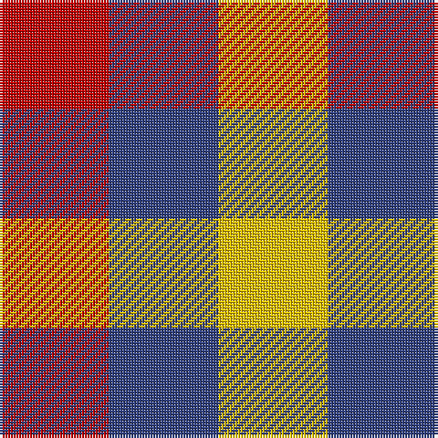

This page is one **sett** — a single exact thread-count. It belongs to the [tartan](/tartans/r1db1ly1/)
(the same proportion at any scale), whose colour order is pattern [RBY](/stripes/rby/).

Sourced from weddslist.  It is a [3 stripe tartan](/stripes/stripes3/).

Original link http://www.weddslist.com/cgi-bin/tartans/pg.pl?source=sts

## Thread count
R/40 B40 Y/40

## Palette

Palette: <strong>Tartan Dictionary</strong> <small style="color:#888">(1 of 4 colours)</small>
<table><thead><tr><th>Colour</th><th>Threads</th><th>Shade</th><th>Base</th><th>OKLCh</th></tr></thead><tbody><tr><td>R/</td><td style="text-align:right;font-variant-numeric:tabular-nums">40</td><td><code style="background-color:#C00000;">#C00000</code> <small style="color:#888">#C00000</small></td><td>R <code style="background-color:#CC0000;">#CC0000</code></td><td><small style="color:#888">oklch(50.7% 0.208 29.2)</small></td></tr><tr><td>B</td><td style="text-align:right;font-variant-numeric:tabular-nums">40</td><td><code style="background-color:#304080;">#304080</code> <small style="color:#888">#304080</small></td><td>B <code style="background-color:#2A418A;">#2A418A</code></td><td><small style="color:#888">oklch(39.4% 0.109 270.2)</small></td></tr><tr><td>Y/</td><td style="text-align:right;font-variant-numeric:tabular-nums">40</td><td><code style="background-color:#F0C000;">#F0C000</code> <small style="color:#888">#F0C000</small></td><td>Y <code style="background-color:#F2BF00;">#F2BF00</code></td><td><small style="color:#888">oklch(82.7% 0.169 90.5)</small></td></tr></tbody></table>

# Sample pattern

## Nearest tartans

The nearest existing variants by ΔTartan distance, with this tartan at the top so the swatches line up against it.

ΔTartan

Tartan

Sett

—

<a href="/ttd/edit/#slug=r1db1ly1~x40">Mothers Pride</a> <a class="nn-out" href="/setts/s3/r1db1ly1~x40/" title="open its dictionary page">↗</a>

1.20

<a href="/ttd/edit/#slug=k1w1r1~x14">Dacre Estate Check</a> <a class="nn-out" href="/setts/s3/k1w1r1~x14/" title="open its dictionary page">↗</a>

1.53

<a href="/ttd/edit/#slug=db1w1r1~x22">Aquascutum</a> <a class="nn-out" href="/setts/s3/db1w1r1~x22/" title="open its dictionary page">↗</a>

1.58

<a href="/ttd/edit/#slug=k1lb1o1~x6">Coigach Tweed</a> <a class="nn-out" href="/setts/s3/k1lb1o1~x6/" title="open its dictionary page">↗</a>

1.71

<a href="/ttd/edit/#slug=db1lr1r1~x4">Usa</a> <a class="nn-out" href="/setts/s3/db1lr1r1~x4/" title="open its dictionary page">↗</a>

1.83

<a href="/ttd/edit/#slug=dg1r1w1db1~x20">Algarve</a> <a class="nn-out" href="/setts/s4/dg1r1w1db1~x20/" title="open its dictionary page">↗</a>

2.15

<a href="/setts/s4/k1w1do1~x8/">Hogg</a>

2.15

<a href="/ttd/edit/#slug=k11g9r10~x2">Wilson's No.204</a> <a class="nn-out" href="/setts/s3/k11g9r10~x2/" title="open its dictionary page">↗</a>

2.29

<a href="/ttd/edit/#slug=k1g1r1~x8">Wilson's, No 187</a> <a class="nn-out" href="/setts/s3/k1g1r1~x8/" title="open its dictionary page">↗</a>

2.32

<a href="/ttd/edit/#slug=dr1o1dr1o1dg1~x8">Ballindalloch Check</a> <a class="nn-out" href="/setts/s5/dr1o1dr1o1dg1~x8/" title="open its dictionary page">↗</a>

2.37

<a href="/ttd/edit/#slug=dt1lb1w1~x8">Glen Moriston Estate Check</a> <a class="nn-out" href="/setts/s3/dt1lb1w1~x8/" title="open its dictionary page">↗</a>

## Neighbour map

Every grey dot is one of 14359 variants placed by the first two principal components of the ΔTartan feature space (44% of its variance). Red is this tartan; blue dots are its nearest — click one to open its page.

<svg viewBox="0 0 640 380" role="img" style="max-width:100%;height:auto;border:1px solid #e0e0e0;border-radius:4px;display:block" xmlns="http://www.w3.org/2000/svg"><image href="/nn/cloud.v1.png" width="640" height="380"/><a href="/setts/s3/k1w1r1~x14/"><circle cx="14.0" cy="366.0" r="4" fill="#3465a4"><title>Dacre Estate Check</title></circle></a><a href="/setts/s3/db1w1r1~x22/"><circle cx="14.0" cy="366.0" r="4" fill="#3465a4"><title>Aquascutum</title></circle></a><a href="/setts/s3/k1lb1o1~x6/"><circle cx="14.0" cy="366.0" r="4" fill="#3465a4"><title>Coigach Tweed</title></circle></a><a href="/setts/s3/db1lr1r1~x4/"><circle cx="14.0" cy="366.0" r="4" fill="#3465a4"><title>Usa</title></circle></a><a href="/setts/s4/dg1r1w1db1~x20/"><circle cx="14.0" cy="366.0" r="4" fill="#3465a4"><title>Algarve</title></circle></a><a href="/setts/s4/k1w1do1~x8/"><circle cx="35.0" cy="366.0" r="4" fill="#3465a4"><title>Hogg</title></circle></a><a href="/setts/s3/k11g9r10~x2/"><circle cx="64.0" cy="366.0" r="4" fill="#3465a4"><title>Wilson's No.204</title></circle></a><a href="/setts/s3/k1g1r1~x8/"><circle cx="14.0" cy="366.0" r="4" fill="#3465a4"><title>Wilson's, No 187</title></circle></a><a href="/setts/s5/dr1o1dr1o1dg1~x8/"><circle cx="67.6" cy="366.0" r="4" fill="#3465a4"><title>Ballindalloch Check</title></circle></a><a href="/setts/s3/dt1lb1w1~x8/"><circle cx="14.0" cy="366.0" r="4" fill="#3465a4"><title>Glen Moriston Estate Check</title></circle></a><circle cx="14.0" cy="366.0" r="5" fill="#c00000"/></svg>

ID: /setts/s3/r1db1ly1~x40/
