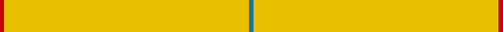
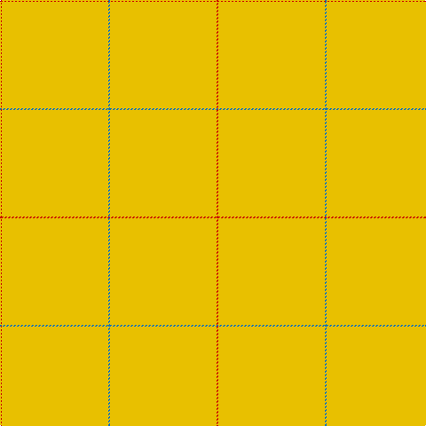

In pattern [BYR](/stripes/byr/).

This was sourced from register-of-tartans.  It is a [3 stripe tartan](/stripes/stripes3/).

Original link https://www.tartanregister.gov.uk/tartanDetails.aspx?ref=3207

## Attestations

This cloth appears in 2 source records; the oldest owns this page.

- 01/01/2006 — Nutwood (register-of-tartans, [record](https://www.tartanregister.gov.uk/tartanDetails.aspx?ref=3207))
- pre 2006 — Nutwood (District) (tartans-authority, [record](http://www.tartansauthority.com/tartan-ferret/display/7053/))

## Register references

External register numbers recorded for this tartan.

- Scottish Register of Tartans: [3207](https://www.tartanregister.gov.uk/tartanDetails.aspx?ref=3207)
- Scottish Tartans Authority (ITI): 7053

## Thread count
R/2 Y120 B/2

## Palette
Each colour and the base-6 reference it is a variant of.

| Colour | Shade | Base |
|---|---|---|
| B | <code style="background-color:#1474B4;">#1474B4</code> `oklch(54.0% 0.129 245.1)` <small>#1474B4</small> | B <code style="background-color:#2A418A;">#2A418A</code> |
| R | <code style="background-color:#C80000;">#C80000</code> `oklch(52.3% 0.215 29.2)` <small>#C80000</small> | R <code style="background-color:#CC0000;">#CC0000</code> |
| Y | <code style="background-color:#E8C000;">#E8C000</code> `oklch(81.9% 0.168 93.7)` <small>#E8C000</small> | Y <code style="background-color:#F2BF00;">#F2BF00</code> |

# Sample pattern

## Nearest tartans

The nearest existing variants by ΔTartan distance.

1. [Dutch Football (Corporate)](/setts/s4/lo24r1w1dt1~x11/) — ΔT 3.24
1. [Rabbie's Dram (Fashion)](/setts/s4/lo60do3lo4r3~x2/) — ΔT 3.38
1. [Manitoba District Tartan Tartan Number: 145. Earliest known date: 1962 A slight modification of the original sett. See products available Copyright © Blair Urquhart, Comrie, 2015](/setts/s8/ly622r21g2dg6g41t2g2t6/) — ΔT 3.88
1. [Kincardine Tweed](/setts/s4/o30r1o15db4~x2/) — ΔT 4.10
1. [Dunbar of Pitgaveny](/setts/s4/o19w1o19m1~x2/) — ΔT 4.19
1. [Dunbar of Pitgaveny](/setts/s3/r1y19w1~x2/) — ΔT 4.39
1. [Dunbar of Pitgaveny (Clan)](/setts/s3/m1o19w1~x2/) — ΔT 4.41
1. [Lagrande](/setts/s5/dg100lo4dg2lo3ly6~x2/) — ΔT 4.72
1. [Canadian Irish Regiment](/setts/s4/lo100dy26g3r2~x2/) — ΔT 4.80
1. [Connacht (1993)](/setts/s10/o64dg6o2dg3o2dg6o64dy2o2dy6~x2/) — ΔT 4.84

## Neighbour map

Every grey dot is one of 14299 variants placed by the first two principal components of the ΔTartan feature space (44% of its variance). Red is this tartan; blue dots are its nearest — click one to open its page.

<svg viewBox="0 0 640 380" role="img" style="max-width:100%;height:auto;border:1px solid #e0e0e0;border-radius:4px;display:block" xmlns="http://www.w3.org/2000/svg"><image href="/nn/cloud.v1.png" width="640" height="380"/><a href="/setts/s4/lo24r1w1dt1~x11/"><circle cx="626.0" cy="188.3" r="4" fill="#3465a4"><title>Dutch Football (Corporate)</title></circle></a><a href="/setts/s4/lo60do3lo4r3~x2/"><circle cx="626.0" cy="227.0" r="4" fill="#3465a4"><title>Rabbie's Dram (Fashion)</title></circle></a><a href="/setts/s8/ly622r21g2dg6g41t2g2t6/"><circle cx="626.0" cy="82.2" r="4" fill="#3465a4"><title>Manitoba District Tartan Tartan Number: 145. Earliest known date: 1962 A slight modification of the original sett. See products available Copyright © Blair Urquhart, Comrie, 2015</title></circle></a><a href="/setts/s4/o30r1o15db4~x2/"><circle cx="626.0" cy="223.2" r="4" fill="#3465a4"><title>Kincardine Tweed</title></circle></a><a href="/setts/s4/o19w1o19m1~x2/"><circle cx="626.0" cy="275.8" r="4" fill="#3465a4"><title>Dunbar of Pitgaveny</title></circle></a><a href="/setts/s3/r1y19w1~x2/"><circle cx="626.0" cy="258.2" r="4" fill="#3465a4"><title>Dunbar of Pitgaveny</title></circle></a><a href="/setts/s3/m1o19w1~x2/"><circle cx="626.0" cy="247.0" r="4" fill="#3465a4"><title>Dunbar of Pitgaveny (Clan)</title></circle></a><a href="/setts/s5/dg100lo4dg2lo3ly6~x2/"><circle cx="626.0" cy="170.8" r="4" fill="#3465a4"><title>Lagrande</title></circle></a><a href="/setts/s4/lo100dy26g3r2~x2/"><circle cx="603.2" cy="170.3" r="4" fill="#3465a4"><title>Canadian Irish Regiment</title></circle></a><a href="/setts/s10/o64dg6o2dg3o2dg6o64dy2o2dy6~x2/"><circle cx="626.0" cy="137.7" r="4" fill="#3465a4"><title>Connacht (1993)</title></circle></a><circle cx="626.0" cy="207.6" r="5" fill="#c00000"/></svg>

ID: /setts/s3/r1ly60b1~x2/
