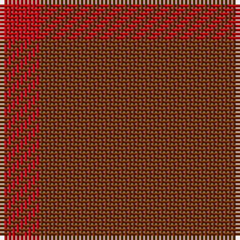

In pattern [RRR](/stripes/rrr/).

This was sourced from weddslist.  It is a [3 stripe tartan](/stripes/stripes3/).

Original link http://www.weddslist.com/cgi-bin/tartans/pg.pl?source=sts

## Thread count
R/10 T20 Ta/10

## Palette
Each colour and the base-6 reference it is a variant of.

| Colour | Shade | Base |
|---|---|---|
| R | <code style="background-color:#C00000;">#C00000</code> `oklch(50.7% 0.208 29.2)` <small>#C00000</small> | R <code style="background-color:#CC0000;">#CC0000</code> |
| T | <code style="background-color:#703000;">#703000</code> `oklch(39.1% 0.105 49.1)` <small>#703000</small> | R <code style="background-color:#CC0000;">#CC0000</code> |
| Ta | <code style="background-color:#703000;">#703000</code> `oklch(39.1% 0.105 49.1)` <small>#703000</small> | R <code style="background-color:#CC0000;">#CC0000</code> |

# Sample pattern

## Nearest tartans

The nearest existing variants by ΔTartan distance.

1. [New Exeter Check (Fashion)](/setts/s5/r8n13r8r13r8/) — ΔT 2.09
1. [Burns' Birthplace (Commem)](/setts/s7/o1o1o1o1o4o3lo1~x12/) — ΔT 3.34
1. [Callum (Buchan)](/setts/s5/n7o1n6o8o1~x8/) — ΔT 4.01
1. [Outlander #3](/setts/s4/y14n7lo6n2~x8/) — ΔT 4.09
1. [Bryce](/setts/s4/r5n35r46o5~x2/) — ΔT 4.24
1. [Outlander #5](/setts/s3/n13do15n2~x4/) — ΔT 4.33
1. [Outlander #3](/setts/s4/o14n7lo7n2~x8/) — ΔT 4.38
1. [Loch Garth](/setts/s4/o12o6o2ly1~x4/) — ΔT 4.41
1. [Brown Watch (single) (Fashion)](/setts/s6/do7k2do12k10dg12k3~x2/) — ΔT 4.50
1. [Miyuki, House Check Tan, 1004A](/setts/s8/r3o8r3o20o20o3o8o3~x2/) — ΔT 4.55

## Neighbour map

Every grey dot is one of 14299 variants placed by the first two principal components of the ΔTartan feature space (44% of its variance). Red is this tartan; blue dots are its nearest — click one to open its page.

<svg viewBox="0 0 640 380" role="img" style="max-width:100%;height:auto;border:1px solid #e0e0e0;border-radius:4px;display:block" xmlns="http://www.w3.org/2000/svg"><image href="/nn/cloud.v1.png" width="640" height="380"/><a href="/setts/s5/r8n13r8r13r8/"><circle cx="422.1" cy="366.0" r="4" fill="#3465a4"><title>New Exeter Check (Fashion)</title></circle></a><a href="/setts/s7/o1o1o1o1o4o3lo1~x12/"><circle cx="513.1" cy="366.0" r="4" fill="#3465a4"><title>Burns' Birthplace (Commem)</title></circle></a><a href="/setts/s5/n7o1n6o8o1~x8/"><circle cx="375.2" cy="338.0" r="4" fill="#3465a4"><title>Callum (Buchan)</title></circle></a><a href="/setts/s4/y14n7lo6n2~x8/"><circle cx="436.9" cy="366.0" r="4" fill="#3465a4"><title>Outlander #3</title></circle></a><a href="/setts/s4/r5n35r46o5~x2/"><circle cx="529.3" cy="337.7" r="4" fill="#3465a4"><title>Bryce</title></circle></a><a href="/setts/s3/n13do15n2~x4/"><circle cx="522.3" cy="366.0" r="4" fill="#3465a4"><title>Outlander #5</title></circle></a><a href="/setts/s4/o14n7lo7n2~x8/"><circle cx="407.0" cy="366.0" r="4" fill="#3465a4"><title>Outlander #3</title></circle></a><a href="/setts/s4/o12o6o2ly1~x4/"><circle cx="619.8" cy="354.9" r="4" fill="#3465a4"><title>Loch Garth</title></circle></a><a href="/setts/s6/do7k2do12k10dg12k3~x2/"><circle cx="377.1" cy="366.0" r="4" fill="#3465a4"><title>Brown Watch (single) (Fashion)</title></circle></a><a href="/setts/s8/r3o8r3o20o20o3o8o3~x2/"><circle cx="552.6" cy="366.0" r="4" fill="#3465a4"><title>Miyuki, House Check Tan, 1004A</title></circle></a><circle cx="417.1" cy="366.0" r="5" fill="#c00000"/></svg>

ID: /setts/s3/r1o2o1~x10/
