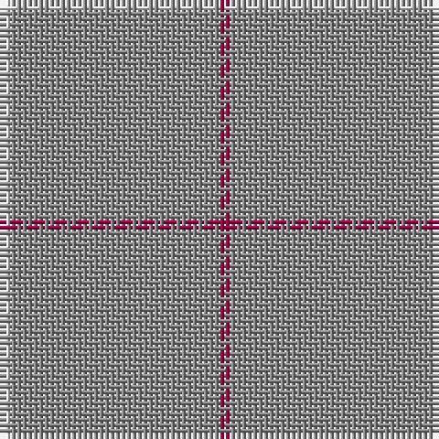

In pattern [RRW](/patterns/rrw/).

This was sourced from house-of-tartan.  It is a [3 stripes tartan](/stripes/stripes3/).

Original link http://www.house-of-tartan.scotland.net/house/TartanViewjs.asp?colr=Def&tnam=1634

## Thread count
LN/2 N38 R/2

## Palette
Each colour and its ΔE from the base-6 reference it is a variant of.

| Colour | Shade | Base | ΔE (OKLab) |
|---|---|---|---|
| LN | <code style="background-color:#E0E0E0;">#E0E0E0</code> `#E0E0E0` | W <code style="background-color:#F7F7F7;">#F7F7F7</code> | 0.07 |
| N | <code style="background-color:#888888;">#888888</code> `#888888` | R <code style="background-color:#CC0000;">#CC0000</code> | 0.24 |
| R | <code style="background-color:#A00048;">#A00048</code> `#A00048` | R <code style="background-color:#CC0000;">#CC0000</code> | 0.12 |

# Sample pattern

## Nearest tartans

The nearest existing variants by ΔTartan distance.

1. [Dunbar of Pitgaveny](/setts/s3/r1g19w1~g808080-r900030-we0e0e0~x2/) — ΔT 0.36
1. [Dunbar of Pitgaveny (Clan)](/setts/s3/r1ra19w1~ra00048-ra888888-wfcfcfc~x2/) — ΔT 0.90
1. [Dunbar of Pitgaveny](/setts/s4/r19w1r19ra1~r888888-raa00048-wfcfcfc~x2/) — ΔT 1.57
1. [Rabbie's Dram (Fashion)](/setts/s4/y60b3y4r3~b441800-ra00000-ya08858~x2/) — ΔT 1.73
1. [Torridon Tweed](/setts/s6/b4ba1b6r1b14y1~b5c5c5c-ba2c2c80-rb468ac-ya0a0a0~x8/) — ΔT 2.69
1. [Pasteur](/setts/s4/g10y1g30ga3~g483824-ga789484-ye4cca4~x4/) — ΔT 2.76
1. [Dutch Football (Corporate)](/setts/s4/y24r1w1b1~b003c64-rc80000-we0e0e0-ybc8c00~x11/) — ΔT 3.01
1. [Kincardine Tweed](/setts/s4/r30ra1r15b4~b0000c8-r9b7a0b-rac80000/) — ΔT 3.06
1. [Auchairne Grey](/setts/s6/r13ra3r4ra56b4ra4~b5c5c5c-rc80000-ra888888~x2/) — ΔT 3.18
1. [Auchairne grey](/setts/s6/r13g3r4g56b4g4~b505050-g808080-rc00000~x2/) — ΔT 3.21

## Neighbour map

Every grey dot is one of 15726 variants placed by the first two principal components of the ΔTartan feature space (44% of its variance). Red is this tartan; blue dots are its nearest — click one to open its page.

<svg viewBox="0 0 640 380" role="img" style="max-width:100%;height:auto;border:1px solid #e0e0e0;border-radius:4px;display:block" xmlns="http://www.w3.org/2000/svg"><image href="/nn/cloud.v1.png" width="640" height="380"/><a href="/setts/s3/r1g19w1~g808080-r900030-we0e0e0~x2/"><circle cx="626.0" cy="258.4" r="4" fill="#3465a4"><title>Dunbar of Pitgaveny</title></circle></a><a href="/setts/s3/r1ra19w1~ra00048-ra888888-wfcfcfc~x2/"><circle cx="626.0" cy="249.3" r="4" fill="#3465a4"><title>Dunbar of Pitgaveny (Clan)</title></circle></a><a href="/setts/s4/r19w1r19ra1~r888888-raa00048-wfcfcfc~x2/"><circle cx="626.0" cy="275.4" r="4" fill="#3465a4"><title>Dunbar of Pitgaveny</title></circle></a><a href="/setts/s4/y60b3y4r3~b441800-ra00000-ya08858~x2/"><circle cx="626.0" cy="228.8" r="4" fill="#3465a4"><title>Rabbie's Dram (Fashion)</title></circle></a><a href="/setts/s6/b4ba1b6r1b14y1~b5c5c5c-ba2c2c80-rb468ac-ya0a0a0~x8/"><circle cx="626.0" cy="261.4" r="4" fill="#3465a4"><title>Torridon Tweed</title></circle></a><a href="/setts/s4/g10y1g30ga3~g483824-ga789484-ye4cca4~x4/"><circle cx="626.0" cy="241.4" r="4" fill="#3465a4"><title>Pasteur</title></circle></a><a href="/setts/s4/y24r1w1b1~b003c64-rc80000-we0e0e0-ybc8c00~x11/"><circle cx="626.0" cy="191.1" r="4" fill="#3465a4"><title>Dutch Football (Corporate)</title></circle></a><a href="/setts/s4/r30ra1r15b4~b0000c8-r9b7a0b-rac80000/"><circle cx="626.0" cy="229.2" r="4" fill="#3465a4"><title>Kincardine Tweed</title></circle></a><a href="/setts/s6/r13ra3r4ra56b4ra4~b5c5c5c-rc80000-ra888888~x2/"><circle cx="604.4" cy="208.9" r="4" fill="#3465a4"><title>Auchairne Grey</title></circle></a><a href="/setts/s6/r13g3r4g56b4g4~b505050-g808080-rc00000~x2/"><circle cx="610.3" cy="212.7" r="4" fill="#3465a4"><title>Auchairne grey</title></circle></a><circle cx="626.0" cy="259.9" r="5" fill="#c00000"/></svg>

ID: /setts/s3/r1ra19w1~ra00048-ra888888-we0e0e0~x2/
