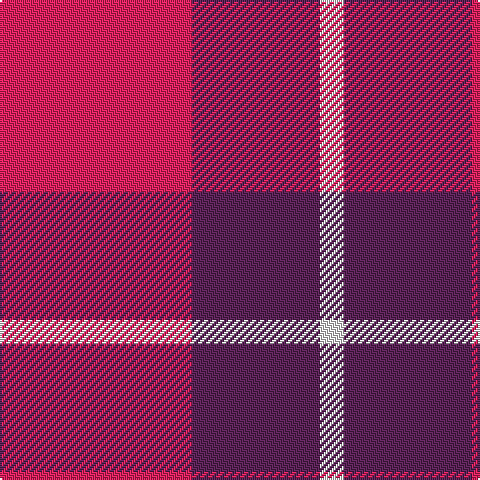

**Bands:** [RBW](/stripes/rbw/) · **Stripes:** [R DP W](/stripes/stripes3/) R DP W

This was sourced from register-of-tartans.  It is a [3 band tartan](/bands/bands3/).

Original link https://www.tartanregister.gov.uk/tartanDetails.aspx?ref=10685

## Also known as

This cloth is also recorded under:

- National Autistic Society Scotland

## Attestations

This cloth appears in 3 source records; the oldest owns this page.

- 28/08/2012 — National Autistic Society Scotland (register-of-tartans, [record](https://www.tartanregister.gov.uk/tartanDetails.aspx?ref=10685))
- pre 2012 — National Autistic Society Scotland (tartans-authority, [record](http://www.tartansauthority.com/tartan-ferret/display/10685/))
- undated — National Autistic Society Scotla Corporate Tartan Tartan Number: 10685. Earliest known date: 30 August 2012 A simple and bold design using the highly identifiable colours of the National Autistic Society. This tartan is intended for use by the Scottish members of the Society. See products available Copyright © Blair Urquhart, Comrie, 2015 (house-of-tartan, [record](http://www.house-of-tartan.scotland.net/house/TartanViewjs.asp?colr=Def&tnam=10685))

## Register references

External register numbers recorded for this tartan.

- Scottish Register of Tartans: [10685](https://www.tartanregister.gov.uk/tartanDetails.aspx?ref=10685)

## Thread count
R/96 DR64 LN/12

## Palette
Each colour and its ΔE from the base-6 reference it is a variant of.

| Colour | Shade | Base | ΔE (OKLab) |
|---|---|---|---|
| DR | <code style="background-color:#5C2458;">#5C2458</code> `#5C2458` | B <code style="background-color:#2A418A;">#2A418A</code> | 0.13 |
| LN | <code style="background-color:#E8E8E8;">#E8E8E8</code> `#E8E8E8` | W <code style="background-color:#F7F7F7;">#F7F7F7</code> | 0.05 |
| R | <code style="background-color:#E82460;">#E82460</code> `#E82460` | R <code style="background-color:#CC0000;">#CC0000</code> | 0.10 |

# Sample pattern

## Nearest tartans

The nearest existing variants by ΔTartan distance.

1. [Masai Shuka 28 (Artefact)](/setts/s3/lb9r20db2~x2/) — ΔT 1.91
1. [Masai Shuka 25 (Artefact)](/setts/s5/db15w2r20db2r4~x2/) — ΔT 1.93
1. [Hamilton (Clan)](/setts/s5/db8r2db8r15w2~x4/) — ΔT 1.98
1. [Hamilton Red Clan Tartan Tartan Number: 477. Earliest known date: 1842 First recorded in the Vestiarium Scoticum which was supposedly based on an ancient manuscript now known to have been forged. The original illustration shows the four main stripes in a very dark shade of blue. There is no evidence of a Hamilton tartan prior to the publication of this spectacular work. The authors, the Sobieski Stuart brothers, enjoyed a popular following amongst the Scottish gentry of the period and it is probable that the design can be attributed to Charles Edward Stuart (Allan Hay) who prepared the illustrations for the book. See products available Copyright © Blair Urquhart, Comrie, 2015](/setts/s5/db6r1db6r9w1~x4/) — ΔT 2.15
1. [Hamilton, (Red)](/setts/s5/db6r1db6r9w1~x2/) — ΔT 2.19
1. [Maryville College](/setts/s4/k13r40o13o8~x2/) — ΔT 2.28
1. [Masai Shuka 24 (Artefact)](/setts/s4/t15w2r20w3~x4/) — ΔT 2.30
1. [British European](/setts/s6/r12db2r12db17w2r2~x2/) — ΔT 2.31
1. [British European (Corporate)](/setts/s6/r12db2r12db17w2r2~x4/) — ΔT 2.31
1. [Hamilton](/setts/s8/r15db8r2db8r2db8r15w2~x4/) — ΔT 2.35

## Neighbour map

Every grey dot is one of 14299 variants placed by the first two principal components of the ΔTartan feature space (44% of its variance). Red is this tartan; blue dots are its nearest — click one to open its page.

<svg viewBox="0 0 640 380" role="img" style="max-width:100%;height:auto;border:1px solid #e0e0e0;border-radius:4px;display:block" xmlns="http://www.w3.org/2000/svg"><image href="/nn/cloud.v1.png" width="640" height="380"/><a href="/setts/s3/lb9r20db2~x2/"><circle cx="386.5" cy="238.4" r="4" fill="#3465a4"><title>Masai Shuka 28 (Artefact)</title></circle></a><a href="/setts/s5/db15w2r20db2r4~x2/"><circle cx="358.9" cy="218.9" r="4" fill="#3465a4"><title>Masai Shuka 25 (Artefact)</title></circle></a><a href="/setts/s5/db8r2db8r15w2~x4/"><circle cx="295.5" cy="245.1" r="4" fill="#3465a4"><title>Hamilton (Clan)</title></circle></a><a href="/setts/s5/db6r1db6r9w1~x4/"><circle cx="320.8" cy="243.9" r="4" fill="#3465a4"><title>Hamilton Red Clan Tartan Tartan Number: 477. Earliest known date: 1842 First recorded in the Vestiarium Scoticum which was supposedly based on an ancient manuscript now known to have been forged. The original illustration shows the four main stripes in a very dark shade of blue. There is no evidence of a Hamilton tartan prior to the publication of this spectacular work. The authors, the Sobieski Stuart brothers, enjoyed a popular following amongst the Scottish gentry of the period and it is probable that the design can be attributed to Charles Edward Stuart (Allan Hay) who prepared the illustrations for the book. See products available Copyright © Blair Urquhart, Comrie, 2015</title></circle></a><a href="/setts/s5/db6r1db6r9w1~x2/"><circle cx="332.6" cy="250.7" r="4" fill="#3465a4"><title>Hamilton, (Red)</title></circle></a><a href="/setts/s4/k13r40o13o8~x2/"><circle cx="276.9" cy="261.2" r="4" fill="#3465a4"><title>Maryville College</title></circle></a><a href="/setts/s4/t15w2r20w3~x4/"><circle cx="300.9" cy="230.3" r="4" fill="#3465a4"><title>Masai Shuka 24 (Artefact)</title></circle></a><a href="/setts/s6/r12db2r12db17w2r2~x2/"><circle cx="347.9" cy="235.0" r="4" fill="#3465a4"><title>British European</title></circle></a><a href="/setts/s6/r12db2r12db17w2r2~x4/"><circle cx="347.9" cy="235.0" r="4" fill="#3465a4"><title>British European (Corporate)</title></circle></a><a href="/setts/s8/r15db8r2db8r2db8r15w2~x4/"><circle cx="332.9" cy="229.4" r="4" fill="#3465a4"><title>Hamilton</title></circle></a><circle cx="343.7" cy="267.1" r="5" fill="#c00000"/></svg>

ID: /setts/s3/r24dp16w3~x4/
