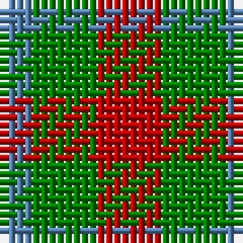

In pattern [BGR](/patterns/bgr/).

This was sourced from weddslist.  It is a [3 stripes tartan](/stripes/stripes3/).

Original link http://www.weddslist.com/cgi-bin/tartans/pg.pl?source=sts

## Thread count
B/4 G8 R/8

## Palette
Each colour and its ΔE from the base-6 reference it is a variant of.

| Colour | Shade | Base | ΔE (OKLab) |
|---|---|---|---|
| B | <code style="background-color:#5480B0;">#5480B0</code> `#5480B0` | B <code style="background-color:#2A418A;">#2A418A</code> | 0.19 |
| G | <code style="background-color:#008000;">#008000</code> `#008000` | G <code style="background-color:#006100;">#006100</code> | 0.10 |
| R | <code style="background-color:#C00000;">#C00000</code> `#C00000` | R <code style="background-color:#CC0000;">#CC0000</code> | 0.03 |

# Sample pattern

## Nearest tartans

The nearest existing variants by ΔTartan distance.

1. [Wilson's, No 61](/setts/s3/b4g7r4~b5480b0-g008000-rc00000~x2/) — ΔT 1.00
1. [Gearach Woodcock Tweed (Corporate)](/setts/s3/g2b1y1~b5c8ca8-g604000-yd87c00/) — ΔT 1.11
1. [Wilson's No.061](/setts/s3/b4g7r4~b5c8ca8-g003820-rc80000~x2/) — ΔT 1.36
1. [Wilson's No.202](/setts/s3/g7k4r4~g006818-k101010-rc80000~x2/) — ΔT 1.44
1. [Angle Dress (Fashion)](/setts/s5/k5g8y5g3y5~g408060-k101010-ybc8c00~x4/) — ΔT 1.54
1. [Wilson's No.207](/setts/s4/g2r2g2b1~b2888c4-g006818-rc80000~x4/) — ΔT 1.80
1. [Wilson's No.188](/setts/s4/g2r4g2b1~b2888c4-g006818-rc80000~x4/) — ΔT 1.84
1. [Wilson's No.200](/setts/s3/g4k7r4~g006818-k101010-rc80000~x2/) — ΔT 1.93
1. [Hirstwood (Name)](/setts/s4/y28r24g55b19~b503868-g003820-r880000-ybc8c00~x2/) — ΔT 1.98
1. [Quaboos, Pipers Plaid](/setts/s4/w9g23r23w9~g008000-rc00000-we0e0e0~x2/) — ΔT 2.00

## Neighbour map

Every grey dot is one of 15726 variants placed by the first two principal components of the ΔTartan feature space (44% of its variance). Red is this tartan; blue dots are its nearest — click one to open its page.

<svg viewBox="0 0 640 380" role="img" style="max-width:100%;height:auto;border:1px solid #e0e0e0;border-radius:4px;display:block" xmlns="http://www.w3.org/2000/svg"><image href="/nn/cloud.v1.png" width="640" height="380"/><a href="/setts/s3/b4g7r4~b5480b0-g008000-rc00000~x2/"><circle cx="173.6" cy="366.0" r="4" fill="#3465a4"><title>Wilson's, No 61</title></circle></a><a href="/setts/s3/g2b1y1~b5c8ca8-g604000-yd87c00/"><circle cx="224.1" cy="366.0" r="4" fill="#3465a4"><title>Gearach Woodcock Tweed (Corporate)</title></circle></a><a href="/setts/s3/b4g7r4~b5c8ca8-g003820-rc80000~x2/"><circle cx="160.2" cy="366.0" r="4" fill="#3465a4"><title>Wilson's No.061</title></circle></a><a href="/setts/s3/g7k4r4~g006818-k101010-rc80000~x2/"><circle cx="158.3" cy="366.0" r="4" fill="#3465a4"><title>Wilson's No.202</title></circle></a><a href="/setts/s5/k5g8y5g3y5~g408060-k101010-ybc8c00~x4/"><circle cx="147.6" cy="341.9" r="4" fill="#3465a4"><title>Angle Dress (Fashion)</title></circle></a><a href="/setts/s4/g2r2g2b1~b2888c4-g006818-rc80000~x4/"><circle cx="225.8" cy="366.0" r="4" fill="#3465a4"><title>Wilson's No.207</title></circle></a><a href="/setts/s4/g2r4g2b1~b2888c4-g006818-rc80000~x4/"><circle cx="239.4" cy="315.0" r="4" fill="#3465a4"><title>Wilson's No.188</title></circle></a><a href="/setts/s3/g4k7r4~g006818-k101010-rc80000~x2/"><circle cx="157.4" cy="366.0" r="4" fill="#3465a4"><title>Wilson's No.200</title></circle></a><a href="/setts/s4/y28r24g55b19~b503868-g003820-r880000-ybc8c00~x2/"><circle cx="161.3" cy="318.9" r="4" fill="#3465a4"><title>Hirstwood (Name)</title></circle></a><a href="/setts/s4/w9g23r23w9~g008000-rc00000-we0e0e0~x2/"><circle cx="120.4" cy="312.4" r="4" fill="#3465a4"><title>Quaboos, Pipers Plaid</title></circle></a><circle cx="157.4" cy="366.0" r="5" fill="#c00000"/></svg>

ID: /setts/s3/r2g2b1~b5480b0-g008000-rc00000~x4/
