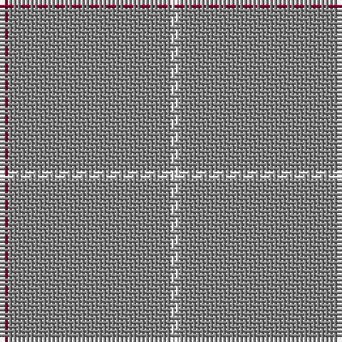

In pattern [RGW](/patterns/rgw/).

This was sourced from weddslist.  It is a [3 stripes tartan](/stripes/stripes3/).

Original link http://www.weddslist.com/cgi-bin/tartans/pg.pl?source=sts

## Thread count
DR/2 N38 LN/2

## Palette
Each colour and its ΔE from the base-6 reference it is a variant of.

| Colour | Shade | Base | ΔE (OKLab) |
|---|---|---|---|
| DR | <code style="background-color:#900030;">#900030</code> `#900030` | R <code style="background-color:#C80000;">#C80000</code> | 0.13 |
| LN | <code style="background-color:#E0E0E0;">#E0E0E0</code> `#E0E0E0` | W <code style="background-color:#F4F4F0;">#F4F4F0</code> | 0.06 |
| N | <code style="background-color:#808080;">#808080</code> `#808080` | G <code style="background-color:#006400;">#006400</code> | 0.22 |

# Sample pattern

ID: /setts/s3/r2g38w2-g808080-r900030-we0e0e0/
