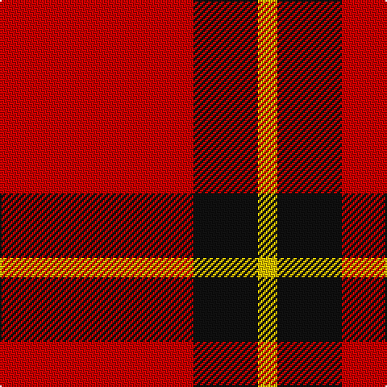

**Bands:** [RKY](/stripes/rky/) · **Stripes:** [R K LY](/stripes/stripes3/) R K LY

This was sourced from tartans-authority.  It is a [3 band tartan](/bands/bands3/).

Original link http://www.tartansauthority.com/tartan-ferret/display/7280/

## Thread count
R/120 K40 Y/12

## Palette
Each colour and its ΔE from the base-6 reference it is a variant of.

| Colour | Shade | Base | ΔE (OKLab) |
|---|---|---|---|
| K | <code style="background-color:#101010;">#101010</code> `#101010` | K <code style="background-color:#000000;">#000000</code> | 0.17 |
| R | <code style="background-color:#C80000;">#C80000</code> `#C80000` | R <code style="background-color:#CC0000;">#CC0000</code> | 0.01 |
| Y | <code style="background-color:#E8C000;">#E8C000</code> `#E8C000` | Y <code style="background-color:#F2BF00;">#F2BF00</code> | 0.02 |

# Sample pattern

## Nearest tartans

The nearest existing variants by ΔTartan distance.

1. [Masai Shuka 26 (Artefact)](/setts/s4/ly3k2r10k1~x4/) — ΔT 1.35
1. [MacKeane](/setts/s5/r4k8r12k1ly1~x2/) — ΔT 1.46
1. [McPeek (Fashion)](/setts/s4/r125k26lb20lo16/) — ΔT 1.50
1. [Masai Shuka 28 (Artefact)](/setts/s3/lb9r20db2~x2/) — ΔT 1.53
1. [MacGregor, Black (Personal)](/setts/s5/r41k19r7k9w3~x2/) — ΔT 1.62
1. [Loch Morar](/setts/s5/r38w9r3dr9w3~x2/) — ΔT 1.65
1. [Macan, of Lurgyvallan (Hose)](/setts/s6/r10k1r4g6~x2/) — ΔT 1.67
1. [International Karate Fed. (Corporat)](/setts/s3/r8w1k1~x20/) — ΔT 1.67
1. [Loch Morar Trade Tartan Tartan Number: 1701. Earliest known date: pre 2003 Nothing See products available Copyright © Blair Urquhart, Comrie, 2015](/setts/s5/r38w9r3do9w3~x2/) — ΔT 1.69
1. [Sinclair](/setts/s5/r30dg12k5lb8r30/) — ΔT 1.72

## Neighbour map

Every grey dot is one of 14299 variants placed by the first two principal components of the ΔTartan feature space (44% of its variance). Red is this tartan; blue dots are its nearest — click one to open its page.

<svg viewBox="0 0 640 380" role="img" style="max-width:100%;height:auto;border:1px solid #e0e0e0;border-radius:4px;display:block" xmlns="http://www.w3.org/2000/svg"><image href="/nn/cloud.v1.png" width="640" height="380"/><a href="/setts/s4/ly3k2r10k1~x4/"><circle cx="367.3" cy="212.0" r="4" fill="#3465a4"><title>Masai Shuka 26 (Artefact)</title></circle></a><a href="/setts/s5/r4k8r12k1ly1~x2/"><circle cx="384.8" cy="212.9" r="4" fill="#3465a4"><title>MacKeane</title></circle></a><a href="/setts/s4/r125k26lb20lo16/"><circle cx="376.6" cy="200.7" r="4" fill="#3465a4"><title>McPeek (Fashion)</title></circle></a><a href="/setts/s3/lb9r20db2~x2/"><circle cx="386.5" cy="238.4" r="4" fill="#3465a4"><title>Masai Shuka 28 (Artefact)</title></circle></a><a href="/setts/s5/r41k19r7k9w3~x2/"><circle cx="382.7" cy="201.8" r="4" fill="#3465a4"><title>MacGregor, Black (Personal)</title></circle></a><a href="/setts/s5/r38w9r3dr9w3~x2/"><circle cx="412.6" cy="182.4" r="4" fill="#3465a4"><title>Loch Morar</title></circle></a><a href="/setts/s6/r10k1r4g6~x2/"><circle cx="407.9" cy="224.9" r="4" fill="#3465a4"><title>Macan, of Lurgyvallan (Hose)</title></circle></a><a href="/setts/s3/r8w1k1~x20/"><circle cx="523.4" cy="246.0" r="4" fill="#3465a4"><title>International Karate Fed. (Corporat)</title></circle></a><a href="/setts/s5/r38w9r3do9w3~x2/"><circle cx="414.5" cy="182.1" r="4" fill="#3465a4"><title>Loch Morar Trade Tartan Tartan Number: 1701. Earliest known date: pre 2003 Nothing See products available Copyright © Blair Urquhart, Comrie, 2015</title></circle></a><a href="/setts/s5/r30dg12k5lb8r30/"><circle cx="364.7" cy="234.4" r="4" fill="#3465a4"><title>Sinclair</title></circle></a><circle cx="434.4" cy="240.2" r="5" fill="#c00000"/></svg>

ID: /setts/s3/r30k10ly3~x4/
